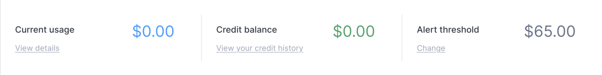

<head>
  <title>Understanding Civo's Billing Process | Civo Documentation</title>
</head>

## Overview

Civo services are chargeable, which is why you need a valid payment method on file at all times, and won't be able to create Kubernetes clusters or instances before your card is verified. This document details how charges are calculated and how we bill you for usage.

## Charges

At any time you can see your current month's charge summary from your [Dashboard](https://dashboard.civo.com) and from there drill down into a [detailed listing of current charges](https://dashboard.civo.com/billing/usage). Services are billed hourly, rounded up to the nearest full hour, and at the rates listed on our [Pricing page](https://www.civo.com/pricing). As with almost all cloud hosting providers, the hourly pricing is worked out by dividing a monthly fee by 28 days (and of course 24 hours in each day).

This means that if the month is longer than 28 days, then theoretically the price would work out to more than the 28 day monthly price. So we cap it at the monthly price. This does have the following well-known side effect - if you launch an instance, run it for 15 days, then close it down and launch a second one and leave it running until the end of the 30 day month, you would be charged more than the monthly fee. This is how the caps work.

We won't automatically stop resources and risk interrupting your services unless your account is suspended.

## Billing for shut down resources

If an instance or Kubernetes cluster is shut down, it still takes up resources, so a stopped instance or cluster is chargeable, and is exactly the same as an active instance or cluster. In other words, The hourly price will be added to your monthly charges while the instances are in your account, running or not.

All our prices are charged in US dollars and are exclusive of VAT (where applicable).

## Payment

On the first day of each month,  we raise an invoice for services used throughout the previous month. Your [previous invoices](https://dashboard.civo.com/invoices) are available within your dashboard.

When we raise the invoice, we will immediately try to settle it. The first method of payment we'll use is any unexpired credit balance on your account. You can read more about credit below.

If there is still a balance left to settle on the invoice, we will attempt to take this from your saved credit/debit card (these card details are held securely by our payment processor Stripe.com, not on our servers).

If your invoice is successfully settled, you'll receive an email notification confirming this.

If your invoice still hasn’t been settled by credit balance or card payment, we'll continue to attempt taking payment for 6 more days and notify you that you are at risk of having your services and account suspended. After this time, if your invoice is still outstanding on the 8th day of the month, your services and account will be **suspended**.

If your account gets suspended or we are not able to take payment from you, [contact us](https://www.civo.com/contact) as soon as possible once you have [entered a valid payment type](https://dashboard.civo.com/billing/new). We will then be able to process your bill and allow to restore your Civo services.

Within two weeks of suspension, if there's still no contact from you or attempt to pay for the services, we’ll completely delete all services including Kubernetes clusters, instances, snapshots, persistent volumes, etc. and will commence debt recovery.

## Accepted Payment types

We accept all major credit/debit card brands supported by Stripe (American Express, MasterCard, Visa). We do not support using a "virtual" or pre-paid card as a payment type.

## Credit

Your account may be credited with Civo credit balance. You can see your [credit history here](https://dashboard.civo.com/billing/credits). This credit has an expiration date, and must be used before it expires. If a credit expires with balance on it, this amount is lost.

If a credit is set to expire at the end of a month, it will be used against that month's usage. So as an example, if a Credit is marked as expiring on 31 March, the invoice you receive on 1 April will have used that credit, as the usage was incurred in March.

Credits are consumed in order of creation, with the oldest first.
