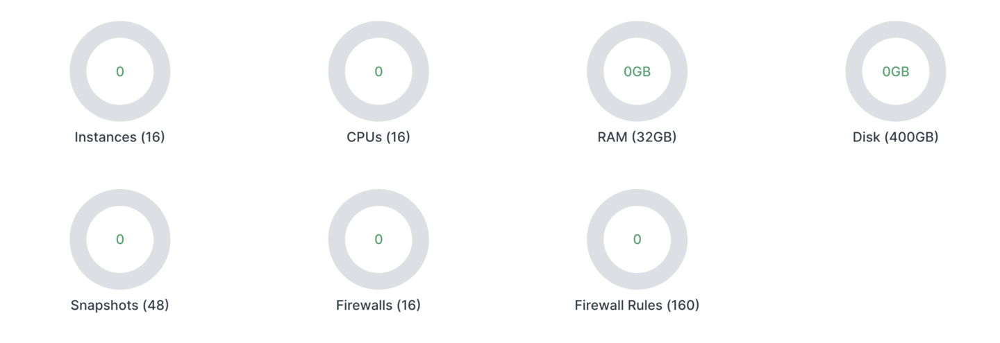
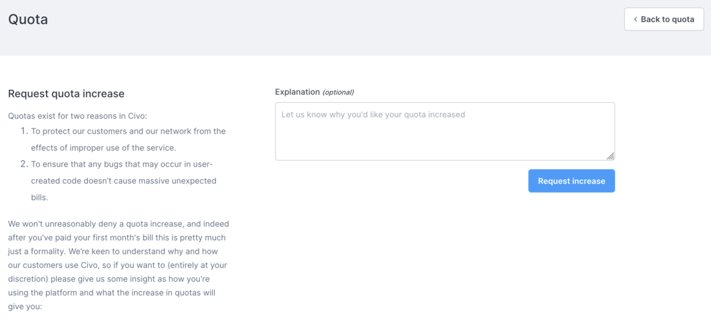

<head>
  <title>Managing Your Civo Account Quota | Civo Documentation</title>
</head>

Each account on Civo has a quota based on a combined allocation of instances/Kubernetes nodes, CPUs, RAM usage, and other resources that can be allocated to an account. All customers start on a basic quota level, like in the screenshot below:

If you reach your quota limit on CPUs for example, you will not be able to create more instances or Kubernetes nodes until your usage comes down or your quota is increased.

This quota can be requested to be changed through the [quota management panel in your account](https://dashboard.civo.com/quota). We are generally happy to increase user quotas after a period of proving that existing account quota is being handled correctly.

If you remove resources by, for example, deleting a Kubernetes node pool, this should be reflected on your quota in a few minutes once the system completes its reconciliation steps.

## Requesting a quota increase

To request a quota increase, navigate to the [Quota page](https://dashboard.civo.com/quota) in your account and click on "Request quota increase" in the top right:

In order for us to expedite the quota increase, please provide as much detail as you are able teo in the explanation field. This field is optional if you have already paid a bill (excluding any credit) on Civo, but helps us in adjusting your quota to a size that will work for you:

## If your quota does not appear correct

If your quota usage seems incorrect, double-check that you are not running workloads in another Civo region, as the quota is account-wide rather than region-specific.

If this does not explain the discrepancy, please [get in touch with us](https://www.civo.com/contact) and we will investigate further.
