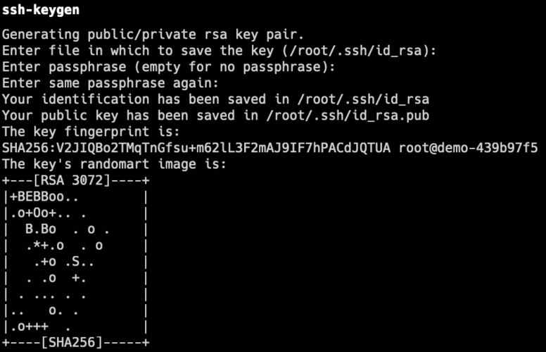
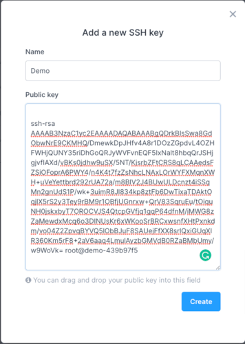
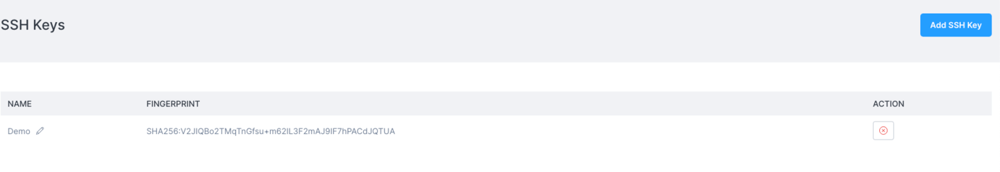

import Tabs from '@theme/Tabs';
import TabItem from '@theme/TabItem';

You can add your SSH keys to your Civo account and use them to log in to Civo instances that have the key associated with them.

SSH keys can be added to accounts under the [Manage/SSH Keys](https://dashboard.civo.com/ssh_keys) section of your dashboard, or programmatically using the [Civo API](https://www.civo.com/api/sshkeys).

You can have multiple SSH keys stored in your account at one time. The initial association of an SSH key with a compute instance will apply one key of your choice.

You must have an existing SSH key in order to add one to your Civo account. The following section describes how you can generate a new key.

## Generating a new SSH key

If you do not yet have an SSH key, you can use the `ssh-keygen` command on your system to generate an SSH key pair. This command is automatically present in Linux and MacOS systems; for Windows, please see [this documentation](https://learn.microsoft.com/en-us/windows-server/administration/openssh/openssh_install_firstuse?tabs=gui).

When running the command and entering the desired filename and passphrase, it should output something like the following:

.

You are now ready to add your new key to your Civo account.

## Adding a SSH key to your Civo account

<Tabs groupId="add-sshkey">
<TabItem value="dashboard" label="Dashboard">

Once you have a generated key, you can copy the **public key** to add to your Civo account in the [SSH keys section](https://dashboard.civo.com/ssh_keys).

The dialog will prompt you for a memorable name and have space to paste the entirety of the public key.



Be sure to include the `ssh-rsa` and any trailing information, these are also part of the key.

Once you click on the *Create* button, the key will then be stored with the name you chose in your account like the following:



You can now [launch virtual machine instances](../compute/create-an-instance.md) and automatically associate your created key with them, allowing you to log in without a password.

</TabItem>

<TabItem value="cli" label="Civo CLI">

You can use the [Civo CLI tool](../overview/civo-cli) to add a new SSH key to your account with the following command:

`civo sshkey add NAME --key PATH_TO_SSH_KEY`

Where *NAME* is the name displayed to you for reference, and *PATH_TO_SSH_KEY* is the full path to the SSH public key file to be used.

You will then be able to use the uploaded SSH key in any [instances you create](../compute/create-an-instance) in Civo.

</TabItem>

<TabItem value="terraform" label="Terraform">

### Preparing the configuration file

Once you have configured the [Civo Terraform provider](../overview/terraform.md), you can define a an SSH key in Terraform.

Create a file such as `main.tf` with the following contents:

```terraform
# Create SSH key
resource "civo_ssh_key" "main"{
  name = "my-public-key"
  public_key = file("~/.ssh/id_rsa.pub")
}
```

You will need to edit the file path to point to the public key location of the key you want to add, as well as the "name" field to your choice of reference.

### Plan

Now, you can run `terraform plan` command to see what's going to be created:

```console
$ terraform plan
Terraform used the selected providers to generate the following execution plan. Resource actions are indicated with the following symbols:
  + create

Terraform will perform the following actions:

  # civo_ssh_key.main will be created
  + resource "civo_ssh_key" "main" {
      + fingerprint = (known after apply)
      + id          = (known after apply)
      + name        = "my-public-key"
      + public_key  = <<-EOT
            (ssh key details)
        EOT
    }

Plan: 1 to add, 0 to change, 0 to destroy.

──────────────────────────────────────────────────────────────────────────────────────────────────────────────────────────────────────────────────────────────────────────────────────────────────────────

Note: You didn't use the -out option to save this plan, so Terraform can't guarantee to take exactly these actions if you run "terraform apply" now.
```

According to the output above, Terraform will add a SSH key in the defined Civo account, set the name to "my-public-key" with content pulled from the public key located at the `~/.ssh/id_rsa.pub` path.

For more details about the `civo_ssh_key` resource, check out the [docs](https://registry.terraform.io/providers/civo/civo/latest/docs/resources/ssh_key) on the Terraform Registry site.

### Apply the configuration

When you are ready to add the key to your account using Terraform, this is accomplished by running the `terraform apply` command. When Terraform asks for confirmation, type yes and hit the Enter key:

```console
$ terraform apply
Terraform used the selected providers to generate the following execution plan. Resource actions are indicated with the following symbols:
  + create

Terraform will perform the following actions:

  # civo_ssh_key.main will be created
  + resource "civo_ssh_key" "main" {
      + fingerprint = (known after apply)
      + id          = (known after apply)
      + name        = "my-public-key"
      + public_key  = <<-EOT
            (ssh key details)
        EOT
    }

Plan: 1 to add, 0 to change, 0 to destroy.

Do you want to perform these actions?
  Terraform will perform the actions described above.
  Only 'yes' will be accepted to approve.

  Enter a value: yes

civo_ssh_key.main: Creating...
civo_ssh_key.main: Creation complete after 2s [id=958000bf-2014-491a-9cdd-b568ee4b8788]

Apply complete! Resources: 1 added, 0 changed, 0 destroyed.
```

Once the configuration gets successfully applied, you will be able to see the new SSH Key in your [Civo account's dashboard](https://dashboard.civo.com/ssh_keys).
</TabItem >

</Tabs>
