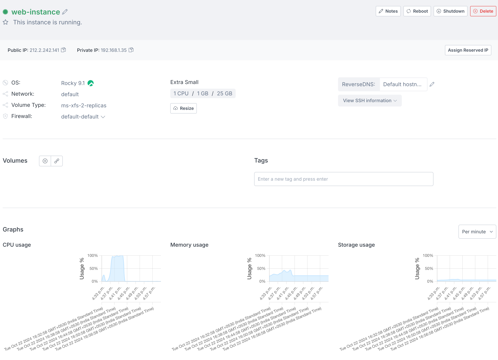

<head>
  <title>Activating Civo Statistics Monitoring | Civo Documentation</title>
</head>

## Overview
Civo provides an optional monitoring daemon to track basic instance statistics, including CPU, memory, and storage usage. This daemon is not enabled by default but can be easily installed and activated by running a simple script. This document provides steps to activate or re-activate statistics monitoring on your Civo instance.


## Prerequisites
- **SSH Access**: Ensure you have [SSH access to the Civo instance](../compute/create-an-instance#9-ssh-key.md). If you are experiencing issues with SSH, refer to the Civo documentation for troubleshooting guides.
- **Root Privileges**: Activating statistics monitoring requires root privileges. Make sure you have the necessary permissions to execute commands as root.
- **`curl` Installation**: The activation process relies on `curl` to download the necessary script. If `curl` is not installed on your instance, you will need to install it via your OS package manager. For example on Ubuntu/Debian-based systems: `sudo apt-get install curl`
- **Presence of the `/etc/civostatsd` File**: The `/etc/civostatsd` file contains your instance's unique token, which is required for statistics monitoring. If this file is missing or has been removed, please contact Civo support for assistance.

## Activation Steps
SSH into your Civo Instance: Connect to your Civo instance using SSH, ensuring you have root privileges. You can choose a random password for logging in to the instance, or use a [previously-uploaded key](../account/ssh-keys.md).
Run the activation Command: Execute the following command to activate statistics monitoring:

```bash
curl -s https://www.civo.com/civostatsd.sh | sudo /bin/bash
```

This command downloads the `civostatsd.sh` script from the Civo website and executes it with root privileges. After a few minutes, you should see these graphs in the instance detail page.

## Troubleshooting
If you encounter issues during the activation process, if the /etc/civostatsd file is missing or has been removed, or if statistics are not being reported after completing the steps, please contact the Civo support team for further assistance.

## Verification
After completing the re-activation steps, statistics should be reported on your dashboard within a few minutes. You can verify this by:

- Logging in to your Civo dashboard
- Navigating to the instance details page


