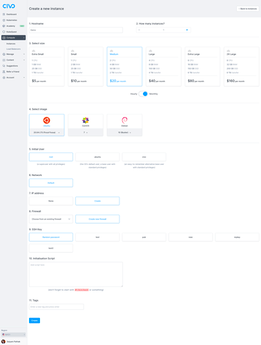
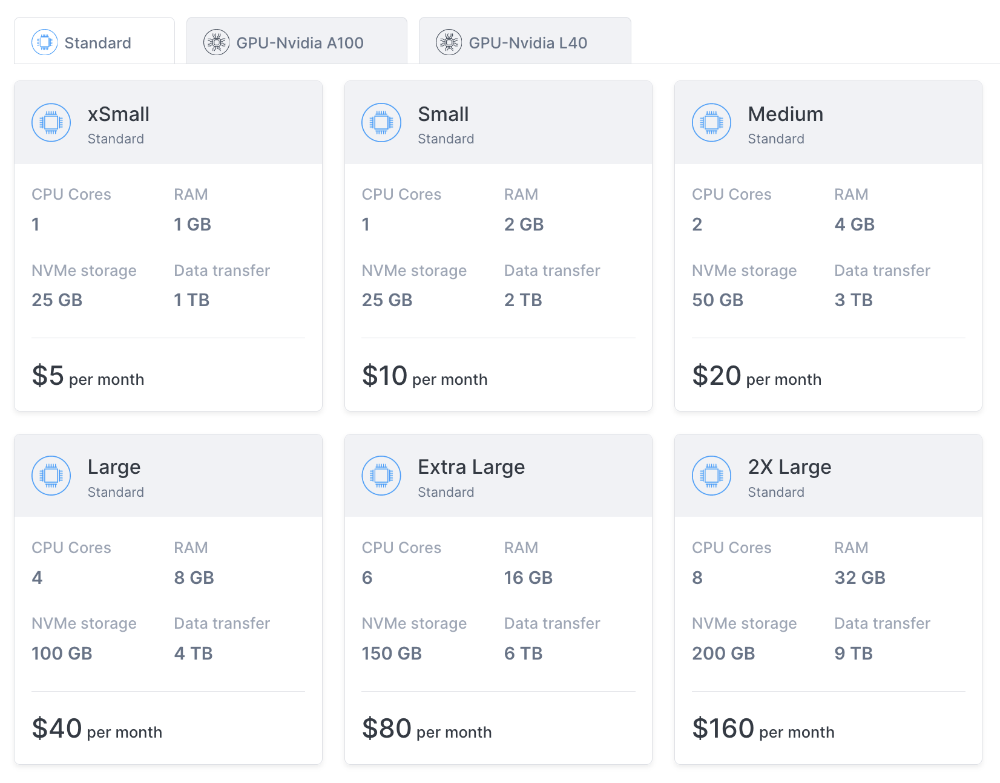

<head>
  <title>Creating a Civo Compute Instance | Civo Documentation</title>
</head>

import Tabs from '@theme/Tabs';
import TabItem from '@theme/TabItem';

## Overview

To create an instance on Civo, you will need to provide several specific parameters. This requirement applies whether you are initiating the instance through the web dashboard or utilizing one of our API tools. In the sections below, you will find detailed documentation that explains the main options available to you during the initial launch of an instance. These options include various configuration settings that you can customize to suit your specific needs, ensuring that your instance is set up precisely as you require from the outset.

## Creating an Instance for GPU Workloads on Civo

Civo offers the capability to run your GPU workloads on its specialized instances. The type of instance you select will differ based on the size and performance requirements you specify. This allows you to tailor your selection to meet a variety of performance needs, whether you are seeking low-latency responses for real-time applications, high-throughput for handling numerous inference requests, or other specific performance characteristics. 

With Civo, you have access to a comprehensive array of options designed to support and optimize your GPU workloads, ensuring you can achieve the desired performance and efficiency for your applications.

Civo provides the following GPU Types:
- **NVIDIA A100 40GB:** Designed for AI and data analytics, it delivers high performance and memory capacity.
- **NVIDIA A100 80GB:** An enhanced version of the A100, offering more memory for demanding workloads such as large AI models.
- **NVIDIA L40S 48GB:** Suitable for tasks requiring a mix of AI and graphics performance, such as 3D rendering and large language model training.
- **NVIDIA H100:** Optimized for AI training and inference with advanced memory and Tensor Cores, suitable for high-performance computing and AI tasks.

To deploy GPU workloads on Civo Instances, [select a GPU optimized image](#4-select-image) from within the [instance creation page](https://dashboard.civo.com/instances/new).

<Tabs groupId="create-instance">

<TabItem value="dashboard" label="Dashboard">

## Creating a Standard Instance from the Civo Dashboard

Begin by selecting the Civo Region you are operating in. You can do so in the lower left of your [Dashboard page](https://dashboard.civo.com):

Then, navigate to the [instance creation page](https://dashboard.civo.com/instances/new):

The numbered sections give you options for the specifications of your compute instances.

### 1. Hostname

The hostname is the name of the instance. If you specify multiple instances to create in section **2** the same hostname will be used for each, with a running sequential number added to make them unique.

Hostnames can only contain letters, numbers, dashes and full stops. Hostnames must end on an alphanumeric character, not a dash or full stop.

### 2. How many instances?

You can create one or more instances in one operation, subject to the limitations of your [quota](../account/quota.md). Each instance created will have the same parameters, only the hostname and IP addresses will be different.

### 3. Select size

You can select the size and instance hardware specifications based on the task you want to accomplish. You can view the available sizing options [here](https://www.civo.com/pricing).

Some [Civo regions](../overview/regions.md) provide the option to create instances with [attached GPUs](https://www.civo.com/ai/cloud-gpu). These can be selected on the corresponding "GPU" tabs of the sizes section, if available in your current region, as shown in the image below:

Sizing options may be restricted depending on your account quota and how many resources are already running in your account. See the [quota documentation](../account/quota.md) for more information.

The hourly/monthly slider for the pricing is purely to show the pricing equivalent at different time scales. All Civo resources are billed hourly. [Read more about billing](../account/billing.md).

:::tip
As the price charged increases with instance size, consider the type of work you expect the instance to be performing. If your instance is too small for the workload, it may not be able to remain responsive. If you over-budget the instance size, you may be paying more for the instance to mostly sit idle.
:::

### 4. Select image

The base operating system image to use for the instance. Note that you can select from a number of versions of each operating system.
 
Custom operating system disk images can be enabled on [CivoStack Enterprise](https://www.civo.com/civostack-enterprise) regions. For more information on creating and managing custom disk images, refer to the [custom image](./custom-image.md) documentation.

### 5. Initial user

The initial user to create for the created instance(s). This is the username to use when logging in to the instance for the first time over SSH.

### 6. Network

The [private network](../networking/private-networks.md) for the instance to be situated in. You can choose from the default network for your account, or if you have created networks prior to creating this instance, you can choose from one of them.

### 7. Public IP address

Select *create* if you would want the instance to have a public IP address and therefore be routable from the wider internet. If you do not choose to create the instance with a public IP address, it will only be accessible from within your chosen [network](../networking/private-networks.md).

### 8. Firewall

You can create a new firewall along with creating this instance, or choose from an existing one if present in the network. Read more about firewalls on Civo.

### 9. SSH Key

You can choose a random password for logging in to the instance, or use a [previously-uploaded key](../account/ssh-keys.md).

### 10. Initialisation script

If you want your instance to be preinstalled with some tools, or want to run a script on startup, this is the section to paste the script. [Read more about instance initialisation script usage](../compute/install-script-usage.md).

### 11. Tags

You can tag instances for administrative and organisation reasons by adding tags here. Tags are entirely optional.

### Creating your instance

When you are satisfied with your initial instance configuration, you can click "**Create**" and be directed to the instance's dashboard page. It will take a moment to become active, and you will be shown the status throughout as it builds:

### Accessing your instance with SSH

Once your instance is running, you will be able to connect to it using SSH. If you chose to use an [uploaded SSH key](../account/ssh-keys.md), you will be able to connect without a password. If you chose to use a random password, you can copy it to your clipboard by clicking on the "*View SSH information* dropdown at the top of the instance's page.

Assuming you had a public IP address assigned to the instance, you will be able to access it with the command format `ssh username@instanceIP`. The IP address information is also displayed at the top of the instance details page.

</TabItem>

<TabItem value="cli" label="Civo CLI">

## Creating an instance using the Civo CLI

You can create a Civo instance on the command-line by running the `civo instance create` command, with optional parameters.

:::tip

You can view the instance creation options available on the Civo CLI by running:

:::

### Creating an instance on the command line with no options

If you run `civo instance create` on its own, it will create an instance with a random name, default options for the size, operating system, initial user and so on, in the currently-selected region, and return.

### Creating an instance on the command line with options

The CLI allows you to specify a number of options for your instance, from the size and specification of the virtual machine, to the firewall rules to set up, the version and flavour of operating system to use, and more. A full list of options for instance creation can be found by running `civo instance create --help`.

As an example, the following command will create an instance in the current region, using the `g3.small` instance type, using the Ubuntu Jammy disk image for the operating system, with an initial user called demo-user.

`civo instance create --hostname=api-demo.test --size=g3.medium  --diskimage=ubuntu-jammy --initialuser=demo-user`

</TabItem>

<TabItem value="terraform" label="Terraform">

## Creating an instance using Terraform

To create an instance using Terraform, you will first need to have an initialized Terraform project. Refer to the [Civo Terraform setup documentation](../overview/terraform.md) before proceeding.

### Preparing a configuration file

First, create a file called `main.tf` and add your Terraform configuration. The configuration should include:

- In the *Query small instance size* block:
  - We are using the `civo_instances_size` data source to find a list of instance sizes that match with these filters:
    - name contains `g3.small`
    - `type` is `instance`
  - We can then refer to this data source as `data.civo_instances_size.small`. To access the sizes later, we can use `data.civo_instances_size.small.sizes` syntax where `sizes` is the data source key that contains all the sizes (list)

- In the *Query instance disk image* block:
  - We are using the `civo_disk_image` data source to find a list of compute instance diski mages from the `LON1` region that match this filter:
    - name is `debian-10`
  - We can then refer to this data source as `data.civo_disk_image.debian`. To access the sizes later, we can use `data.civo_disk_image.debian.diskimages` syntax where `diskimages` is the data source key that contains all the diskimages (list)

- In the Create a new instance block:
  - We are creating a new Civo compute instance using the `civo_instance` resource, and
    - Use `LON1` region (note: this region field is optional — if no region is provided in the configuration or provider.tf file, the system will choose one for you)
    - Set the hostname to `foo.com`
    - For the `size` field, we take the first element (index 0) from the `data.civo_instances_size.small.sizes` list defined above
    - For the `disk_image` field, we take the first element (index 0) from the `data.civo_disk_image.debian.diskimages` list
  - We can then refer to this instance as `civo_instance.foo` in other resources if we need to.

The civo_instance resource does support other fields too. Check out the [Terraform provider documentation](https://registry.terraform.io/providers/civo/civo/latest/docs/resources/instance) for more details.

### Running Terraform plan

Once you have created the `main.tf` file with your chosen options, you can run `terraform plan` to see what's going to be created:

[CODE BLOCK REMOVED]

As you can see, Terraform will create an instance with size set to `g3.small` and disk image set to `a42...560`. That means the data source queries are working.

### Applying the configuration

You can now execute the command to create the actual compute instance. Run `terraform apply` and when prompted, type `yes`:

[CODE BLOCK REMOVED]

When the creation completes, refresh your [Civo dashboard](https://dashboard.civo.com/instances) and you will see there's a new compute instance that has been created. Click it to see more details. It will look something like this:

### Updating an instance configuration

There will be a new file named `terraform.tfstate` in your local project directory. If you print its contents, it will look something like:

[CODE BLOCK REMOVED]

This is the [Terraform State File](https://developer.hashicorp.com/terraform/language/state) which is created when the configuration is applied.

If you update your `main.tf` file and run `terraform apply` again, Terraform will refresh the state file, try to understand what you want to update and update your compute instance accordingly. You may want to update components such as the firewall id to choose another [firewall](../networking/firewalls.md) or add a tag, for example.

If there's no change in your `main.tf` file and you rerun `terraform apply`, it will output a `No changes. Your infrastructure matches the configuration` message back to you.
</TabItem>
</Tabs>
