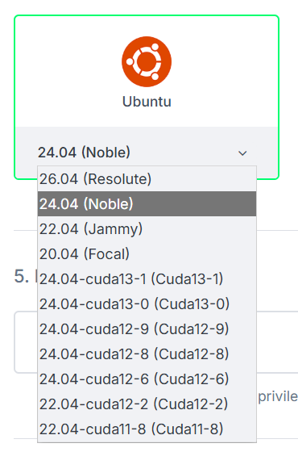

<head>
  <title>GPU Instances on Civo | Civo Documentation</title>
</head>

import Tabs from '@theme/Tabs';
import TabItem from '@theme/TabItem';

## Overview

Civo offers NVIDIA GPU compute instances for AI/ML training and inference, rendering, and scientific workloads. There are two ways to get a GPU-ready instance: start from a base Ubuntu image and install the NVIDIA drivers yourself, or use a Civo-provided CUDA disk image that ships with the NVIDIA drivers, the NVIDIA container toolkit, and CUDA already configured and ready to use on first boot.

:::note
If you want to run GPU workloads on Kubernetes instead of a single instance, see [GPU Clusters on Civo Kubernetes](../kubernetes/advanced/gpu-config.md).
:::

## Regional availability

GPU compute is not available in every Civo region. Check the [Regions](../overview/regions.md) page for the current availability matrix, or list the regions your account can reach from the CLI:

```bash
civo region list
```

Pass `--region <CODE>` to any `civo` CLI command to target a specific region, or set your default region with `civo region use <CODE>`.

## Choosing a disk image

When you launch a GPU instance you can pick the disk image that best matches how much customisation you need.

| Path | When to use |
|------|-------------|
| Base Ubuntu image (e.g. `ubuntu-noble`) + install drivers yourself | You need a specific driver or CUDA version, or you're hardening / customising the OS. Follow [Installing NVIDIA drivers on GPU instances running Ubuntu](./gpu-instance-drivers-ubuntu.md). |
| Civo CUDA image (e.g. `ubuntu-cuda13-1`) | You want NVIDIA drivers, the container toolkit, and CUDA pre-installed and ready to use on first boot. |

## Listing the available CUDA disk images

Civo publishes a family of CUDA-enabled Ubuntu disk images. You can list them from the CLI or pick one in the Dashboard.

<Tabs groupId="create-instance">

<TabItem value="dashboard" label="Dashboard" default>

When creating an instance, choose **Ubuntu** in the disk image picker and pick a CUDA variant from the version drop-down. CUDA images are listed as `24.04-cudaXX-Y (CudaXX-Y)` alongside the standard Ubuntu releases.



</TabItem>

<TabItem value="cli" label="Civo CLI">

List every disk image available in your current region with `civo diskimage list`:

```bash
civo diskimage list
```

The output is a table of all available images. CUDA-enabled Ubuntu images are named `ubuntu-cudaXX-Y` and sit alongside the standard Ubuntu images:

```
+--------------------------------------+-----------------+----------------+-----------+--------------+
| ID                                   | Name            | Version        | State     | Distribution |
+--------------------------------------+-----------------+----------------+-----------+--------------+
| <uuid>                               | ubuntu-noble    | 24.04          | available | ubuntu       |
+--------------------------------------+-----------------+----------------+-----------+--------------+
| <uuid>                               | ubuntu-cuda12-8 | 24.04-cuda12-8 | available | ubuntu       |
+--------------------------------------+-----------------+----------------+-----------+--------------+
| <uuid>                               | ubuntu-cuda13-0 | 24.04-cuda13-0 | available | ubuntu       |
+--------------------------------------+-----------------+----------------+-----------+--------------+
| <uuid>                               | ubuntu-cuda13-1 | 24.04-cuda13-1 | available | ubuntu       |
+--------------------------------------+-----------------+----------------+-----------+--------------+
```

To narrow the list to just CUDA images, pipe through `grep`:

```bash
civo diskimage list | grep cuda
```

The newest images (currently `ubuntu-cuda13-0` and `ubuntu-cuda13-1`) ship the latest CUDA release on Ubuntu 24.04 — pick the highest version unless you have a reason to pin to an older CUDA.

</TabItem>

<TabItem value="terraform" label="Terraform">

You can look up CUDA images from Terraform using the [`civo_disk_image` data source](https://registry.terraform.io/providers/civo/civo/latest/docs/data-sources/disk_image), filtered by name:

```terraform
data "civo_disk_image" "cuda" {
  region = "LON1"
  filter {
    key    = "name"
    values = ["ubuntu-cuda13-1"]
  }
}
```

Reference the resolved image as `element(data.civo_disk_image.cuda.diskimages, 0).id` when creating an instance — see the Terraform tab in the next section for the full example.

</TabItem>

</Tabs>

## Creating a GPU instance with a Civo CUDA image

Once you've chosen a CUDA image and a GPU size, create the instance using whichever interface suits you. For the full list of GPU sizes and pricing see [Creating an instance](./create-an-instance.md) and [civo.com/pricing](https://www.civo.com/pricing).

<Tabs groupId="create-instance">

<TabItem value="dashboard" label="Dashboard" default>

Follow the standard [Creating an instance](./create-an-instance.md) flow, with two GPU-specific choices:

1. On **Step 3 — Choose Size**, switch to the **GPU** category and pick a GPU size (for example `g4.gpu.small`).
2. On **Step 4 — Choose Image**, select **Ubuntu** and pick a CUDA version from the drop-down (for example `24.04-cuda13-1 (Cuda13-1)`).

Complete the rest of the form (network, firewall, SSH key) as normal and click **Create**.

</TabItem>

<TabItem value="cli" label="Civo CLI">

```bash
civo instance create my-gpu-instance \
  --size g4.gpu.small \
  --diskimage ubuntu-cuda13-1 \
  --region lon1
```

</TabItem>

<TabItem value="terraform" label="Terraform">

The example below queries a GPU size and a CUDA disk image, then creates an instance using both. Substitute your own region, SSH key resource, hostname, and the GPU size / CUDA version you want.

```terraform
# Query a GPU instance size
data "civo_size" "gpu" {
  filter {
    key    = "name"
    values = ["g4.gpu.small"]
  }
  filter {
    key    = "type"
    values = ["instance"]
  }
}

# Query a CUDA disk image
data "civo_disk_image" "cuda" {
  region = "LON1"
  filter {
    key    = "name"
    values = ["ubuntu-cuda13-1"]
  }
}

# Create the GPU instance
resource "civo_instance" "gpu" {
  region     = "LON1"
  hostname   = "my-gpu-instance"
  size       = element(data.civo_size.gpu.sizes, 0).name
  disk_image = element(data.civo_disk_image.cuda.diskimages, 0).id
}
```

Apply the configuration with `terraform init` followed by `terraform apply`. For full Civo provider setup see [Using Civo with Terraform](../overview/terraform.md).

</TabItem>

</Tabs>

Once the instance is `ACTIVE`, SSH in and run `nvidia-smi` to confirm the GPU is visible.

## Single-GPU NVLink behaviour

Single-GPU H100 hosts need a one-line NVIDIA module option to come up cleanly. The Civo CUDA image handles this for you; if you bring your own drivers on a base image you need to apply it yourself.

### What happens by default

When the NVIDIA driver loads on an H100 host with only one GPU, it tries to bring up the NVLink fabric. Because there is no peer GPU on the host the fabric initialisation fails, and as a result the driver never becomes ready. The symptom customers see is `nvidia-smi` hanging or erroring out, and the kernel log shows NVLink initialisation failures.

The fix is to tell the `nvidia` kernel module not to bring up NVLink in the first place by setting `NVreg_NvLinkDisable=1` in `/etc/modprobe.d/`.

### What the Civo CUDA image does

The Civo CUDA images ship with a systemd unit called `nvidia-service-check.service` that runs early at boot, before the NVIDIA fabric-manager service starts. It uses `lspci` to detect whether an NVLink Switch device is present on the host:

```bash
lspci | grep -i nvidia | grep -q "Switch"
```

- If **no switch is present** (a single-GPU host), the service writes the following module option to `/etc/modprobe.d/nvidia-disable-nvlink.conf`:

  ```
  options nvidia NVreg_NvLinkDisable=1
  ```

  and then reloads the `nvidia` kernel module so the option takes effect before any other NVIDIA service tries to use NVLink.

- If **a switch is present** (a multi-GPU host with NVLink), the same file is written with the option commented out, leaving NVLink enabled, and `nvidia-fabricmanager` comes up normally.

The net effect is that, on the Civo CUDA image, `nvidia-smi` "just works" on both single-GPU and multi-GPU instances without any manual steps.

### Reboot / reload requirement when you change it manually

The `NVreg_NvLinkDisable=1` option is only read when the `nvidia` kernel module is loaded. On a fresh boot of the Civo CUDA image this is handled automatically by `nvidia-service-check.service` running before the driver and fabric-manager services start.

If you ever change `/etc/modprobe.d/nvidia-disable-nvlink.conf` yourself, you need to either:

- **reboot the instance**, or
- **unload and reload the `nvidia` kernel modules** (and restart any NVIDIA services such as `nvidia-persistenced` and `nvidia-fabricmanager`)

for the change to apply. The simplest reliable option is a reboot.

### If you're using a base image instead

If you're not using a Civo CUDA image and you're on a single-GPU H100 host, you must apply the same modprobe option yourself, or the driver will not come up. The procedure is covered as part of the manual driver install — see [Single-GPU H100 instances: disable NVLink](./gpu-instance-drivers-ubuntu.md#single-gpu-h100-instances-disable-nvlink).

## Verifying the GPU is ready

After the instance is up, run the following checks over SSH:

- `nvidia-smi` should list the expected number of GPU(s) with the driver and CUDA versions populated.
- On a single-GPU H100 host — whether you're using the Civo CUDA image or the manual workaround — `cat /proc/driver/nvidia/params | grep NvLinkDisable` should show that `NvLinkDisable` is set.

## See also

- [Installing NVIDIA drivers on GPU instances running Ubuntu](./gpu-instance-drivers-ubuntu.md) — manual driver install on a base image.
- [GPU Clusters on Civo Kubernetes](../kubernetes/advanced/gpu-config.md) — GPUs on Kubernetes including the K8s NVLink workaround.
- [Regions](../overview/regions.md) — regional availability matrix.
