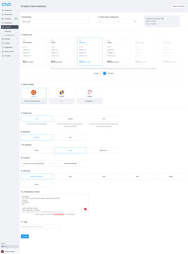
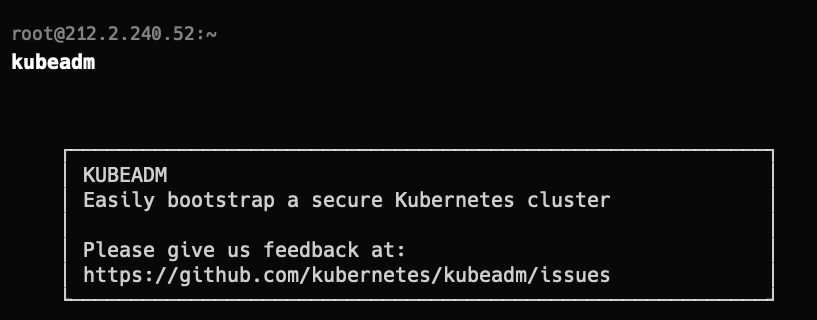
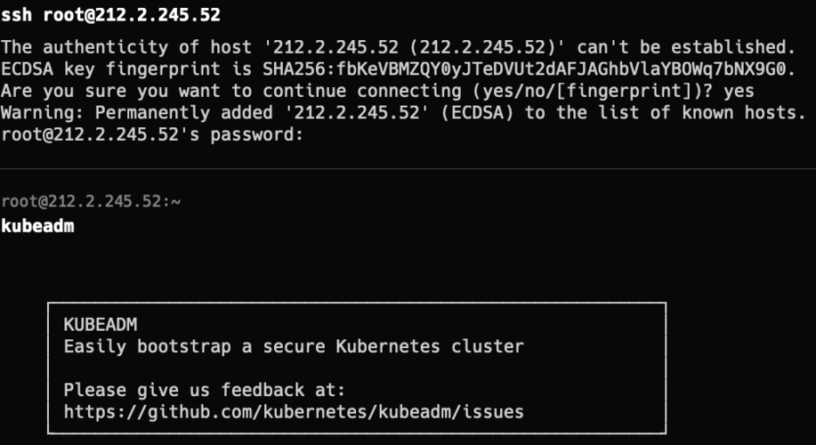

<head>
  <title>Install Scripts for Compute Instances | Civo Documentation</title>
</head>

During Civo [compute instance creation](../compute/create-an-instance.md) there is a section where you can provide an installation script. This can prove to be very useful when you want to install certain tooling on the instance or run scripts for initial setup.

In this example we will set up `containerd`, `kubeadm`, `kubectl` and `kubelet` on an instance. The use case for this can be that you can create 4 instances and have them all execute the install script on creation. After that you would need to just run `kubeadm init` and `kubeadm join` commands to set up a Kubernetes (K8s) cluster.

Although the simpler way to run your Kubernetes workloads is to just run a [Civo Kubernetes cluster](../kubernetes/) this is intended to demonstrate how to use the installation script in a real-world scenario.

On the [instance creation page](https://dashboard.civo.com/instances/new), choose `Ubuntu` as your operating system for a Medium size instance, and paste the below code in the *installation script* section:

```bash
#!/bin/bash
cat <<EOF | sudo tee /etc/modules-load.d/containerd.conf 
overlay 
br_netfilter 
EOF

sudo modprobe overlay 
sudo modprobe br_netfilter
cat <<EOF | sudo tee /etc/sysctl.d/99-kubernetes-cri.conf 
net.bridge.bridge-nf-call-iptables = 1 
net.ipv4.ip_forward = 1 
net.bridge.bridge-nf-call-ip6tables = 1 
EOF

sudo sysctl --system

sudo apt-get update && sudo apt-get install -y containerd
sudo mkdir -p /etc/containerd
sudo containerd config default | sudo tee /etc/containerd/config.toml
sudo systemctl restart containerd

sudo swapoff -a
sudo sed -i '/ swap / s/^\(.*\)$/#\1/g' /etc/fstab

sudo apt-get update && sudo apt-get install -y apt-transport-https curl

curl -s https://packages.cloud.google.com/apt/doc/apt-key.gpg | sudo apt-key add -
cat <<EOF | sudo tee /etc/apt/sources.list.d/kubernetes.list
deb https://apt.kubernetes.io/ kubernetes-xenial main
EOF
sudo apt-get update
sudo apt-get install -y kubelet=1.24.2-00 kubeadm=1.24.2-00 kubectl=1.24.2-00
sudo apt-mark hold kubelet kubeadm kubectl
```



Once the instance is created and you log in, you will be able to see the instance is ready with all the tooling that was given as part of the installation script.

Civo allows you to create multiple instances simultaneously, and each of them will run the script provided on startup:


You would therefore be able to run `kubeadm` on both instances:





This is one example to make use of the installation script functionality for instances on Civo - any shell script can automatically be executed on launch if provided when the instance is created.
