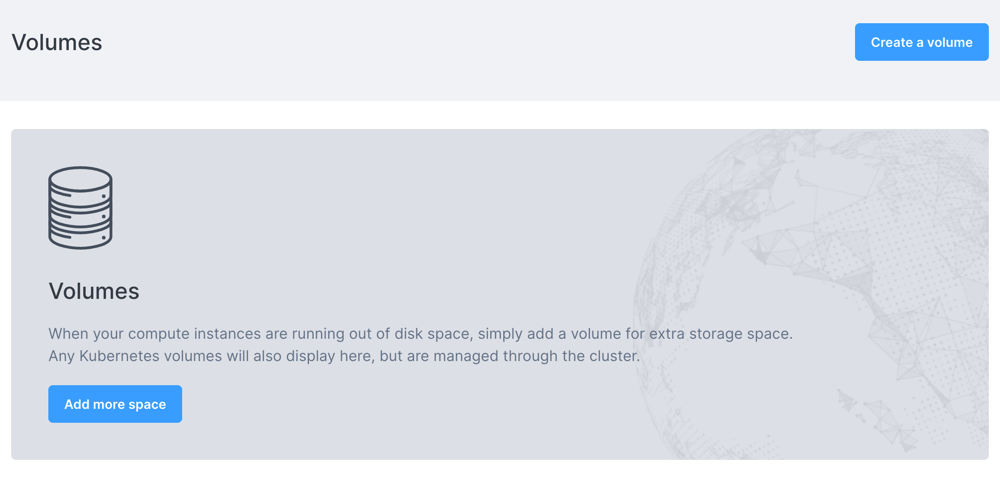
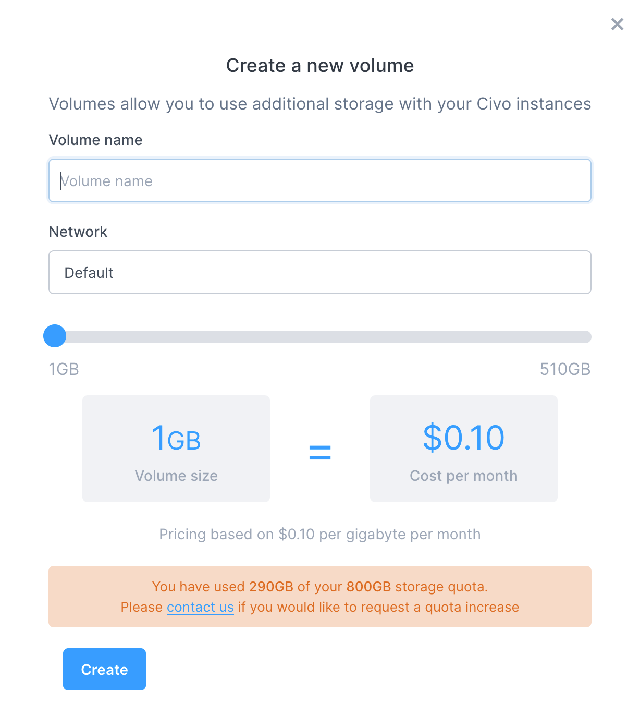
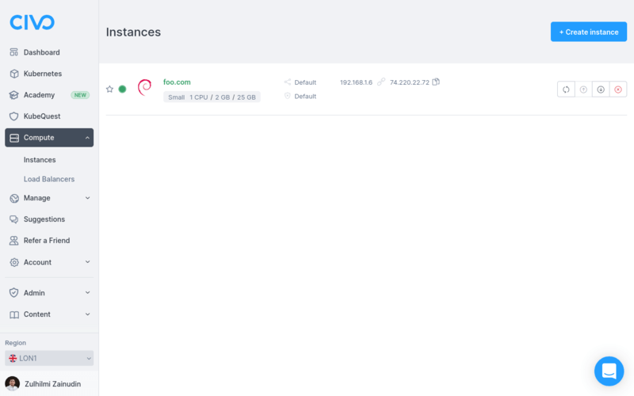
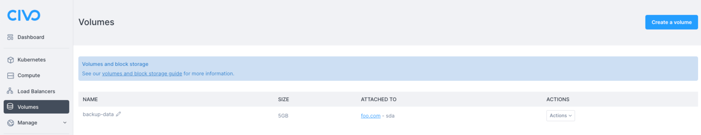
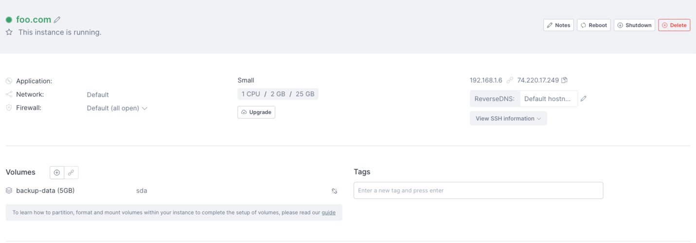

import Tabs from '@theme/Tabs';
import TabItem from '@theme/TabItem';

<head>
  <title>How to Manage Volumes for Your Civo Instances | Civo Documentation</title>
</head> 

Volumes are flexible-size additional storage for instances. By creating a volume and associating it with an instance, an additional virtual disk will be made available for backups or database files that can then moved to another instance, or used as extra storage space.

Volumes take disk space on your account's quota, and can only be created up to this quota limit. For more information, see [Quota](../account/quota).

:::note
Volumes are region and network-specific. If you create a volume in one [private network](../networking/private-networks.md), it can only be mounted and used by instances in that network.
:::

<Tabs groupId="create-volumes">
<TabItem value="dashboard" label="Dashboard">

## Creating a volume on the dashboard

Navigate to the [Volumes section](https://dashboard.civo.com/volumes) of your account dashboard.



Then, click on "Create a volume":



You will be able to give your volume a name, select a [network](../networking/) if you have created any in the region, and see the pricing for your chosen size.

Click "Create". The volume will be created in your account.

You can then proceed to attach the volume to a running instance.

</TabItem>

<TabItem value="cli" label="Civo CLI">

## Creating a volume on the command line

You can create a new volume by calling `civo volume create NAME --size NUMBER_GIGABYTES`:

```console
$ civo volume create CLI-demo-volume --size 25
Created a volume called CLI-demo-volume with ID 59076ec8-edba-4071-80d0-e9cfcce37b12
```

By default, the volume is created in the `default` network in your currently-selected region. You can use the switch `--network NETWORK_ID` to specify a [private network](../networking/private-networks.md) in which to create the volume.

You can see all available options for volume creation on the CLI by running `civo volume create --help`.

## Attaching a volume to an instance on the command line

Mounting (Attaching) a volume onto an instance will allow that instance to use the volume as a drive. The command syntax is `civo volume attach VOLUME_NAME INSTANCE_NAME`:

```console
$ civo volume attach CLI-demo-volume api-demo.test
The volume called CLI-demo-volume with ID 59076ec8-edba-4071-80d0-e9cfcce37b12 was attached to the instance api-demo.test
```

If this is a newly-created volume, you would need to partition, format and mount the volume. For more information, see "Preparing and using your volumes in instances" below.

:::note
You can only attach a volume to one instance at a time.
:::


</TabItem>

<TabItem value="terraform" label="Terraform">

## Creating a volume using Terraform

### Step 1 - Add region to provider

Since the `region` field is optional in most of Civo Terraform provider's resources and data sources (if no region is provided in the configuration or `provider.tf` file, the system will choose one for you), it's a good idea to just declare it once at the provider level.

The benefits of declaring `region` at provider level are:

* We don't have to repeat it all over the place in our configuration file(s)
* Terraform will ensure all API calls for data sources and resources communicate with a consistent region

To do so, simply update your `provider.tf` to include `region` field. Example:

```
// code omitted for brevity

provider "civo" {
  token = "<YOUR_CIVO_API_KEY>"
	region = "LON1"
}
```

### Step 2 - Prepare configuration file

Let's first create a file named `main.tf`:

```
# Change directory to Terraform project
$ cd ~/civo

# Create the file
$ touch main.tf
```

Using your favourite editor (e.g. _nano_ or VS Code), add the following code inside that file and save it:

```terraform
# Query small instance size
data "civo_size" "small" {
    filter {
        key = "name"
        values = ["g3.small"]
        match_by = "re"
    }

    filter {
        key = "type"
        values = ["instance"]
    }

}

# Query instance disk image
data "civo_disk_image" "debian" {
    filter {
        key = "name"
        values = ["debian-10"]
    }
}

# Query default network
data "civo_network" "default" {
    label = "default"
}

# Create a new instance
resource "civo_instance" "foo" {
    hostname = "foo.com"
    size = element(data.civo_size.small.sizes, 0).name
    disk_image = element(data.civo_disk_image.debian.diskimages, 0).id
}

# Create volume
resource "civo_volume" "db-backup" {
    name = "backup-data"
    size_gb = 5
    network_id = data.civo_network.default.id
}

# Create volume attachment
resource "civo_volume_attachment" "db-backup-attachment" {
    instance_id = civo_instance.foo.id
    volume_id  = civo_volume.db-backup.id
}
```

So what happens when we apply the configuration above?

* The _Query small instance size_, _Query instance disk image_ and _Create a new instance_ blocks were taken from [Launch a Civo compute instance using Terraform](../compute/create-an-instance#creating-an-instance-using-terraform) guide. Be sure to checkout that guide for the explanation.
* In the _Query default network_ block:
    * We are querying for Default network in our Civo account using [`civo_network`](https://registry.terraform.io/providers/civo/civo/latest/docs/data-sources/network) data source, by looking at
        * `label` attribute for `default` network name
    * We then can refer to this data source as `data.civo_network.default`. For example, to refer to this data source network ID, we can use `data.civo_network.default.id` syntax.
* In the  _Create volume_ block:
    * We are creating a new volume using [`civo_volume`](https://registry.terraform.io/providers/civo/civo/latest/docs/resources/volume) resource, and
        * Set its name to `backup-data`
        * Set its size to `5` GB
        * Set its network to default network we queried earlier by using `data.civo_network.default.id` syntax
    * We then can refer to this volume as `civo_volume.db-backup`. For example, to refer to this volume ID, we can use `civo_volume.db-backup.id` syntax.
* In the _Create volume attachment_ block:
    * We are creating a new volume attachment using [`civo_volume_attachment`](https://registry.terraform.io/providers/civo/civo/latest/docs/resources/volume_attachment) resource, and
        * Set its `instance_id` attribute to the `foo.com` compute instance by using `civo_instance.foo.id` syntax
        * Set its `volume_id` attribute to the `backup-data` volume by using `civo_volume.db-backup.id` syntax
    * We then can refer to this volume attachment as `civo_volume_attachment.db-backup-attachment` (if we need to). For example, to refer to this volume ID, we can use `civo_volume_attachment.db-backup-attachment.id` syntax.

Checkout [`civo_volume`](https://registry.terraform.io/providers/civo/civo/latest/docs/resources/volume) docs and [`civo_volume_attachment`](https://registry.terraform.io/providers/civo/civo/latest/docs/resources/volume_attachment) docs for more information about the resources usage.

### Step 3 - Plan

Now, you can run `terraform plan` command to see what's going to be created.

```console
$ terraform plan
Terraform used the selected providers to generate the following execution plan. Resource actions are indicated with the following symbols:
  + create

Terraform will perform the following actions:

  # civo_instance.foo will be created
  + resource "civo_instance" "foo" {
      + cpu_cores          = (known after apply)
      + created_at         = (known after apply)
      + disk_gb            = (known after apply)
      + disk_image         = "a4204155-a876-43fa-b4d6-ea2af8774560"
      + firewall_id        = (known after apply)
      + hostname           = "foo.com"
      + id                 = (known after apply)
      + initial_password   = (sensitive value)
      + initial_user       = "civo"
      + network_id         = (known after apply)
      + private_ip         = (known after apply)
      + pseudo_ip          = (known after apply)
      + public_ip          = (known after apply)
      + public_ip_required = "create"
      + ram_mb             = (known after apply)
      + size               = "g3.small"
      + source_id          = (known after apply)
      + source_type        = (known after apply)
      + status             = (known after apply)
      + template           = (known after apply)
    }

  # civo_volume.db-backup will be created
  + resource "civo_volume" "db-backup" {
      + id          = (known after apply)
      + mount_point = (known after apply)
      + name        = "backup-data"
      + network_id  = "5c16ab17-933a-46ed-96c6-8a093a0179e1"
      + size_gb     = 5
    }

  # civo_volume_attachment.db-backup-attachment will be created
  + resource "civo_volume_attachment" "db-backup-attachment" {
      + id          = (known after apply)
      + instance_id = (known after apply)
      + volume_id   = (known after apply)
    }

Plan: 3 to add, 0 to change, 0 to destroy.

──────────────────────────────────────────────────────────────────────────────────────────────────────────────────────────────────────────────────────────────────────────────────────────────────────────

Note: You didn't use the -out option to save this plan, so Terraform can't guarantee to take exactly these actions if you run "terraform apply" now.
```

As you can see from plan output above, Terraform will create the following resources in `LON1` region for us:

* A compute instance (`foo.com`) with `g3.small` size
* A volume (`backup-data`) with 5GB size in default network
* A volume attachment linking our `foo.com` compute instance and `backup-data` volume

### Step 4 - Apply

It's now time to create the actual compute instance, volume and volume attachment. Let's run `terraform apply` command. When it asks for confirmation, type `yes` and hit Enter key.

```console
$ terraform apply
Terraform used the selected providers to generate the following execution plan. Resource actions are indicated with the following symbols:
  + create

Terraform will perform the following actions:

  # civo_instance.foo will be created
  + resource "civo_instance" "foo" {
      + cpu_cores          = (known after apply)
      + created_at         = (known after apply)
      + disk_gb            = (known after apply)
      + disk_image         = "a4204155-a876-43fa-b4d6-ea2af8774560"
      + firewall_id        = (known after apply)
      + hostname           = "foo.com"
      + id                 = (known after apply)
      + initial_password   = (sensitive value)
      + initial_user       = "civo"
      + network_id         = (known after apply)
      + private_ip         = (known after apply)
      + pseudo_ip          = (known after apply)
      + public_ip          = (known after apply)
      + public_ip_required = "create"
      + ram_mb             = (known after apply)
      + size               = "g3.small"
      + source_id          = (known after apply)
      + source_type        = (known after apply)
      + status             = (known after apply)
      + template           = (known after apply)
    }

  # civo_volume.db-backup will be created
  + resource "civo_volume" "db-backup" {
      + id          = (known after apply)
      + mount_point = (known after apply)
      + name        = "backup-data"
      + network_id  = "5c16ab17-933a-46ed-96c6-8a093a0179e1"
      + size_gb     = 5
    }

  # civo_volume_attachment.db-backup-attachment will be created
  + resource "civo_volume_attachment" "db-backup-attachment" {
      + id          = (known after apply)
      + instance_id = (known after apply)
      + volume_id   = (known after apply)
    }

Plan: 3 to add, 0 to change, 0 to destroy.

Do you want to perform these actions?
  Terraform will perform the actions described above.
  Only 'yes' will be accepted to approve.

  Enter a value: yes

civo_volume.db-backup: Creating...
civo_instance.foo: Creating...
civo_volume.db-backup: Creation complete after 3s [id=06a1da94-10bc-4c29-bb19-06a422fde100]
civo_instance.foo: Still creating... [10s elapsed]
civo_instance.foo: Still creating... [20s elapsed]
civo_instance.foo: Still creating... [30s elapsed]
civo_instance.foo: Still creating... [40s elapsed]
civo_instance.foo: Still creating... [50s elapsed]
civo_instance.foo: Still creating... [1m0s elapsed]
civo_instance.foo: Creation complete after 1m6s [id=5a5c26ba-8458-4b94-8e05-03bdbe62da3c]
civo_volume_attachment.db-backup-attachment: Creating...
civo_volume_attachment.db-backup-attachment: Creation complete after 3s [id=5a5c26ba-8458-4b94-8e05-03bdbe62da3c-06a1da94-10bc-4c29-bb19-06a422fde100-20210920031423945300000001]

Apply complete! Resources: 3 added, 0 changed, 0 destroyed.
```

Now, if you refresh Civo web UI, you will see there's new compute instance created for you:



And, a new volume, attached to your compute instance:



You can see the volume got created and got attached to the the instance as well.

If you notice, there will be a new file named `terraform.tfstate` get created for you in your local project directory. And, if you print its content, it will look like:

```console
$ cat terraform.tfstate
{
  "version": 4,
  "terraform_version": "1.0.6",
  "serial": 26,
  "lineage": "aed62c49-752a-459f-efd9-479d827c0436",
  "outputs": {},
  "resources": [
    {
      "mode": "data",
      "type": "civo_disk_image",
      "name": "debian",
      "provider": "provider[\"registry.terraform.io/civo/civo\"]",
      "instances": [
        {
          "schema_version": 0,
          "attributes": {
            "diskimages": [
              {
                "id": "a4204155-a876-43fa-b4d6-ea2af8774560",
                "label": "",
                "name": "debian-10",
                "version": "10"
              }
            ],
            "filter": [
              {
                "all": false,
                "key": "name",
                "match_by": "exact",
                "values": [
                  "debian-10"
                ]
              }
            ],
            "id": "terraform-20210920031313385500000002",
            "region": null,
            "sort": null
          },
          "sensitive_attributes": []
        }
      ]
    },
    {
      "mode": "data",
      "type": "civo_instances_size",
      "name": "small",
      "provider": "provider[\"registry.terraform.io/civo/civo\"]",
      "instances": [
        {
          "schema_version": 0,
          "attributes": {
            "filter": [
              {
                "all": false,
                "key": "name",
                "match_by": "re",
                "values": [
                  "g3.small"
                ]
              },
              {
                "all": false,
                "key": "type",
                "match_by": "exact",
                "values": [
                  "instance"
                ]
              }
            ],
            "id": "terraform-20210920031313351000000001",
            "sizes": [
              {
                "cpu": 1,
                "description": "Small",
                "disk": 25,
                "name": "g3.small",
                "ram": 2048,
                "selectable": true,
                "type": "instance"
              }
            ],
            "sort": null
          },
          "sensitive_attributes": []
        }
      ]
    },
    {
      "mode": "data",
      "type": "civo_network",
      "name": "default",
      "provider": "provider[\"registry.terraform.io/civo/civo\"]",
      "instances": [
        {
          "schema_version": 0,
          "attributes": {
            "default": true,
            "id": "5c16ab17-933a-46ed-96c6-8a093a0179e1",
            "label": "Default",
            "name": "cust-433e075e-808d-default",
            "region": "LON1"
          },
          "sensitive_attributes": []
        }
      ]
    },
    {
      "mode": "managed",
      "type": "civo_instance",
      "name": "foo",
      "provider": "provider[\"registry.terraform.io/civo/civo\"]",
      "instances": [
        {
          "schema_version": 0,
          "attributes": {
            "cpu_cores": 1,
            "created_at": "0001-01-01 00:00:00 +0000 UTC",
            "disk_gb": 25,
            "disk_image": "a4204155-a876-43fa-b4d6-ea2af8774560",
            "firewall_id": "cde686be-6fbd-48e8-9777-83d805853235",
            "hostname": "foo.com",
            "id": "5a5c26ba-8458-4b94-8e05-03bdbe62da3c",
            "initial_password": "BE7Jb0Sui2Ij",
            "initial_user": "civo",
            "network_id": "5c16ab17-933a-46ed-96c6-8a093a0179e1",
            "notes": "",
            "private_ip": "192.168.1.6",
            "pseudo_ip": null,
            "public_ip": "74.220.22.72",
            "public_ip_required": "create",
            "ram_mb": 2048,
            "region": null,
            "reverse_dns": "",
            "script": "",
            "size": "g3.small",
            "source_id": "debian-10",
            "source_type": "diskimage",
            "sshkey_id": "",
            "status": "ACTIVE",
            "tags": null,
            "template": null
          },
          "sensitive_attributes": [],
          "private": "bnVsbA==",
          "dependencies": [
            "data.civo_disk_image.debian",
            "data.civo_instances_size.small"
          ]
        }
      ]
    },
    {
      "mode": "managed",
      "type": "civo_volume",
      "name": "db-backup",
      "provider": "provider[\"registry.terraform.io/civo/civo\"]",
      "instances": [
        {
          "schema_version": 0,
          "attributes": {
            "id": "06a1da94-10bc-4c29-bb19-06a422fde100",
            "mount_point": "",
            "name": "backup-data",
            "network_id": "5c16ab17-933a-46ed-96c6-8a093a0179e1",
            "region": null,
            "size_gb": 5
          },
          "sensitive_attributes": [],
          "private": "bnVsbA==",
          "dependencies": [
            "data.civo_network.default"
          ]
        }
      ]
    },
    {
      "mode": "managed",
      "type": "civo_volume_attachment",
      "name": "db-backup-attachment",
      "provider": "provider[\"registry.terraform.io/civo/civo\"]",
      "instances": [
        {
          "schema_version": 0,
          "attributes": {
            "id": "5a5c26ba-8458-4b94-8e05-03bdbe62da3c-06a1da94-10bc-4c29-bb19-06a422fde100-20210920031423945300000001",
            "instance_id": "5a5c26ba-8458-4b94-8e05-03bdbe62da3c",
            "region": null,
            "volume_id": "06a1da94-10bc-4c29-bb19-06a422fde100"
          },
          "sensitive_attributes": [],
          "private": "bnVsbA==",
          "dependencies": [
            "civo_instance.foo",
            "civo_volume.db-backup",
            "data.civo_disk_image.debian",
            "data.civo_instances_size.small",
            "data.civo_network.default"
          ]
        }
      ]
    }
  ]
}
```

That's the [Terraform state file](https://developer.hashicorp.com/terraform/language/state) that was created after you create the compute instance, volume and volume attachment just now.

When you update your `main.tf` file and run `terraform apply` again, Terraform will refresh the state file, try to understand what you want to update and update your compute instance/volume/volume attachment.

If there's no change in your `main.tf` file and you rerun `terraform apply`, it will output `No changes. Your infrastructure matches the configuration.` message back to you.
</TabItem>
</Tabs>

## Preparing and using volumes in your instances

In order to format and mount a newly-created volume, or an existing one you have detached from another instance, see [this guide](https://www.civo.com/learn/configuring-block-storage-on-civo).
