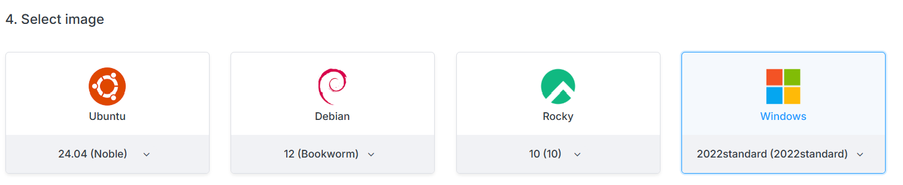
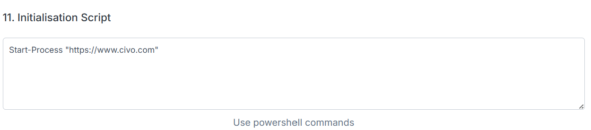

<head>
  <title>Compute Instances Running Windows | Civo Documentation</title>
</head>

import Tabs from '@theme/Tabs';
import TabItem from '@theme/TabItem';

:::note
Windows images for compute instances are available in the Civo Public Cloud and CivoStack Enterprise regions by request and need to be enabled on your account. Please see the [legal disclaimer](./windows-disk-images.md#legal-disclaimer) section below.
:::

## Creating a Windows instance

Once enabled, the option of using a Windows disk image will be available for customers on the Civo dashboard on the instance creation pages.

The Civo provided Microsoft Windows Server 2022 Standard edition images are regularly rebuilt with the latest available Windows updates.  Once an instance is deployed, keeping up with any further updates are a customer responsibility.

## Automation during instance creation

A set of PowerShell commands can be specified in the *Initialisation Script* section of the instance creation screen, which will be executed during the initial instance creation (on the first boot only).

## Known issues

### Windows Bitlocker support

Civo does not currently support the use of the Bitlocker feature, and any use of Bitlocker will require the recovery key to be entered on each reboot.

While Windows VMs have a TPM presented, this TPM is NOT persistent. The non-persistent TPM allows the use of SecureBoot; however it does not support the use of Windows Bitlocker (disk encryption). If Windows Bitlocker is enabled using the TPM, then the Bitlocker recovery key will need to be manually entered when the VM is cold booted.

### Windows Sysprep CD

The Windows Sysprep CD remains mapped to the instance following its initial configuration. The `unattend.xml` file located on the sysprep CD includes the initial administrator password, and so customers are recommended to change this initial password once the instance is successfully running.

### Remote Desktop

Windows Remote Desktop Services are enabled; this is to allow customers to remotely access their virtual machines, but can also be viewed as a security risk. The Civo [Firewall](../networking/firewalls.md) can be used to restrict access to the remote desktop service when a virtual machine instance has a public IP address assigned.

### Hostname length

Windows has a `computerName` length limitation of 15 characters, and can't be a fully qualified name given full stop characters (`.`) aren't allowed. The Windows `computeName` is set as the first 15 characters of the Civo instance name - for example, a Windows instance created with the instance name `verylongwindowsservername` will be configured as `verylongwindows`, but continue to show the long instance name on the Civo portal, CLI, in Civo API responses, and the like.

## Legal Disclaimer

Civo is providing this feature as an Authorised Outsourcer under the Microsoft Flexible Virtualisation Benefit. Licensing compliance is your responsibility and Bring Your Own Licence is required. Before deployment, please verify that your licenses are eligible for the Flexible Virtualisation Benefit.