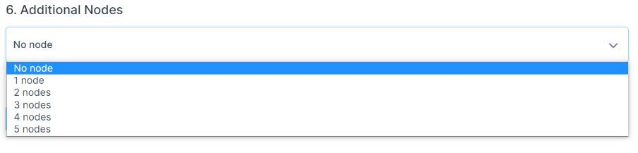

# Getting started with Civo Database

We do all the heavy lifting as our database service significantly lowers the administrative burden, allowing you to focus on developing applications.

Launching a database on Civo has a few specific requirements depending on if you are using MySQL or PostgreSQL. The documentation below covers the main options available for database launch.

## Launch your first database on the dashboard

Begin by selecting the [database section](https://dashboard.civo.com/databases) in the left-hand navigation & click the "Launch my first database" button.

This will take you to the "[Create a new database" page](https://dashboard.civo.com/databases/new):

The numbered sections give you options for the specifications of your new database.

### 1. Name

Add your database name here. This is a reference and must be unique within the Civo region you are using.

### 2. Network

When you create a database, you can assign it to a specific network. For more information, refer to the [documentation on private networks](../networking/).

### 3. Firewall

To set your database firewall, we give you 2 options:

- Choose an existing firewall from a dropdown list.

- Create a new firewall directly in the Database UI: 

:::note
By taking the second option, you acknowledge you will have to configure the firewall yourself and open all ports to all traffic until you do so.
:::

In the example above, Civo Database gives you 2 options between processing opening a network port for MySQL traffic in a firewall or security group configuration:

- *Open port 3306 for MySQL traffic*: open port 3306 to all incoming traffic, allowing any IP address to connect to the MySQL or PostgreSQL service running on the server. This is useful when you need to allow connections from multiple IP addresses, such as when running a public-facing service.
- *Open port 3306 for MySQL access from my IP only*: would restrict access to port 3306 to a specific IP address, by default the address you are connecting from. This is useful when you want to limit access to the MySQL or PostgreSQL services to a specific machine or network, such as for security reasons or when testing connectivity from a specific location.

### 4. Software

Currently, we offer two different types of database software: MySQL and PostgreSQL.

### 5. Size and pricing

Choose the RAM, CPU, and NVMe storage size needed for your new database.

:::noteBest practices
- Consider the size and complexity of your data.
- Evaluate the expected workload on your database.
- Keep in mind that you can easily scale horizontally by adding new nodes.
- Start with a size that you think will work well for your current needs.
- Adjust resources as necessary based on performance metrics and workload changes.
:::

By choosing your RAM, CPU, and NVMe storage size, you will have full transparency on the cost of your database displayed hourly or monthly. For more information on our pricing, visit [Civo’s pricing page](https://www.civo.com/pricing). For billing information, refer to [billing documentation](../account/billing.md).

### 6. Additional nodes

Civo Database provides scalable managed PostgreSQL and MySQL databases that are automatically backed up nightly. They are always-on, and for further peace of mind, you can choose to run additional nodes for your databases.

Select if you would like to add additional nodes to your database. We give you the option to add up to 5 nodes. Note that this will impact the price charged for your database.

:::noteWhy add nodes?
There are several reasons why one might add additional nodes to a database:

- Scalability: As a database grows in size and complexity, it may become necessary to add more nodes to ensure that it can handle an increasing amount of data and traffic. Adding more nodes allows for the workload to be distributed across the cluster, which can increase performance and reduce the risk of bottlenecks.

- Fault tolerance: By adding additional nodes, a database can be made more resilient to hardware failures, network outages, and other issues that can impact availability. With multiple nodes, the database can continue to operate even if one or more nodes fail.

- Improved analytics: In some cases, adding more nodes can help to support advanced analytics and data processing tasks, such as machine learning and predictive modeling. With more nodes, data can be processed faster, enabling more sophisticated analysis and modeling.
:::

Finally, click on "Create database" to make the magic happen!

