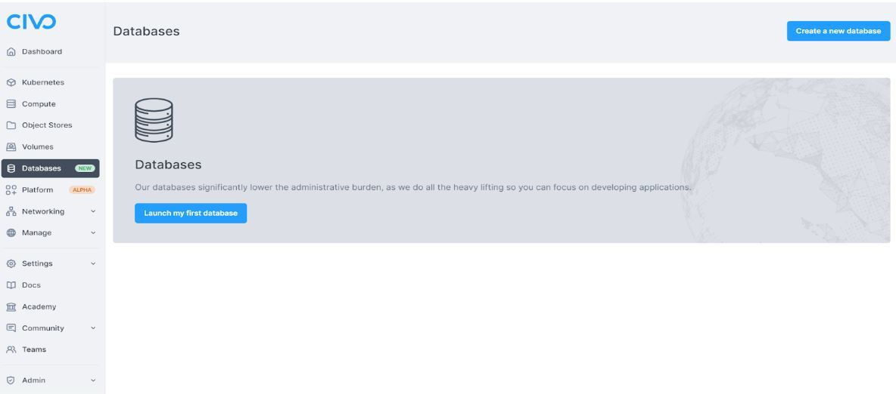
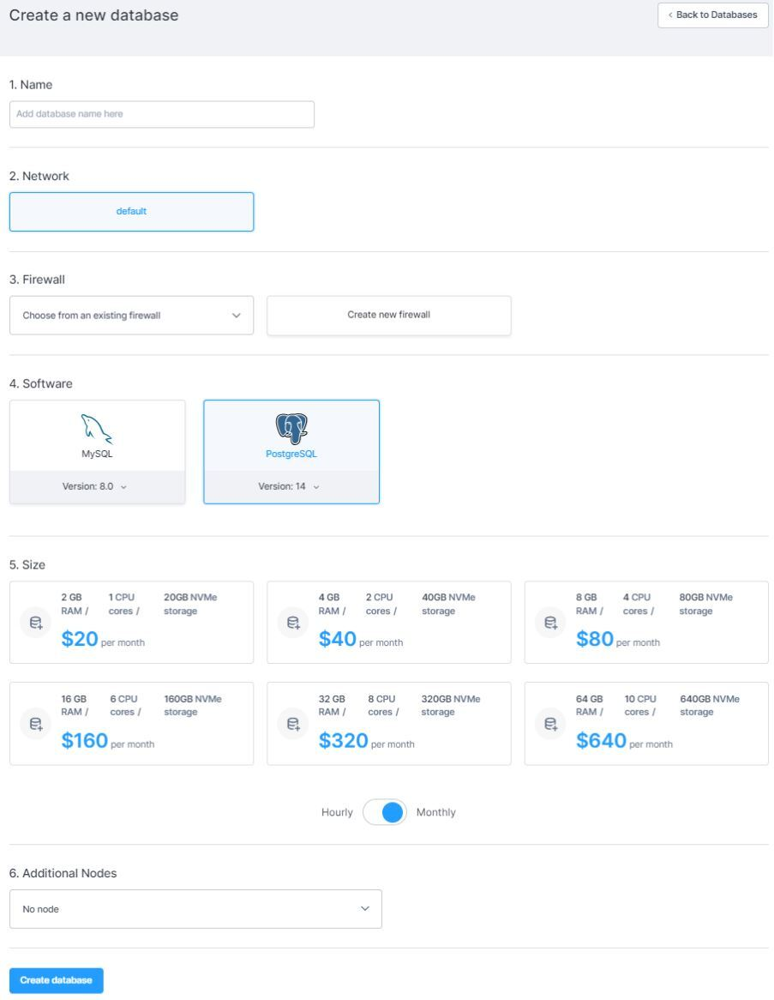
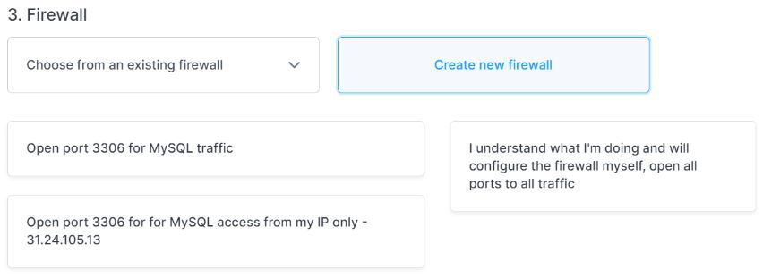
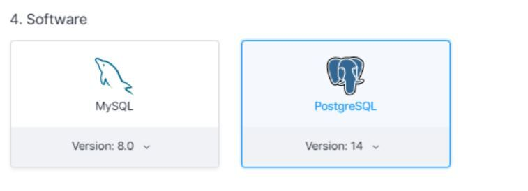
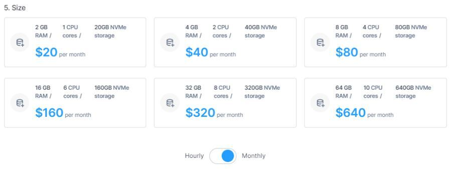
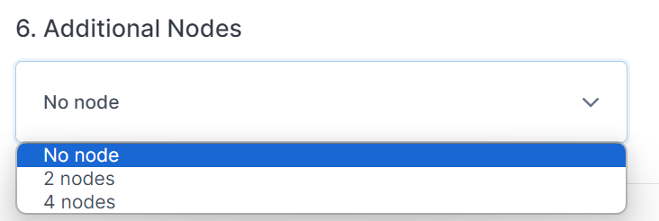
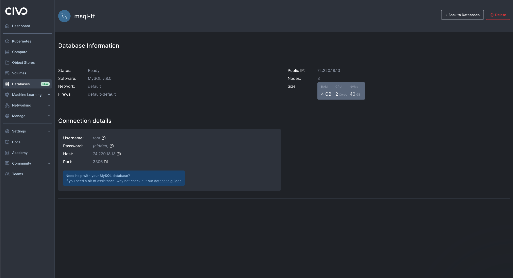

# Getting started with Civo Database

We do all the heavy lifting as our database service significantly lowers the administrative burden, allowing you to focus on developing applications.

Launching a database on Civo has a few specific requirements depending on if you are using MySQL or PostgreSQL. The documentation below covers the main options available for database launch.


import Tabs from '@theme/Tabs';
import TabItem from '@theme/TabItem';

<Tabs groupId="create-database">

<TabItem value="dashboard" label="Dashboard">

## Launch your first database on the dashboard

Begin by selecting the [database section](https://dashboard.civo.com/databases) in the left-hand navigation & click the "Launch my first database" button.



This will take you to the "[Create a new database" page](https://dashboard.civo.com/databases/new):



The numbered sections give you options for the specifications of your new database.

### 1. Name

Add your database name here. This is a reference and must be unique within the Civo region you are using.

### 2. Network

When you create a database, you can assign it to a specific network. For more information, refer to the [documentation on private networks](../networking/).

### 3. Firewall

To set your database firewall, we give you 2 options:

- Choose an existing firewall from a dropdown list.

- Create a new firewall directly in the Database UI: 



:::note
By taking the second option, you acknowledge you will have to configure the firewall yourself and open all ports to all traffic until you do so.
:::

In the example above, Civo Database gives you 2 options between processing opening a network port for MySQL traffic in a firewall or security group configuration:

- *Open port 3306 for MySQL traffic*: open port 3306 to all incoming traffic, allowing any IP address to connect to the MySQL or PostgreSQL service running on the server. This is useful when you need to allow connections from multiple IP addresses, such as when running a public-facing service.
- *Open port 3306 for MySQL access from my IP only*: would restrict access to port 3306 to a specific IP address, by default the address you are connecting from. This is useful when you want to limit access to the MySQL or PostgreSQL services to a specific machine or network, such as for security reasons or when testing connectivity from a specific location.

### 4. Software

Currently, we offer two different types of database software: MySQL and PostgreSQL.

Versions available are
- for MySQL: 8
- for PostgreSQL: 14, 15, 16, 17

Please notice that a PostgreSQL database with version 14 cannot co-exist in the same Network of a database with different version.



### 5. Size and pricing

Choose the RAM, CPU, and NVMe storage size needed for your new database.



:::note Best practices

- Consider the size and complexity of your data.
- Evaluate the expected workload on your database.
- Keep in mind that you can easily scale horizontally by adding new nodes.
- Start with a size that you think will work well for your current needs.
- Adjust resources as necessary based on performance metrics and workload changes.
:::

By choosing your RAM, CPU, and NVMe storage size, you will have full transparency on the cost of your database displayed hourly or monthly. For more information on our pricing, visit [Civo’s pricing page](https://www.civo.com/pricing). For billing information, refer to [billing documentation](../account/billing.md).

### 6. Additional nodes

Civo Database provides scalable managed PostgreSQL and MySQL databases. They are always-on, and for further peace of mind, you can choose to run additional nodes for your databases.

Select if you would like to add additional nodes to your database. We give you the option to add 2 or 4 additional nodes. Note that this will impact the price charged for your database.



:::note Why add nodes?

There are several reasons why one might add additional nodes to a database:

- Scalability: As a database grows in size and complexity, it may become necessary to add more nodes to ensure that it can handle an increasing amount of data and traffic. Adding more nodes allows for the workload to be distributed across the cluster, which can increase performance and reduce the risk of bottlenecks.

- Fault tolerance: By adding additional nodes, a database can be made more resilient to hardware failures, network outages, and other issues that can impact availability. With multiple nodes, the database can continue to operate even if one or more nodes fail.

- Improved analytics: In some cases, adding more nodes can help to support advanced analytics and data processing tasks, such as machine learning and predictive modeling. With more nodes, data can be processed faster, enabling more sophisticated analysis and modeling.
:::

Finally, click on "Create database" to make the magic happen!


Once your database is created, see the following links for connecting to your database:
 - [Connecting to your Civo MySQL Database](https://www.civo.com/docs/database/mysql/connect)
 - [Connecting to your Civo PostgreSQL Database](https://www.civo.com/docs/database/postgresql/connect)

### 7. (OPTIONAL) Connecting your Database to Kubernetes

> PREREQUISITE: In order to proceed, you must have your Database connection details in order to proceed (e.g. hostname, port, database name, username, password)

**Create a Secret in Kubernetes for Database Credentials:**
To securely store your database credentials, create a Kubernetes secret.

Create a YAML file for the secret:
```yaml
apiVersion: v1
kind: Secret
metadata:
  name: db-credentials
type: Opaque
data:
  username: <base64_encoded_username>
  password: <base64_encoded_password>
  hostname: <base64_encoded_hostname>
  port: <base64_encoded_port>
  dbname: <base64_encoded_dbname>
```

> NOTE: Replace the placeholders with your actual credentials encoded in base64. You can encode your credentials using `echo -n 'your_value' | base64`

Apply the secret to your cluster:
```bash
kubectl apply -f db-credentials.yaml
```

**Configure Your Application to Use the Database**
Now, you need to update your Kubernetes deployment or pod configuration to use the database credentials stored in the secret.

Modify your deployment YAML file to include the environment variables:
```yaml
apiVersion: apps/v1
kind: Deployment
metadata:
  name: your-app
spec:
  replicas: 1
  selector:
    matchLabels:
      app: your-app
  template:
    metadata:
      labels:
        app: your-app
    spec:
      containers:
        - name: your-container
          image: your-image
          env:
            - name: DB_USERNAME
              valueFrom:
                secretKeyRef:
                  name: db-credentials
                  key: username
            - name: DB_PASSWORD
              valueFrom:
                secretKeyRef:
                  name: db-credentials
                  key: password
            - name: DB_HOSTNAME
              valueFrom:
                secretKeyRef:
                  name: db-credentials
                  key: hostname
            - name: DB_PORT
              valueFrom:
                secretKeyRef:
                  name: db-credentials
                  key: port
            - name: DB_NAME
              valueFrom:
                secretKeyRef:
                  name: db-credentials
                  key: dbname
```

Apply the updated deployment to your cluster:
```bash
kubectl apply -f your-deployment.yaml
```

After deploying your application, ensure that it can connect to the managed database. You can check the logs of your application pods to verify the connection.
```bash
kubectl logs -l app=your-app
```

Look for any error messages related to database connectivity. If everything is configured correctly, your application should be able to communicate with the managed database.


</TabItem>

<TabItem value="cli" label="Civo CLI">

## Creating an instance using the Civo CLI 

You can create a Civo database on the command-line by running the `civo database create` command with a name as the only argument.

### Creating a database on the command line with no options

If you run `civo database create <DATABASE-NAME>` with no options,  it will create a one node database in the currently selected region,  with MySQL as the database engine and `g3.db.small` as the instance size.

### Creating a database on the command line with options 

The CLI allows you to specify a number of options, from the size of the cluster to the firewall rules, version , type of database and more. A full list of options can be found by running `civo database create --help`. 


As an example, the following command will create a one node PostgreSQL database cluster called "civo-db" of size `g3.db.medium` , with a custom firewall rule allowing access through 5432, in the LON1 region. 

`civo database create civo-db --firewall-rules "5432" --region LON1 --size g3.db.medium` 

```console 
Database (civo-db) with ID 02d46ed0-f1eb-437c-9751-bbf9c1f32f91 has been created
```

### Retrieving your Connection Details from the command line 

Once running, you can can retrieve your database connection details through the CLI by running `civo database credential [database_name]`.

```console
civo db credential civo-db

      ID : 02d46ed0-f1eb-437c-9751-bbf9c1f32f91
    Name : civo-db
    Host : 74.220.17.158:0
    Username : civo
    Password : <password>
```

### Viewing Database information on Civo CLI 

You can get a nicely-formatted information about your database by running the `civo database show [database_name]`.

```bash
civo database show civo-db
              ID : 02d46ed0-f1eb-437c-9751-bbf9c1f32f91
            Name : civo-db
          Status : Ready
            Size : g3.db.medium
           Nodes : 1
        Software : PostgreSQL
        Software Version : 14
            Host : 74.220.17.158:0
```

:::note
You will need to have set the correct [Civo region](../overview/regions.md) for where the database was created when you [set up Civo CLI](../overview/civo-cli.md), or specify it in the command with `--region` to be able to view the cluster information.
:::

### (OPTIONAL) Connecting your Database to Kubernetes

> PREREQUISITE: In order to proceed, you must have your Database connection details in order to proceed (e.g. hostname, port, database name, username, password)

**Create a Secret in Kubernetes for Database Credentials:**
To securely store your database credentials, create a Kubernetes secret.

Create a YAML file for the secret:
```yaml
apiVersion: v1
kind: Secret
metadata:
  name: db-credentials
type: Opaque
data:
  username: <base64_encoded_username>
  password: <base64_encoded_password>
  hostname: <base64_encoded_hostname>
  port: <base64_encoded_port>
  dbname: <base64_encoded_dbname>
```

> NOTE: Replace the placeholders with your actual credentials encoded in base64. You can encode your credentials using `echo -n 'your_value' | base64`

Apply the secret to your cluster:
```bash
kubectl apply -f db-credentials.yaml
```

**Configure Your Application to Use the Database**
Now, you need to update your Kubernetes deployment or pod configuration to use the database credentials stored in the secret.

Modify your deployment YAML file to include the environment variables:
```yaml
apiVersion: apps/v1
kind: Deployment
metadata:
  name: your-app
spec:
  replicas: 1
  selector:
    matchLabels:
      app: your-app
  template:
    metadata:
      labels:
        app: your-app
    spec:
      containers:
        - name: your-container
          image: your-image
          env:
            - name: DB_USERNAME
              valueFrom:
                secretKeyRef:
                  name: db-credentials
                  key: username
            - name: DB_PASSWORD
              valueFrom:
                secretKeyRef:
                  name: db-credentials
                  key: password
            - name: DB_HOSTNAME
              valueFrom:
                secretKeyRef:
                  name: db-credentials
                  key: hostname
            - name: DB_PORT
              valueFrom:
                secretKeyRef:
                  name: db-credentials
                  key: port
            - name: DB_NAME
              valueFrom:
                secretKeyRef:
                  name: db-credentials
                  key: dbname
```

Apply the updated deployment to your cluster:
```bash
kubectl apply -f your-deployment.yaml
```

After deploying your application, ensure that it can connect to the managed database. You can check the logs of your application pods to verify the connection.
```bash
kubectl logs -l app=your-app
```

Look for any error messages related to database connectivity. If everything is configured correctly, your application should be able to communicate with the managed database.

</TabItem>


<TabItem value="terraform" label="Terraform">

## Creating a Database using Terraform 

To create an instance using Terraform, you will first need to have an initialized Terraform project. Refer to the [Civo Terraform setup documentation](../overview/terraform.md) before proceeding.

First, create a file called `main.tf`, and add the following Terraform code to it:

```terraform 
# Query small instance size
data "civo_size" "small" {
  filter {
    key      = "name"
    values   = ["db.small"]
    match_by = "re"
  }
  filter {
    key    = "type"
    values = ["database"]
  }
}

# Query database version 
data "civo_database_version" "mysql" {
  filter {
    key    = "engine"
    values = ["mysql"]
  }
}

resource "civo_database" "mysql_db" {
  name    = "mysql-tf"
  region  = "LON1"
  size    = element(data.civo_size.small.sizes, 0).name
  nodes   = 2
  engine  = element(data.civo_database_version.mysql.versions, 0).engine
  version = element(data.civo_database_version.mysql.versions, 0).version
}
```

In the code above we:
use the data source `civo_size`  "small" block to retrieve details about the `db.small` size option. The filters ensure we target the correct size by searching for a name matching `db.small` using regex and specifying the `database` type.

Similarly, the data source `civo_database_version` "mysql" block gathers information about available MySQL versions. The filter here focuses on versions with the `mysql` engine.

Finally, with the desired size and version readily available, we define the `civo_database` resource. With three nodes and the engine and version, we extracted from the data source.

At the time of writing Civo currently supports PostgreSQL and MySQL with support for Redis coming soon.

:::note
when creating a database cluster you should always choose an odd number of nodes. This is because an even number doesn't guarantee stability during the leader election.
:::

### Running Terraform plan 

Once you have created the `main.tf` file with your chosen options, you can run `terraform plan` to see what's going to be created: 


```console 
terraform plan
data.civo_database_version.mysql: Reading...
data.civo_size.small: Reading...
data.civo_size.small: Read complete after 1s [id=terraform-20240105120002648500000001]
data.civo_database_version.mysql: Read complete after 1s [id=terraform-20240105120002800800000002]

Terraform used the selected providers to generate the following execution plan. Resource actions are indicated with the following symbols:
  + create

Terraform will perform the following actions:

  # civo_database.mysql_db will be created
  + resource "civo_database" "mysql_db" {
      + dns_endpoint = (known after apply)
      + endpoint     = (known after apply)
      + engine       = "MySQL"
      + firewall_id  = (known after apply)
      + id           = (known after apply)
      + name         = "mysql-tf"
      + network_id   = (known after apply)
      + nodes        = 3
      + password     = (known after apply)
      + port         = (known after apply)
      + region       = (known after apply)
      + size         = "g3.db.small"
      + status       = (known after apply)
      + username     = (known after apply)
      + version      = "8.0"
    }

Plan: 1 to add, 0 to change, 0 to destroy.
```

### Applying the configuration 

Once satisfied with the proposed change, run `terraform apply` and when prompted, type `yes`:

```console
Terraform used the selected providers to generate the following execution plan. Resource actions are indicated with the following symbols:
  + create

Terraform will perform the following actions:

  # civo_database.mysql_db will be created
  + resource "civo_database" "mysql_db" {
      + dns_endpoint = (known after apply)
      + endpoint     = (known after apply)
      + engine       = "MySQL"
      + firewall_id  = (known after apply)
      + id           = (known after apply)
      + name         = "mysql-tf"
      + network_id   = (known after apply)
      + nodes        = 3
      + password     = (known after apply)
      + port         = (known after apply)
      + region       = (known after apply)
      + size         = "g3.db.small"
      + status       = (known after apply)
      + username     = (known after apply)
      + version      = "8.0"
    }

Plan: 1 to add, 0 to change, 0 to destroy.

Do you want to perform these actions?
  Terraform will perform the actions described above.
  Only 'yes' will be accepted to approve.

  Enter a value: yes

civo_database.mysql_db: Creating...
civo_database.mysql_db: Still creating... [10s elapsed]
civo_database.mysql_db: Still creating... [20s elapsed]
civo_database.mysql_db: Still creating... [30s elapsed]
civo_database.mysql_db: Still creating... [40s elapsed]
civo_database.mysql_db: Still creating... [50s elapsed]
civo_database.mysql_db: Still creating... [1m0s elapsed]
civo_database.mysql_db: Still creating... [1m10s elapsed]
civo_database.mysql_db: Still creating... [1m20s elapsed]
civo_database.mysql_db: Still creating... [1m30s elapsed]
civo_database.mysql_db: Still creating... [1m40s elapsed]
civo_database.mysql_db: Still creating... [1m50s elapsed]
civo_database.mysql_db: Still creating... [2m0s elapsed]
civo_database.mysql_db: Still creating... [2m10s elapsed]
civo_database.mysql_db: Still creating... [2m20s elapsed]
civo_database.mysql_db: Still creating... [2m30s elapsed]
civo_database.mysql_db: Still creating... [2m40s elapsed]
civo_database.mysql_db: Still creating... [2m50s elapsed]
civo_database.mysql_db: Still creating... [3m0s elapsed]
civo_database.mysql_db: Still creating... [3m10s elapsed]
civo_database.mysql_db: Still creating... [3m20s elapsed]
civo_database.mysql_db: Still creating... [3m30s elapsed]
civo_database.mysql_db: Creation complete after 3m40s [id=97de98fb-62dd-4fd1-a147-82a9c8f8804d]

Apply complete! Resources: 1 added, 0 changed, 0 destroyed.
```
When the creation completes, refresh your [Civo dashboard](https://dashboard.civo.com/databases) and you will see there's a new database that has been created. Click it to see more details. It will look something like this:



### (OPTIONAL) Connecting your Database to Kubernetes

> PREREQUISITE: In order to proceed, you must have your Database connection details in order to proceed (e.g. hostname, port, database name, username, password)

**Create a Secret in Kubernetes for Database Credentials:**
To securely store your database credentials, create a Kubernetes secret.

Create a YAML file for the secret:
```yaml
apiVersion: v1
kind: Secret
metadata:
  name: db-credentials
type: Opaque
data:
  username: <base64_encoded_username>
  password: <base64_encoded_password>
  hostname: <base64_encoded_hostname>
  port: <base64_encoded_port>
  dbname: <base64_encoded_dbname>
```

> NOTE: Replace the placeholders with your actual credentials encoded in base64. You can encode your credentials using `echo -n 'your_value' | base64`

Apply the secret to your cluster:
```bash
kubectl apply -f db-credentials.yaml
```

**Configure Your Application to Use the Database**
Now, you need to update your Kubernetes deployment or pod configuration to use the database credentials stored in the secret.

Modify your deployment YAML file to include the environment variables:
```yaml
apiVersion: apps/v1
kind: Deployment
metadata:
  name: your-app
spec:
  replicas: 1
  selector:
    matchLabels:
      app: your-app
  template:
    metadata:
      labels:
        app: your-app
    spec:
      containers:
        - name: your-container
          image: your-image
          env:
            - name: DB_USERNAME
              valueFrom:
                secretKeyRef:
                  name: db-credentials
                  key: username
            - name: DB_PASSWORD
              valueFrom:
                secretKeyRef:
                  name: db-credentials
                  key: password
            - name: DB_HOSTNAME
              valueFrom:
                secretKeyRef:
                  name: db-credentials
                  key: hostname
            - name: DB_PORT
              valueFrom:
                secretKeyRef:
                  name: db-credentials
                  key: port
            - name: DB_NAME
              valueFrom:
                secretKeyRef:
                  name: db-credentials
                  key: dbname
```

Apply the updated deployment to your cluster:
```bash
kubectl apply -f your-deployment.yaml
```

After deploying your application, ensure that it can connect to the managed database. You can check the logs of your application pods to verify the connection.
```bash
kubectl logs -l app=your-app
```

Look for any error messages related to database connectivity. If everything is configured correctly, your application should be able to communicate with the managed database.


</TabItem>

</Tabs>
