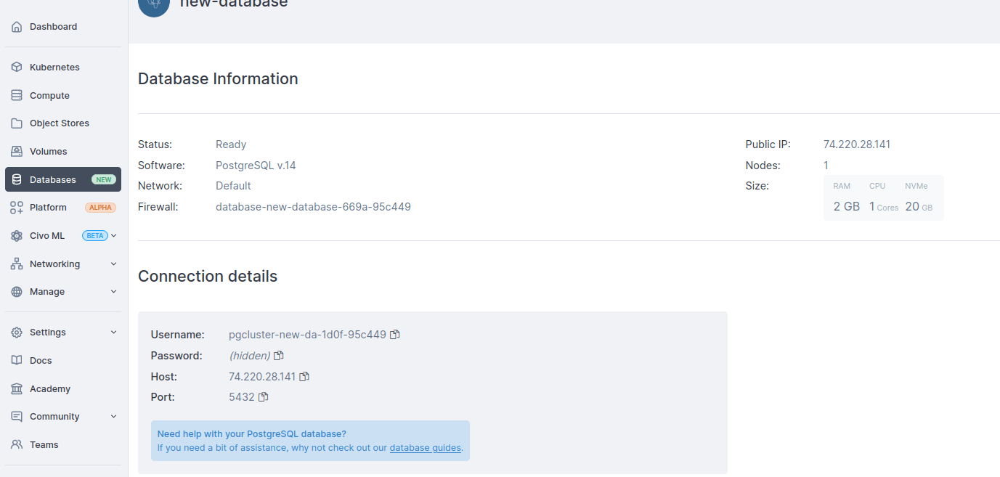
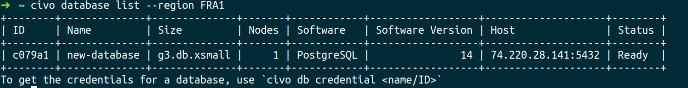
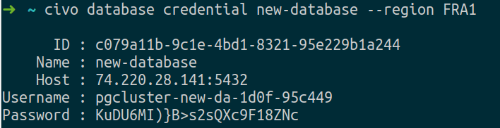
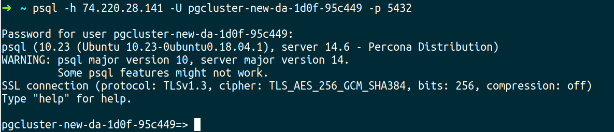
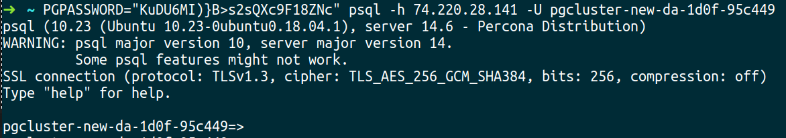
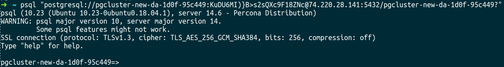

<head>
  <title>Connecting to your Civo PostgreSQL Database | Civo Documentation</title>
</head>

You can connect to the PostgreSQL database via command line tools, applications and clients. This guide explains how to retrieve your database connection details and connect to the database using the `psql` command line tool. 

## Retrieve Connection Details

### Through the Civo Dashboard

To retrieve your database connection details, go to:
- Your [Civo Dashboard](https://dashboard.civo.com/)
- Navigate to the database section in the left-hand panel:


- Select your database to view the connection details, including:
  - Host IP/FQDN, 
  - username,
  - password.



### Through the Civo CLI

Use the Civo CLI to manage your databases. Civo CLI allows you to create, update, delete, and list Civo Databases. 

- To list your databases, run:

```bash
civo database list
```



To get the credentials of a specific database, use:

```bash
civo db credential [Database_Name]
```



## Connect to your Civo PostgreSQL Database

The `psql` client command is a terminal-based front-end to PostgreSQL and is used to connect to the database.

Before connecting, ensure you have the [psql client](https://www.postgresql.org/docs/11/app-psql.html) installed on your local computer.

### Connection Command

To connect to your database using  `psql`, use the following syntax:

```bash
psql -h [PostgreSQL host IP/FQDN] -U [username] -p 5432 [database_name]
```
The default database name will be `postgres`



### Using Environment Variables for Passwords

For convenience, you can use the  `PGPASSWORD` environment variable to set the password before running the `psql` command:

```bash
export PGPASSWORD='your_password'; psql -h [PostgreSQL host IP/FQDN] -U [username] -p 5432 [database_name]
```

However, this method is less secure than entering the password when prompted.



### Connection String

Alternatively, you can connect using a connection string format:

```bash
psql "postgresql://[username]:[password]@[PostgreSQL host IP/FQDN]:5432/[database name]?"
```



## Post-Connection Validation

After connecting, you should run a test query to confirm that the connection is successful:

```bash
\l
```

## Troubleshooting Connections

If you encounter connection issues, verify that your credentials are correct and that the civo firewall allows connections from your source IP address, if you need further assistance contact support.

## Use Case Examples

To explore practical use case examples and deepen your understanding of the applications, you can find a [range of tutorials on PostgreSQL](https://www.civo.com/learn/categories/postgresql). These tutorials provide steps by steps guides and real-world applications that can widen your knowledge and usage of PostgreSQL in various scenarios.
