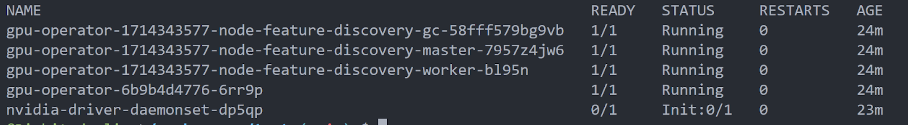
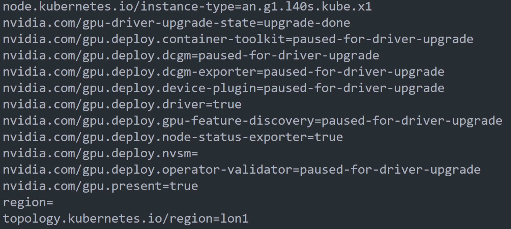

import Tabs from '@theme/Tabs';
import TabItem from '@theme/TabItem';

<head>
  <title>Creating a GPU Cluster | Civo Documentation</title>
</head>

## Overview

GPU workloads on Kubernetes power everything from large-language-model training to real-time inference and 3D rendering. Civo Kubernetes lets you add GPU node pools to a cluster and run those workloads with the standard NVIDIA tooling.

This page covers:

- The GPU types Civo offers
- How to install the NVIDIA GPU Operator on a Civo Kubernetes cluster
- The extra step required for **single-GPU H100 nodes**
- Verification and troubleshooting

## GPU Types

**Civo provides the following GPU types:**

- **NVIDIA A100 Tensor Core GPU** — available in 40 GB and 80 GB variants. Well suited to model training, LLMs, and scientific computing; delivers over 312 TFLOPS of FP16 performance across 1,248 Tensor cores.
- **NVIDIA H100 Tensor Core GPU** — Hopper-generation GPU built for AI training and inference, ideal for large models such as chatbots and recommendation engines. Single-GPU H100 nodes need one extra install step — see [Single-GPU H100 nodes: NVLink workaround](#single-gpu-h100-nodes-nvlink-workaround).
- **NVIDIA L40S GPU** — 48 GB of GDDR6 memory. A good fit for mixed AI + graphics workloads such as 3D rendering and LLM training.
- **NVIDIA B200 Tensor Core GPU** — Blackwell-generation GPU for the most demanding training and inference workloads. Runs with the standard install shown below.
- **NVIDIA GH200 Grace Hopper Superchip** — integrated CPU + GPU package tailored for generative AI, large-scale inference, and HPC workloads.

To use GPUs on Kubernetes, [add a GPU node pool to your cluster](managing-node-pools.md), then install the NVIDIA GPU Operator as described below.

:::note
GPU nodes use a separate instance SKU from standard Kubernetes nodes. Pricing and availability are shown in the Civo Dashboard when you add a node pool.
:::

## Installing the NVIDIA GPU Operator

The NVIDIA GPU Operator installs and manages the GPU driver, the device plugin, and GPU Feature Discovery. You install it once per cluster — after that, any GPU node pool you add is detected automatically.

### Before you start

1. **A Civo Kubernetes cluster with a GPU node pool.** If you don't have one yet, follow [Creating a Kubernetes cluster](../create-a-cluster.md) and add a GPU node pool.
2. **The cluster's `kubeconfig`**, downloaded from the Civo Dashboard and set as your current context.
3. **[Helm](https://helm.sh/docs/intro/install/)** installed on the machine you're running the install from.

Confirm `kubectl` is pointed at the right cluster:

```bash
kubectl get nodes
```

You should see your cluster's nodes, including the GPU worker(s).

### Install the Operator

Civo's GPU images ship with the NVIDIA container toolkit already installed, so the Operator should **not** re-install it. Use the command below — the flags match how Civo's GPU images are built.

:::note
The flags and workarounds on this page have been validated against **NVIDIA GPU Operator chart v25.10.1** (app version v25.10.1). Newer chart versions should work with the same flags, but this is the version Civo has tested end-to-end. You can pin to it with `--version 25.10.1` on the `helm upgrade --install` command.
:::

```bash
helm repo add nvidia https://helm.ngc.nvidia.com/nvidia
helm repo update

helm upgrade --install gpu-operator \
  -n gpu-operator --create-namespace \
  nvidia/gpu-operator \
  --set driver.enabled=true \
  --set toolkit.enabled=false \
  --set devicePlugin.enabled=true \
  --set gfd.enabled=true \
  --set operator.defaultRuntime=containerd \
  --set validator.cuda.runtimeClassName=nvidia
```

What each flag does:

| Flag | Purpose |
|------|---------|
| `driver.enabled=true` | Let the Operator install the matching NVIDIA driver on the GPU node. |
| `toolkit.enabled=false` | Skip container-toolkit install — it's already baked into the Civo image. |
| `devicePlugin.enabled=true` | Expose GPUs to Kubernetes as schedulable resources (`nvidia.com/gpu`). |
| `gfd.enabled=true` | Run GPU Feature Discovery so nodes are labelled with their GPU model and capabilities. |
| `operator.defaultRuntime=containerd` | Use the `containerd` runtime that Civo Kubernetes ships with. |
| `validator.cuda.runtimeClassName=nvidia` | Run the Operator's CUDA validator with the `nvidia` runtime class. |

:::note
You do not need to upgrade the Operator manually — it tracks newer driver versions and reconciles the node automatically.
:::

### Single-GPU H100 nodes: NVLink workaround

On a node with **only one H100**, the NVIDIA driver tries to bring up NVLink at load time, fails (because there is no peer GPU to link with), and the driver never becomes ready. The fix is to disable NVLink in a small kernel-module config and pass it to the Operator at install time.

Apply this **in addition to** the standard install above — it only affects driver loading, nothing else.

1. Create a ConfigMap in the `gpu-operator` namespace that disables NVLink:

   ```bash
   kubectl create namespace gpu-operator --dry-run=client -o yaml | kubectl apply -f -

   kubectl -n gpu-operator create configmap nvidia-kernel-config \
     --from-literal=nvidia.conf='options nvidia NVreg_NvLinkDisable=1' \
     --dry-run=client -o yaml | kubectl apply -f -
   ```

2. Install (or re-install) the Operator, adding `driver.kernelModuleConfig.name=nvidia-kernel-config` to the command from the previous section:

   ```bash
   helm upgrade --install gpu-operator \
     -n gpu-operator --create-namespace \
     nvidia/gpu-operator \
     --set driver.enabled=true \
     --set driver.kernelModuleConfig.name=nvidia-kernel-config \
     --set toolkit.enabled=false \
     --set devicePlugin.enabled=true \
     --set gfd.enabled=true \
     --set operator.defaultRuntime=containerd \
     --set validator.cuda.runtimeClassName=nvidia
   ```

:::warning
Only apply this workaround on **single-H100 nodes**. On multi-H100 nodes the GPUs use NVLink to talk to each other — disabling it will reduce peer-to-peer bandwidth between GPUs.
:::

### Verify the installation

Check that the Operator pods are running:

```bash
kubectl -n gpu-operator get pods
```



Then confirm the GPU node has been labelled with its GPU model and `nvidia.com/gpu.present=true`:

```bash
kubectl describe node <your-gpu-node>
```



Your cluster can now schedule pods that request `nvidia.com/gpu` resources.

## Troubleshooting

**A Helm install timed out.** Re-run the same `helm upgrade --install …` command — it is idempotent. If you prefer a one-liner that re-runs whichever release is already installed:

```bash
export HELM_RELEASE_NAME=$(helm list -n gpu-operator -q)
helm upgrade $HELM_RELEASE_NAME nvidia/gpu-operator -n gpu-operator
```

**Driver pod on an H100 node is stuck in `CrashLoopBackOff` or `Init:Error`.** This is the NVLink issue described above. Follow [Single-GPU H100 nodes: NVLink workaround](#single-gpu-h100-nodes-nvlink-workaround), then run `kubectl -n gpu-operator rollout restart daemonset/nvidia-driver-daemonset` to pick up the new config.

**Pods that request `nvidia.com/gpu` stay `Pending`.** Confirm the node has the label `nvidia.com/gpu.present=true` and that GPU Feature Discovery is running (`kubectl -n gpu-operator get pods -l app=gpu-feature-discovery`). If the labels are missing, the Operator hasn't finished provisioning the node yet — give it another minute or inspect the driver pod logs.
