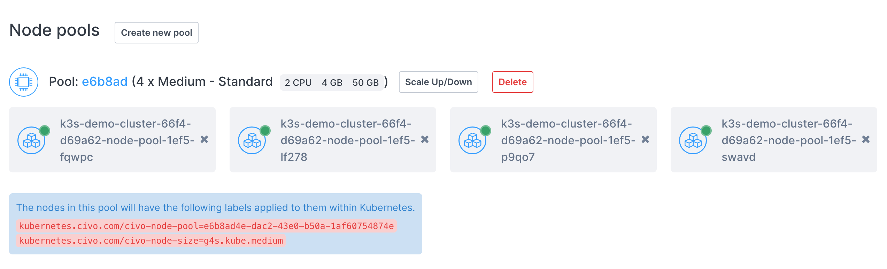
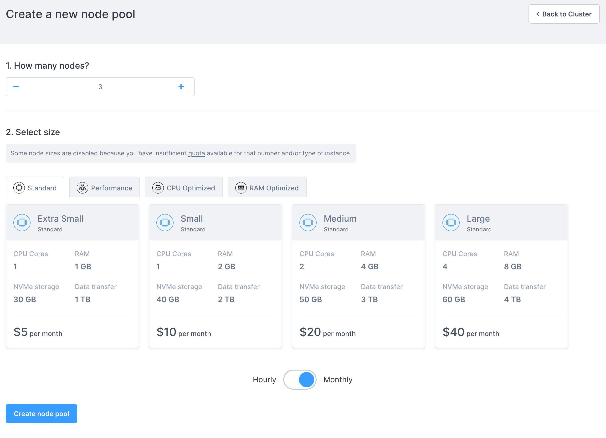
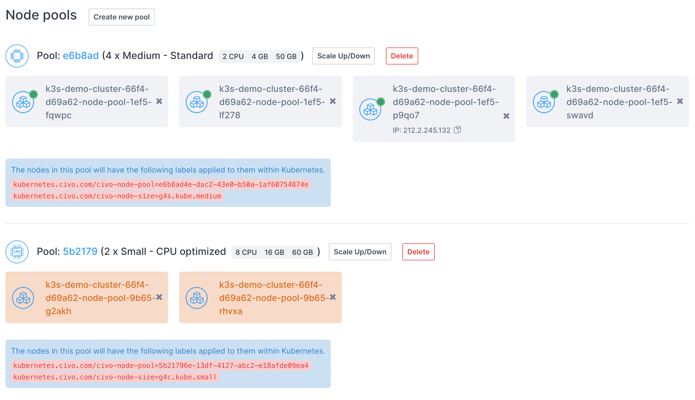
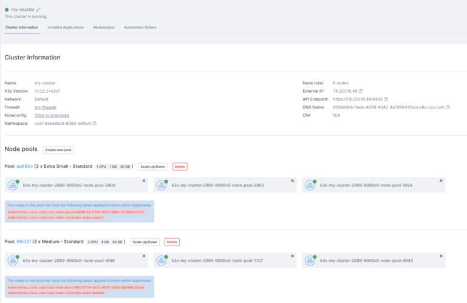
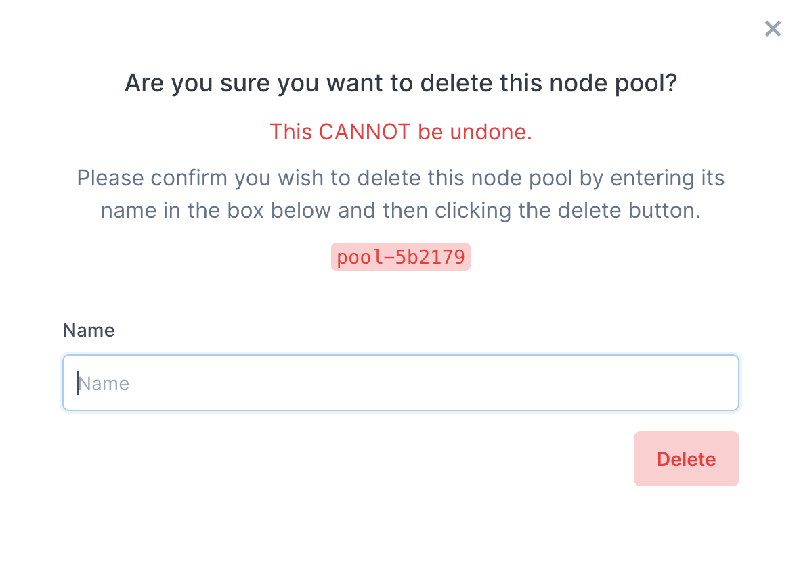
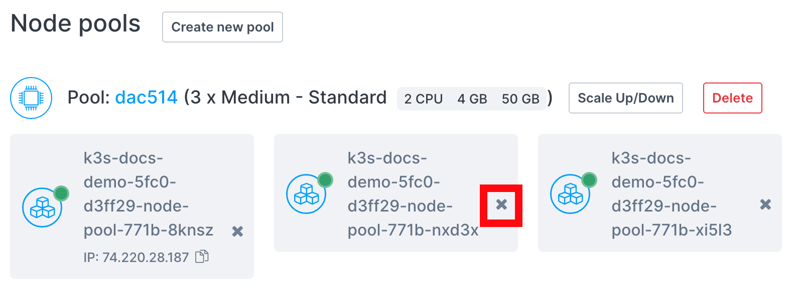
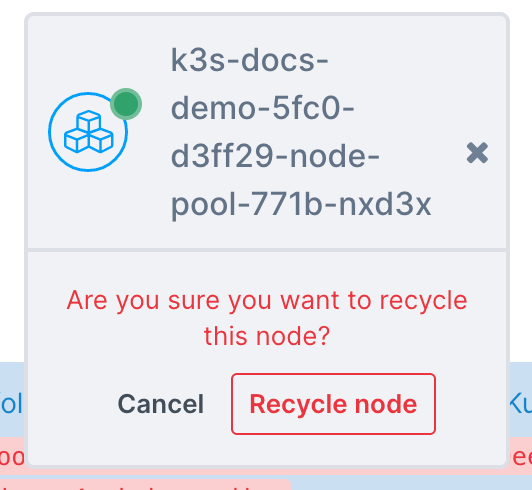

import Tabs from '@theme/Tabs';
import TabItem from '@theme/TabItem';

<head>
  <title>Managing a Civo Kubernetes Cluster's Node Pools | Civo Documentation</title>
</head> 

## Overview

You can group a cluster's worker nodes into *node pools*. The nodes in each pool are all of the same size, so if you want a cluster to have nodes of different instance sizes, you must create a new pool for each size.

:::note
When creating nodes for GPU workloads, you will need to select the "GPU Optimized" Tab when selecting the size of the node.
:::

### Adding a new node pool

<Tabs groupId="add-nodepools">

<TabItem value="dashboard-add-nodepool" label="Dashboard">

You can add a new node pool to a running cluster by clicking on "**Create new pool**" on your cluster's information page.

You will be taken to the pool creation page:

In this section, you can select the number of nodes to create in this new pool, and the specifications/size of the nodes to create. You can choose from the same sizes as when [creating a cluster](../create-a-cluster.md).

The cost per node of each type is displayed.

When you click "**Create new pool**" you will be taken back to the cluster information page and the new pool will be displayed as creating:

You can then specify specific tasks within your cluster to run on a specific pool's nodes, optimizing your cluster.

</TabItem>

<TabItem value="cli-add-nodepool" label="Civo CLI">

The command to add a node pool to a running cluster is `civo kubernetes node-pool create CLUSTER_NAME -n NUMBER -s SIZE`. For example, to add a new node pool of 2 `g4s.kube.medium` nodes to a cluster called "civo-cluster" you would use:

The `--size` or `-s` parameter is followed by the code of the type of Kubernetes node you want to create, which you can get by running `civo sizes ls`.

</TabItem>

<TabItem value="terraform-add-nodepool" label="Terraform">

### 1. Prepare the node pool configuration file

Once you have configured the [Civo Terraform provider](../../overview/terraform.md) and successfully created a [Kubernetes cluster resource](../create-a-cluster.md) in Terraform, you can define a new node pool as follows.

In the `main.tf` file, enter the following:

The sections of the above file are as follows:

- *Query xsmall instance size*
  - Using the `civo_size` data source to find a list of compute instance sizes that match the filter:
    - `type` is `kubernetes`
  - Sorting the result (instance sizes) by `RAM` in ascending order (smallest first)
  - This data source can then be referred to as `data.civo_size.xsmall`
  - To access the sizes later, we can use `data.civo_size.xsmall.sizes` syntax where `sizes` is the data source key that contains all the sizes (list)

- *Create a firewall* and *Create a firewall rule*
  - Creates a new firewall and firewall rule for the Kubernetes cluster. Specifically, we are opening port 6443 so we can communicate with our cluster from outside e.g. through the `kubectl` CLI. See the [firewall creation](../../networking/firewalls.md) documentation for more information.

- *Create a cluster*
  - Creates a new Kubernetes cluster using the [civo_kubernetes_cluster](https://registry.terraform.io/providers/civo/civo/latest/docs/resources/kubernetes_cluster) resource in the `LON1` region, with:
    - a name of `my-cluster`,
    - target node size of 3 nodes,
    - for the `target_nodes_size` field, uses the first element (index 0) from the `data.civo_size.xsmall.sizes` list defined above,
    - assigns the `firewall_id` of the firewall created earlier to the cluster,
    - a reference name of `civo_kubernetes_cluster.my-cluster` you can use to point to the cluster in other resources, if needed.

- *Query medium instance size*
  - Uses the [civo_instance_size](https://registry.terraform.io/providers/civo/civo/latest/docs/data-sources/instance_size) data source to find a list of compute instance sizes that match with these filters:
    - `name` contains `medium`,
    - `type` is `kubernetes`
  - Sorting the result (instance sizes) by `RAM` in ascending order (smallest first)
  - This data source can then be referred to as `data.civo_size.medium`
  - To access the sizes later, we can use `data.civo_size.medium.sizes` syntax where `sizes` is the data source key that contains all the sizes (list)

- *Create a nodepool*
  - Creates a new node pool using the [civo_kubernetes_node_pool](https://registry.terraform.io/providers/civo/civo/latest/docs/resources/kubernetes_node_pool) resource, and:
    - Calls it `back-end-nodepool`
    - Sets the region to be in the same region where the `my-cluster` Kubernetes cluster is located
    - Links it to the `my-cluster` cluster using the `cluster_id` attribute
    - Sets the number of nodes in the pool to `3`
    - For the `size` field, takes the first element (index 0) from the `data.civo_instances_size.medium.sizes` list fetched earlier
    - This node pool can then be referred to as `civo_kubernetes_node_pool.back-end-nodepool` in other resources, if needed

### 2. Plan

With the above configuration saved, you can run `terraform plan` to see the resources to be created:

As you can see from the plan output above, Terraform will create a cluster (my-cluster) and a second node pool of 3 Medium size nodes for us. It will also create a firewall and firewall rule for our cluster.

### 3. Apply

To apply the configuration and allow Terraform to create the resources, run `terraform apply` and type `yes` when asked for confirmation:

When the creation completes, refresh your Civo web dashboard. You should see the new cluster on the [Kubernetes page](https://dashboard.civo.com/kubernetes). Click it to see more details. It should show both node pools running:

### Updating a node pool configuration on Terraform

If you notice, there will be a new file named terraform.tfstate in your local project directory after applying the configuration. Its contents will be along the lines of the following:

This is the [Terraform State File](https://developer.hashicorp.com/terraform/language/state) which is created when the configuration is applied.

If you update your `main.tf` file and run `terraform apply` again, Terraform will refresh the state file, try to understand what you want to update and update your defined resources, in this case a cluster and its associated node pools, accordingly.

If there's no change in your `main.tf` file and you rerun `terraform apply`, it will output a `No changes. Your infrastructure matches the configuration` message back to you.

</TabItem>
</Tabs>

### Deleting a node pool

<Tabs groupId="delete-nodepools">
<TabItem value="dashboard-delete-nodepool" label="Dashboard">

You can delete a node pool entirely by clicking on the "**Delete**" button next to the node pool information.

A popup will appear asking you to confirm that you want to delete the node pool by entering its name:

The pool will be deleted as soon as you click "**Delete**" and is irreversible. All workloads in that pool will be destroyed and re-allocated in your cluster.

</TabItem>

<TabItem value="cli-delete-nodepool" label="Civo CLI">

Deletion of a node pool through the CLI uses the syntax `civo kubernetes node-pool delete CLUSTER_NAME POOL_ID`.

You can retrieve the pool ID by running `civo kubernetes show CLUSTER_NAME`. It will be shown as part of the node pools section in parentheses:

In this case the id is `52b2179`, and the cluster name is `demo-cluster`. You can delete the node pool, therefore, by running

The CLI would confirm the deletion:

</TabItem>
</Tabs>

### Recycling nodes

If you need to rebuild nodes for whatever reason, you can use the **recycle** method to rebuild a single node. 

:::note
Recycling a node will delete it entirely, rebuild a new node to match it, and attach that to your cluster. When a node is recycled, it is fully deleted. The recycle command does not drain a node, it simply deletes it before building a new node and attaching it to a cluster. It is intended for scenarios where the node itself develops an issue and must be replaced with a new one.
:::

<Tabs groupId="recycle-nodes">

<TabItem value="dashboard-recycle-node" label="Dashboard">

Recycling a node on the dashboard is done on the Kubernetes cluster management page in the Node Pools section. Each node will have its own button to recycle, highlighted in the image below:

Once you click the recycle button, you will be prompted to confirm your choice:

The confirmation is important, as the node is immediately torn down and replaced when recycled.

</TabItem>

<TabItem value="cli-recycle-node" label="Civo CLI">

The CLI command to recycle a node takes the format `civo kubernetes recycle`. This takes as arguments your cluster and the specific node you wish to recycle:

If you were to look at the output of `civo kubernetes show (cluster_name)` you would see the node being rebuilt and the status reflecting that.

</TabItem>

</Tabs>
