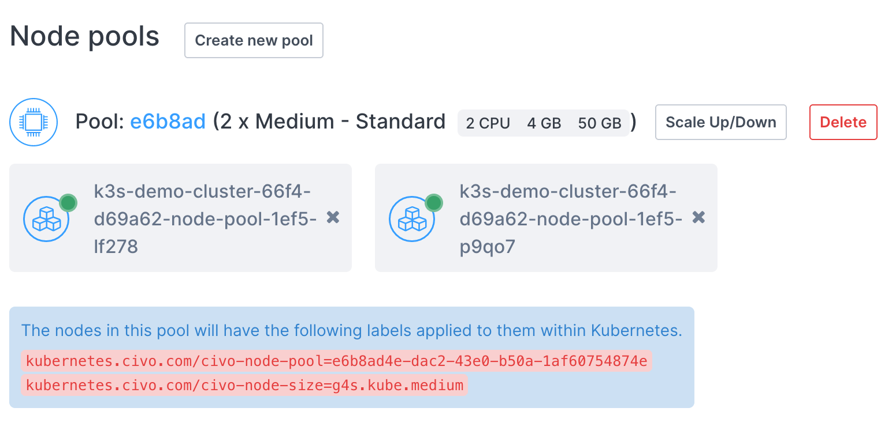
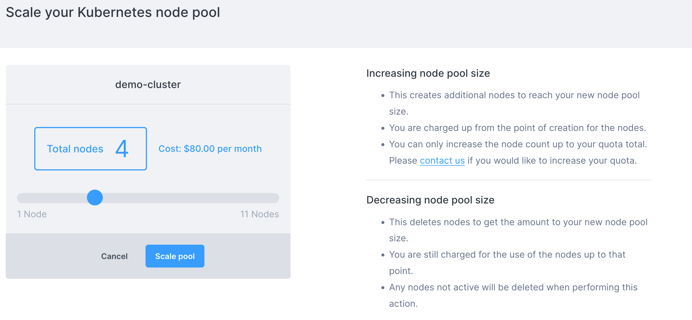
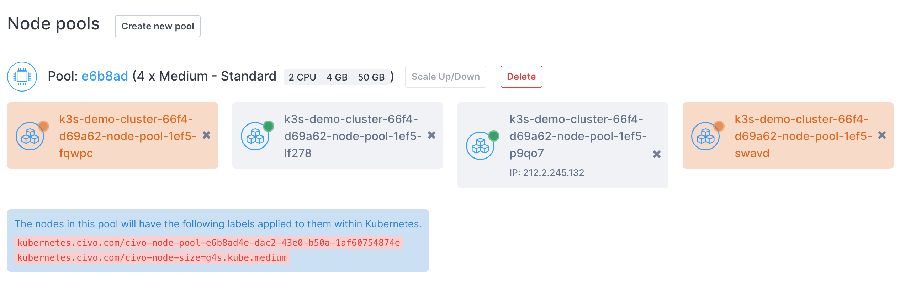

import Tabs from '@theme/Tabs';
import TabItem from '@theme/TabItem';

<head>
  <title>Scaling a Civo Kubernetes Cluster's Nodes | Civo Documentation</title>
</head> 

## Overview

You can scale the number of nodes in a cluster's node pool up or down without having to define new node pools. If you scale the number of nodes up, they will have the same specifications and labels as existing nodes in that pool.

You can scale the number of nodes [manually](#scaling-nodes-manually), or automate it by [configuring the cluster autoscaler](#using-the-civo-cluster-autoscaler).

:::tip Information on scaling down nodes

The scaling down of nodes in a cluster will be determined by the following:

- Any instance that has been explicitly requested via the API to be deleted
- Any instances that are in a building state
- Any nodes that are in a *not ready* state in your cluster
- Any nodes that are cordoned in your cluster
- Remaining nodes ordered by age in descending order
:::

## Scaling nodes manually

<Tabs groupId="scale-nodes-manually">

<TabItem value="dashboard" label="Dashboard">

### Dashboard

On a running cluster, you can scale each node pool of the cluster separately. You will find the scale button next to each node pool you are running:



When you click **Scale Up/Down**, you will be shown a page allowing you to specify the number of nodes, along with being shown the change to the cluster's billing that results:



Once you click "scale pool" you will be taken to the cluster information page and see the new amount of nodes:



If you scaled the node pool up, these nodes will take a minute or so to become available. If you scaled the pool down, the nodes are deleted immediately.

</TabItem>

<TabItem value="civo-cli" label="Civo CLI">

### Civo CLI

To scale a node pool using the Civo CLI, you need to provide the cluster name, the pool ID in question and the number of nodes required, in the form `civo kubernetes node-pool scale CLUSTER_NAME NODEPOOL_ID -n NUMBER [flags]`. You can see the pool ID by retrieving the cluster's information through `civo kubernetes show CLUSTER_NAME`.

For example, to scale the cluster `civo-cluster`'s pool `f48c05` to 3 nodes, you would use:

```bash
civo kubernetes node-pool scale civo-cluster f48c05 -n 3
```

The CLI would confirm the change:

```console
The pool (f48c0576-c30a-4a24-82dc-22b60b9ccf01) was scaled to (3) in the cluster (civo-cluster)
```

</TabItem>

<TabItem value="Terraform" label="Terraform">

### Terraform

A Terraform command to create a Civo cluster will create a `terraform.tfstate` file in your local directory. Among its contents are the defined components of the cluster, from the node types to firewall details. If you wish to scale existing node pools using Terraform, you would need to modify the specified configuration and notify Terraform of the change of state to allow it to reconcile the changes in your cluster.

Scaling an existing node pool with Terraform requires editing of the `main.tf` file, such as:

```terraform
resource "civo_kubernetes_node_pool" "back-end-nodepool" {
    region = civo_kubernetes_cluster.my-cluster.region
    cluster_id = civo_kubernetes_cluster.my-cluster.id
    size = element(data.civo_size.medium.sizes, 0).name
    node_count = 3
}
```

To scale the node pool up by 2 nodes, you would need to edit the `node_count` line to 5. Then save the file and run `terraform apply`. Because the configuration has diverged from the known state of `terraform.tfstate`, Terraform will refresh the state file, try to understand what you want to update and update your cluster/NodePool.

If there's no change in your main.tf file and you rerun `terraform apply`, it will output a `No changes. Your infrastructure matches the configuration` message back to you.

</TabItem>
</Tabs>

## Using the Civo cluster autoscaler

The Civo cluster autoscaler is an implementation of the [Kubernetes autoscaler](https://github.com/kubernetes/autoscaler/tree/master/cluster-autoscaler) that adjusts the number of nodes in a cluster down or up based on specific conditions, namely:

- If pods fail to initialize or run because nodes lack the resources to run them
- If nodes are not fully utilized, the pods performing the workload could reasonably be scheduled on other nodes.

You can set up the Civo cluster autoscaler on any running cluster by adding it as an application from the [Marketplace](https://www.civo.com/marketplace).

:::info
By default, the autoscaler is configured to scale between 1 and 10 nodes, but you can [edit the configuration](#editing-the-cluster-autoscaler-configuration) to fit your use case.
:::

### Setting up the cluster autoscaler

<Tabs groupId="setup-autoscaler">

<TabItem value="dashboard" label="Dashboard">

As a marketplace application, you can add the cluster autoscaler to any running Civo Kubernetes cluster. You will find the autoscaler in the Management group of the Marketplace when first setting up a cluster:


You can also add the autoscaler to an already-running cluster by navigating to the Marketplace tab on the cluster's management page in the dashboard:


</TabItem>

<TabItem value="civo-cli" label="Civo CLI">

If you are creating a new Kubernetes cluster, you can add the cluster autoscaler as part of the applications to add using the `-a` parameter. Please refer to the [cluster creation documentation](../create-a-cluster.md) for more information.

You can add the cluster autoscaler to a running Civo Kubernetes cluster using the CLI by running the command `civo kubernetes applications add civo-cluster-autoscaler -c <clustername>`.

For more information Civo CLI, see the [CLI documentation](../../overview/civo-cli.md).
</TabItem>

<TabItem value="terraform" label="Terraform">

To add the cluster autoscaler application via Terraform, include it in the `applications` section of the cluster definition such as the following:

```terraform
resource "civo_kubernetes_cluster" "cluster" {
  name              = "<name you want to give your cluster>"
  cluster_type      = "k3s" # k3s or talos
  applications      = "civo-cluster-autoscaler"
  network_id        = civo_network.example.id # replace with your network reference
  firewall_id       = civo_firewall.example.id # replace with your firewall reference
  pools {
      label = "pool-name"
      size = "g4s.kube.small"
      node_count = 3
  }
}
```

Refer to the [cluster creation documentation](../create-a-cluster.md) using Terraform for more options and required fields.

</TabItem>
</Tabs>

### Behind the scenes

Adding the autoscaler requires only selecting it as an application and installing it. It will be configured to run in the `kube-system` namespace as a pod:

```console
# The KUBECONFIG for a cluster with an installed autoscaler has been set as the current context
$ kubectl get pods -A
NAMESPACE     NAME                                  READY   STATUS      RESTARTS   AGE
kube-system   civo-ccm-7cb9c4b58f-7j6qr             1/1     Running     0          3m42s
kube-system   coredns-7796b77cd4-6rk9k              1/1     Running     0          3m42s
kube-system   civo-csi-node-b98bd                   2/2     Running     0          3m28s
kube-system   civo-csi-controller-0                 4/4     Running     0          3m42s
kube-system   helm-install-traefik-crd-dm927        0/1     Completed   0          3m37s
kube-system   helm-install-traefik-2286p            0/1     Completed   1          3m37s
kube-system   metrics-server-ff9dbcb6c-9d6dg        1/1     Running     0          3m42s
kube-system   traefik-sc2zv                         1/1     Running     0          3m3s
kube-system   cluster-autoscaler-855989d6d4-p7ns8   1/1     Running     0          106s
```

When you install the autoscaler onto a cluster, the system will inject a number of Kubernetes secrets into the deployment which allows the Cloud Controller Manager to scale the cluster up or down depending on the need.

You can view the full pod configuration of the autoscaler as it is set up by running kubectl describe pod cluster-autoscaler -n kube-system. Some of the notable elements, which will be discussed further below, are:

```console
Command:
      ./cluster-autoscaler
      --v=4
      --stderrthreshold=info
      --cloud-provider=civo
      --nodes=1:10:workers
      --skip-nodes-with-local-storage=false
      --skip-nodes-with-system-pods=false

Limits:
      cpu:     100m
      memory:  300Mi
Requests:
      cpu:     100m
      memory:  300Mi
```

These lines define the running configuration of the autoscaler in its default configuration, including the minimum and maximum number of nodes to scale to. The autoscaler watches for events in the cluster for CPU and memory requests from pods. If no nodes have the requested capacity available for scheduling, this triggers a scaling event in the cluster and a node is added to the pool.

```console
Environment:
      CIVO_API_URL:     <set to the key 'api-url' in secret 'civo-api-access'>     Optional: false
      CIVO_API_KEY:     <set to the key 'api-key' in secret 'civo-api-access'>     Optional: false
      CIVO_CLUSTER_ID:  <set to the key 'cluster-id' in secret 'civo-api-access'>  Optional: false
      CIVO_REGION:      <set to the key 'region' in secret 'civo-api-access'>      Optional: false
```

These secrets are automatically injected to the cluster by the application when you install it from the Civo marketplace. These allow the Cloud Controller Manager to call upon the Civo API to scale the cluster up or down. The `Optional: false` lines are significant because each of these secrets must match what your cluster and account details require in order for the scaling to work successfully.

## Editing the cluster autoscaler configuration

The cluster autoscaler default configuration can be edited to your use case. Editing the autoscaler configuration involves making alterations to its deployment definition. This can be done through the `kubectl edit` command:

```bash
kubectl edit deployment cluster-autoscaler -n kube-system
```

This will open up the default editor to allow you to make changes to the definition. When you are finished, saving the file will commit the changes back to the cluster, which will attempt to reconcile its state to match what you have written.

As an example, you can edit the minimum number of nodes from 1 to 2, which would keep the minimum worker node count at 2 even if a deployment on the cluster would be scaled down.

If you edit the autoscaler configuration with `kubectl edit deployment cluster-autoscaler -n kube-system` and change the line `--nodes=1:10:workers` to read `--nodes=2:10:workers` instead, the cluster will treat that value as the new floor for the node count. As such, if you scale the cluster to, for example, 6 nodes in the pool, the autoscaler will begin monitoring resource usage on these new nodes to potentially bring them back to line with your specification.

To trigger a scale down to the new minimum node count, you can edit the a deployment resource to edit the replicas number down. This will trigger a reconciliation of the nodes by the autoscaler within a few seconds.

You can also control the maximum number of nodes that the pool can scale to. This is set by the second number on the `--nodes=1:10:workers` line. If you wanted a node pool to be able to scale beyond 10 nodes, you could edit that number accordingly. 

:::note
Your [account quota](../../account/quota.md) will take precedence over any node scaling, and you would begin seeing "Quota Limit Reached" errors in the Cloud Controller Manager pod if the autoscaler would try to scale the node count beyond what your quota allows for.
:::
