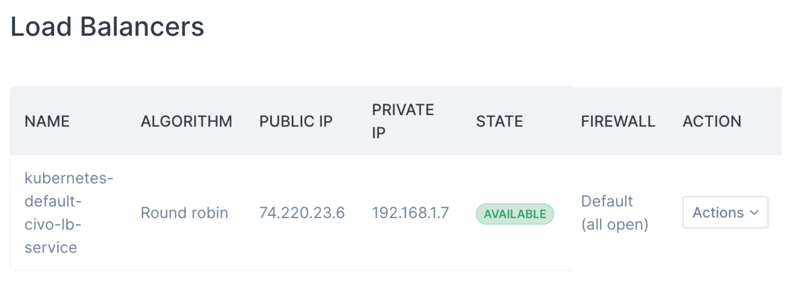

<head>
  <title>Creating Load Balancers | Civo Documentation</title>
</head>

## Overview

Load balancers distribute incoming traffic across multiple instances, improving the performance and availability of your applications. You can create and configure load balancers through the Civo dashboard to route traffic to your instances with various distribution algorithms and health checking options.

Load balancers are billed hourly according to the [current pricing](https://www.civo.com/pricing). Additional costs apply for each subsequent 10,000 concurrent requests you configure the load balancer to handle. Usage is tracked as part of your [billing](../../account/billing.md) and [quota](../../account/quota.md).

## Creating a Load Balancer

You can create a load balancer from the dashboard to distribute traffic across your instances. Load balancers can be configured with various options detailed below.

## Load Balancer Configuration Options

The following configuration options are available when creating a load balancer from the dashboard:

### Algorithm

The load balancing algorithm determines how traffic is distributed across your instances:
- **Round Robin** (default): Requests are distributed evenly across all available instances in sequence
- **Least Connections**: Requests are sent to the instance with the fewest active connections

### Network

You can select which network the load balancer should use to communicate with your instances. Choose from available networks in your account.

### Firewall

Select which firewall rules to apply to your load balancer. You can choose from existing firewalls in your account or create a new one. If no firewall is specified, the load balancer will use the default firewall configuration.

### Maximum Concurrent Requests

By default, load balancers are configured to handle 10,000 concurrent requests. You can increase this limit by entering a value above 10,000 in the dashboard. An additional charge is levied for each 10,000 requests above the default limit.

:::warning
Updating the maximum concurrent requests will cause a brief period of downtime as the load balancer rebuilds.
:::

## Instance Pools

Instance pools allow you to target specific groups of instances for traffic distribution. When configuring instance pools in the dashboard, you can specify:

### Targeting Instances
You can target instances using either:
- **Tags**: Select instances that have specific tags assigned to them
- **Names**: Directly specify instance names to include in the pool

**Note**: Only use one method (tags or names) per instance pool, not both.

### Port Configuration
For each instance pool, configure:
- **Source Port**: The port on the load balancer that will receive incoming traffic
- **Target Port**: The port on your instances where traffic should be forwarded
- **Protocol**: The protocol to use (HTTP, TCP, etc.)

### Health Checks
Configure health check settings to ensure traffic is only sent to healthy instances:
- **Health Check Port**: The port on your instances to monitor for health status
- **Health Check Path**: The path to check for HTTP health checks (e.g., `/healthz`)

## Viewing Load Balancer Details

You can view the current configuration of any load balancers on the [load balancers listing page](https://dashboard.civo.com/loadbalancers). From there, you can see details such as:

- Load balancer name and status
- Algorithm being used
- Public IP address
- Connected backends/instances

You can view more specific details of a particular load balancer by clicking on it or using the "Actions" menu and selecting "View".

## Deleting a Load Balancer

You can delete a load balancer from the dashboard by going to the load balancers listing page and using the "Actions" menu to select "Delete". Once deleted, billing for the load balancer and its associated public IP address will stop immediately.
