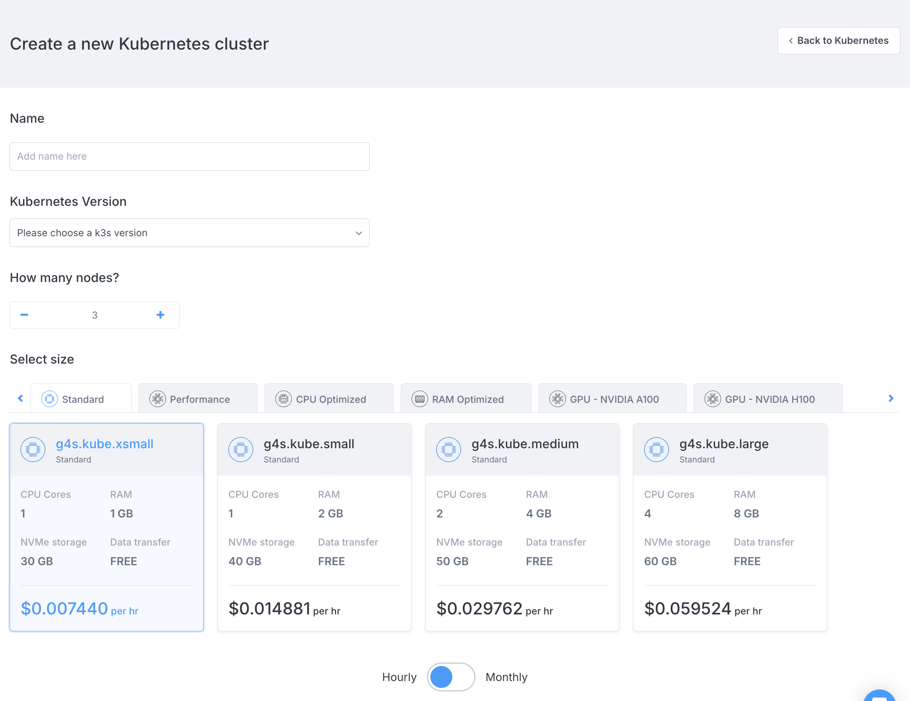
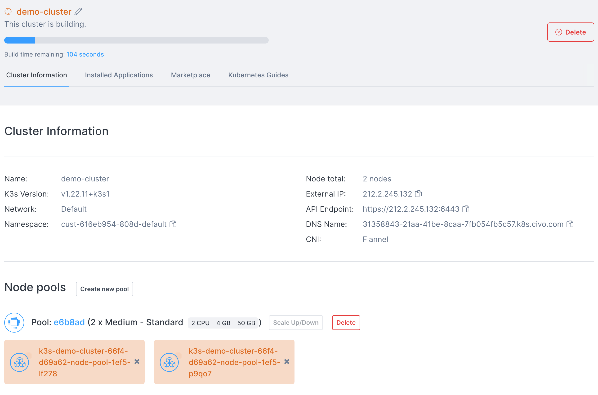
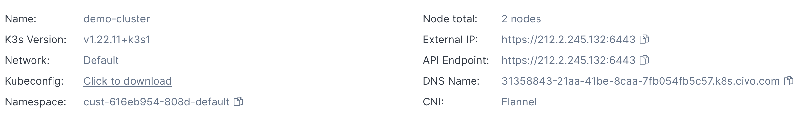

import Tabs from '@theme/Tabs';
import TabItem from '@theme/TabItem';

<head>
  <title>Creating a Kubernetes Cluster on Civo | Civo Documentation</title>
</head>

## Overview

Setting up a managed Kubernetes cluster on Civo offers a smooth experience, enabling you to personalise different components of your cluster for an ideal configuration. Civo also provides a number of CPU and GPU options to ensure optimal performance, cost-efficiency, and scalability.

Running GPU workloads (for example: TensorFlow, PyTorch, Real-time Inference) on Kubernetes requires higher computational requirements. In addition, large models require nodes with more GPU memory.

:::tip

For details on creating and configuring a GPU Cluster check out the [GPU Clusters page](../kubernetes/advanced/installing-gpu-operator.md)

:::

### Deploying Workloads on Civo Kubernetes

Civo Kubernetes supports deploying Standard, Performance, or CPU-Optimized workloads.

The following instructions outline the steps for creating a Kubernetes cluster for standard workloads, with options to set up the cluster using the Civo Dashboard, Civo CLI, or Terraform.

[//]: # (The only thing that is not clear to me based on the content below is if these steps are the same if it's a Standard, Performance or CPU-Optimzed workload, if it is that should be clearly stated)

<Tabs groupId="create-cluster">
<TabItem value="dashboard" label="Dashboard">

## Creating a Cluster with the Dashboard

### Step 1 - Select your region

Select the Civo Region in which you are operating in the lower left of your [Dashboard page](https://dashboard.civo.com).

### Step 2 - Navigate to the cluster creation page

From your Civo dashboard, navigate to the [Kubernetes cluster creation page](https://dashboard.civo.com/kubernetes/new)

    

### Step 3 - Provide your cluster details

The numbered sections give you options for the cluster details, complete the required information to create your cluster.

- **1. Name** Provide a name for your cluster. _No spaces allowed._

- **2. Number of nodes**

    Kubernetes clusters on Civo can have multiple node pools - this is the number you want to launch in the cluster's initial node pool. This can be scaled up and down once the cluster is running, and does not include the control plane node, which is handled by Civo.

- **3. Network**

    If you have created custom networks in this region, choose one of them here. Custom networks allow you to define private networking within a region, which allows you to prevent some resources from being routable to the public internet. Civo Kubernetes clusters always have a public IP address.

- **4. Firewall**

    If you have configured existing firewalls in this region, select one of them for this cluster, or create a new firewall and specify which port(s) to open. Firewall rules can be customised after creation.

- **5. Node size**

    The specifications for the machines in the initial node pool. These are priced per node, per hour. The "Hourly/Monthly" slider allows you to estimate the cost per month or per hour of the cluster running. For more information, see the [Billing section](../account/billing.md).

  - Sizes or configurations may not be available due to quota on your account or the number of nodes you have chosen in section 2 above
  - Depending on the applications you want to run on your cluster, you may need to select larger nodes.

- **6. Advanced options**

  This section allows you to optionally configure advanced options. Including the Container Networking Interface (CNI) and Cluster type.

  :::note

  Flannel and Talos Linux support are being deprecated.

  :::

- **7. Marketplace**

  Use Marketplace to remove applications and prevent them from being installed by default, or add applications to start alongside your cluster.

### Step 4 - Create your cluster

When you are satisfied with your initial cluster configuration, select "**Create cluster**" to finalize the creation and open the cluster's dashboard page. It takes a moment to become active, and displays the status during setup.



### Step 5 - Connect to your cluster

Once running, you can use `kubectl` and the downloaded `kubeconfig` file from the cluster's page to interact with your cluster. You will find the `kubeconfig` file for download in the "Cluster information" section:



</TabItem>

<TabItem value="cli" label="Civo CLI">

## Creating a Cluster Using the Civo CLI

You can create a Civo Kubernetes cluster on the command line by running the `civo kubernetes create` command, with optional parameters.

### Using the CLI with No Options

If you run `civo kubernetes create` on its own, it creates a cluster in the currently-selected region with a generated name, some default options, and return.

### Using the CLI command with Options

The CLI allows you to specify any number of options for your cluster, from the size of the nodes in the initial node pool to the firewall rules to set up, the version of Kubernetes to use, and more. A full list of options for cluster creation can be found by running `civo kubernetes create --help`.

As an example, the following command will create a 4-node K3s cluster called "civo-cluster" of _g4s.kube.medium_ nodes, with a custom firewall with only port 6443 open, in the LON1 region, and wait for the cluster to become live before saving the _kubeconfig_ alongside your current `~/.kube/config` file.

    ```bash

    civo kubernetes create civo-cluster -n 4 -s g4s.kube.medium --cluster-type k3s --create-firewall --firewall-rules "6443" --region LON1 --wait --save --merge --switch`

    ```

When you run the above, the Civo CLI shows you the completion time and confirmation that your _kubeconfig_ has been merged in, and the current context has been switched to the new cluster:

    ```console
    Merged with main kubernetes config: ~/.kube/config

    Access your cluster with:
    kubectl get node
    The cluster civo-cluster (ac1447d4-d938-4c0d-8eb6-7844b7f0a4dd) has been created in 1 min 28 sec
    ```

### Downloading the Cluster `kubeconfig` from the CLI

Once running, you can use `kubectl` and the _kubeconfig_ file from the cluster to interact with it. If you did not save the _kubeconfig_ on cluster creation, you can use `civo kubernetes config civo-cluster --save` to download the configuration and access your cluster.

## Viewing Cluster Information

Once you have a running cluster, you can get a nicely-formatted information screen by running `civo kubernetes show [cluster_name]`. You can also use a partial name or unique section of the ID to have it show, like in the following example - as long as the part of the name you input matches only one cluster, you'll get the cluster information returned:

    ```bash
    $ civo k8s show demo
                        ID : 73866847-749a-43b9-8168-65bc3cc12ffc
                      Name : docs-demo
              ClusterType : k3s
                    Region : LON1
                    Nodes : 4
                      Size : g4s.kube.medium
                    Status : ACTIVE
                  Firewall : k3s-cluster-docs-demo-0377-b72777
                  Version : 1.23.6-k3s1
              API Endpoint : https://74.220.27.254:6443
              External IP : 74.220.27.254
              DNS A record : 73866847-749a-43b9-8168-65bc3cc12ffc.k8s.civo.com
    Installed Applications : Traefik-v2-nodeport, metrics-server

    Pool (a1cd9b):
    +-------------------------------------------------+---------------+----------+-----------------+-----------+----------+---------------+
    | Name                                            | IP            | Status   | Size            | Cpu Cores | RAM (MB) | SSD disk (GB) |
    +-------------------------------------------------+---------------+----------+-----------------+-----------+----------+---------------+
    | k3s-docs-demo-614e-9e2f67-node-pool-1372-dnz9h  | 74.220.27.254 | ACTIVE   | g4s.kube.medium |         1 |     2048 |            40 |
    | k3s-docs-demo-614e-9e2f67-node-pool-1372-2u195  |               | BUILDING | g4s.kube.medium |         1 |     2048 |            40 |
    | k3s-docs-demo-614e-9e2f67-node-pool-1372-ts645  |               | ACTIVE   | g4s.kube.medium |         1 |     2048 |            40 |
    | k3s-docs-demo-614e-9e2f67-node-pool-1372-4xirw  |               | BUILDING | g4s.kube.medium |         1 |     2048 |            40 |
    +-------------------------------------------------+---------------+----------+-----------------+-----------+----------+---------------+

    Labels:
    kubernetes.civo.com/node-pool=a1cd9b96-3707-4998-8fc3-209144ad234c
    kubernetes.civo.com/node-size=g4s.kube.medium

    Applications:
    +---------------------+-----------+-----------+--------------+
    | Name                | Version   | Installed | Category     |
    +---------------------+-----------+-----------+--------------+
    | Traefik-v2-nodeport |       2.6 | true      | architecture |
    | metrics-server      | (default) | true      | architecture |
    +---------------------+-----------+-----------+--------------+
    ```

You can see that the four nodes that were requested are running, they are the size they were specified to be above, and the cluster has the default installed applications, _Traefik_ and the Kubernetes _metrics-server_ up as well. Any changes, such as scaling your cluster up/down, are immediately reflected on this status screen as shown in the _BUILDING_ state of the two nodes.

:::note
You will need to have set the correct [Civo region](../overview/regions.md) for where the cluster was created when you [set up Civo CLI](../overview/civo-cli.md), or specify it in the command with `--region` to be able to view the cluster information.
:::

</TabItem>
</Tabs>
