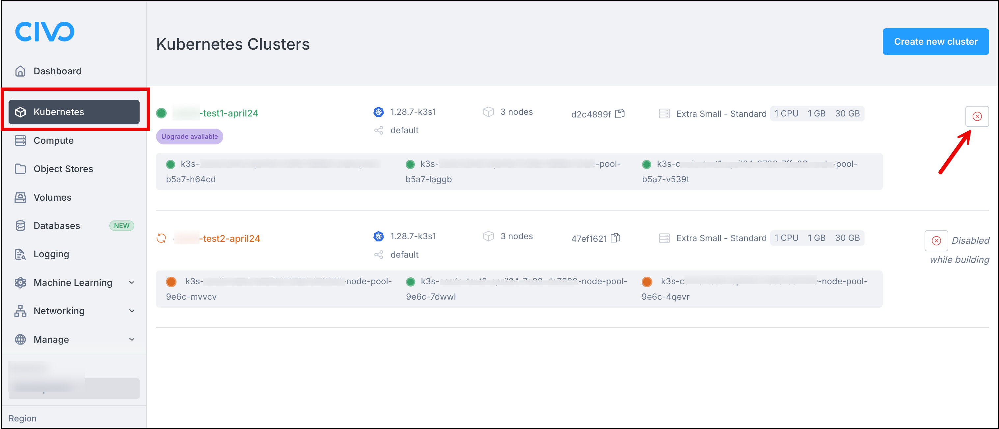

<head>
  <title>Deleting a Civo Kubernetes Cluster | Civo Documentation</title>
</head>

## Overview

Kubernetes clusters on Civo remain in your account until you delete them. Clusters in your account are [billed hourly](../account/billing.md) for each node and count towards your [account quota](../account/quota.md). If you no longer need a Kubernetes cluster, you can delete it in the following ways.

:::danger

Cluster deletion is immediate and irreversible. Retrieve any important data you may need from an instance **before** deleting it.

:::

## Steps for Deleting a Cluster

There are two easy methods for deleting a cluster from Civo. You can delete a cluster through the Civo Dashboard, or with the CIvo CLI. Refer to the steps below for the method you prefer.

### Deleting a Cluster from the Dashboard

1. After logging in to the Dashboard, navigate to **Kubernetes** , locate the cluster you want to delete. If you're viewing the full list of clusters **select the red X** at the top right corner.
  
     - From the cluster dashboard look for the **Delete** button in the top right.

    

2. As a precaution, the system asks you to confirm the name of the cluster you are looking to delete. Confirm the cluster name, and select **Delete**. The cluster is deleted immediately.

:::warning
If you have external [volumes](./config/kubernetes-volumes.md) attached to the cluster when it is deleted, these remain in your account for use. They are not automatically removed. As such, any external volumes [are billed](../account/billing.md) until they are explicitly deleted.
:::

### Deleting a Cluster using the Civo CLI

1. Ensure your current region is set to the one where the cluster is running, you can delete it using:

    ```bash
    civo kubernetes delete cluster_name
    ```

2. By default, the Civo CLI confirms whether you want to proceed:

    ```bash
    $ civo kubernetes delete demo-cluster
    Warning: Are you sure you want to delete the demo-cluster Kubernetes cluster (y/N) ? y
    The Kubernetes cluster (demo-cluster) has been deleted
    ```

:::tip
For scripting use, you can add a `-y` flag to Civo CLI commands which usually require confirmation. This assumes you answer "yes" to any prompt.
:::
