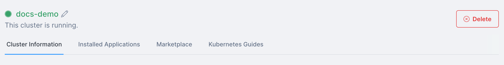

import Tabs from '@theme/Tabs';
import TabItem from '@theme/TabItem';

<head>
  <title>Deleting a Civo Kubernetes Cluster | Civo Documentation</title>
</head>

## Overview

Kubernetes clusters on Civo remain in your account until you delete them. Clusters in your account are [billed hourly](../account/billing.md) for each node and count towards your [account quota](../account/quota.md). If you no longer need a Kubernetes cluster, you can delete it in the following ways.

:::danger

Cluster deletion is immediate and irreversible. Make sure you have retrieved any data you may need from an instance before deleting it.

:::

<Tabs groupId="delete-cluster">
<TabItem value="dashboard" label="Dashboard">

## Deleting a Cluster from the Dashboard

You can delete a cluster from its dashboard page by clicking the "Delete" button on the top right of the page.



As a precaution, the system asks you to confirm the name of the cluster you are looking to delete.

When you confirm the cluster name, the system deletes the cluster immediately.

:::warning
If you have any external [volumes](./kubernetes-volumes.md) attached to the cluster when it is deleted, these remain in your account for use. They are not automatically removed. As such, any external volumes [are billed](../account/billing.md) until they are explicitly deleted.
:::
</TabItem>

<TabItem value="cli" label="Civo CLI">

## Deleting a Cluster using the Civo CLI

Ensuring your current region is set to the one where the cluster is running, you can delete it using:

  ```bash
  civo kubernetes delete cluster_name
  ```

By default, Civo CLI confirms whether you want to proceed:

  ```bash
  $ civo kubernetes delete demo-cluster
  Warning: Are you sure you want to delete the demo-cluster Kubernetes cluster (y/N) ? y
  The Kubernetes cluster (demo-cluster) has been deleted
  ```

:::tip
For scripting use, you can add a `-y` flag to Civo CLI commands which usually require confirmation. This assumes you answer "yes" to any prompt.
:::

</TabItem>
</Tabs>
