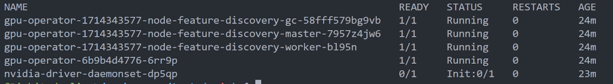
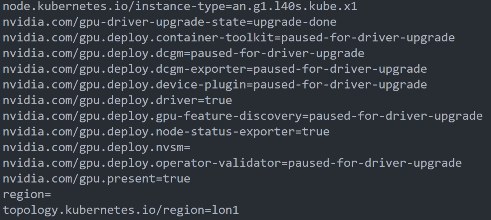

import Tabs from '@theme/Tabs';
import TabItem from '@theme/TabItem';

<head>
  <title>Installing NVIDIA GPU operator | Civo Documentation</title>
</head>

To take advantage of the Nvidia GPU in Civo Kubernetes clusters, you may wish to install a GPU operator to the cluster. This document will detail the following:
- Preparation of a Kubernetes cluster with a GPU node
- Installation of the GPU operator using Helm
- Troubleshooting
### Preparation

Start by creating a Kubernetes cluster and allocate a GPU node to it following the instructions [here](https://www.civo.com/docs/kubernetes/create-a-cluster).

You will also need to download the KUBECONFIG for the cluster once it is running.

In order to install the GPU operator, you will need to [have Helm installed](https://helm.sh/docs/intro/install/) on the machine you are working on.

Now you should be able to use Kubectl to manage the Kubernetes Cluster.

## Installation of the GPU operator using Terraform Helm

Once your KUBECONFIG is downloaded and set as your current context,  you can run the following to deploy the GPU operator:  

```bash  
kubectl create ns gpu-operator

kubectl label --overwrite ns gpu-operator pod-security.kubernetes.io/enforce=privileged

helm repo add nvidia https://helm.ngc.nvidia.com/nvidia \

    && helm repo update

helm install --wait --generate-name \

    -n gpu-operator --create-namespace \

    nvidia/gpu-operator

```  
  
:::Note: 
No upgrade the GPU operator to newer versions are needed - this process is fully automated
:::

Once you have deployed the GPU operator, run `kubectl -n gpu-operator get pods` to verify that the GPU operator is running well:


Now you are all set to use the GPU Operator, feel free to run `kubectl describe nodes` to verify that the GPU node was indeed classified to have a GPU, you would particularly see the following in the node’s labels:


### Troubleshooting

If you experience any issues during the deployment (for example if you experience a timeout), you can reattempt the deployment by rerunning:

```sh
terraform apply
```