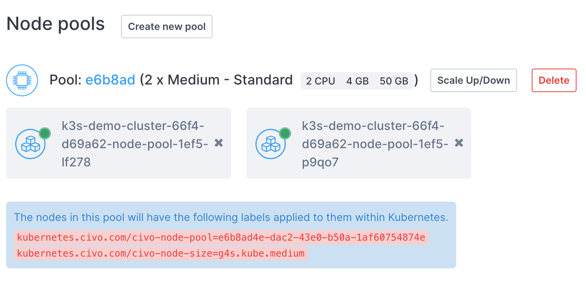
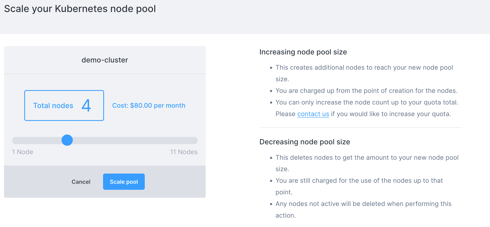
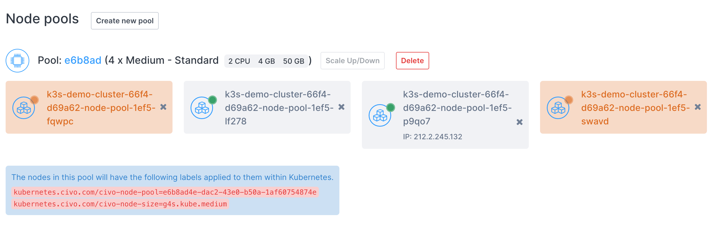

import Tabs from '@theme/Tabs';
import TabItem from '@theme/TabItem';

# Scaling a Kubernetes cluster's nodes

## Overview

You can scale the number of nodes in a cluster's node pool up or down without having to define new node pools. If you scale the number of nodes up, they will have the same specifications and labels as existing nodes in that pool.

<Tabs groupId="scale-nodes">

<TabItem value="dashboard" label="Dashboard">

## Dashboard

On a running cluster, you can scale each node pool of the cluster separately. You will find the scale button next to each node pool you are running:



When you click **Scale Up/Down**, you will be shown a page allowing you to specify the number of nodes, along with being shown the change to the cluster's billing that results:



Once you click "scale pool" you will be taken to the cluster information page and see the new amount of nodes:



If you scaled the node pool up, these nodes will take a minute or so to become available. If you scaled the pool down, the nodes are deleted immediately.

</TabItem>

<TabItem value="civo-cli" label="Civo CLI">

## Civo CLI

To scale a node pool using the Civo CLI, you need to provide the cluster name, the pool ID in question and the number of nodes required, in the form `civo kubernetes node-pool scale CLUSTER_NAME NODEPOOL_ID -n NUMBER [flags]`. You can see the pool ID by retrieving the cluster's information through `civo kubernetes show CLUSTER_NAME`.

For example, to scale the cluster `civo-cluster`'s pool `f48c05` to 3 nodes, you would use:

```bash
civo kubernetes node-pool scale civo-cluster f48c05 -n 3
```

The CLI would confirm the change:

```console
The pool (f48c0576-c30a-4a24-82dc-22b60b9ccf01) was scaled to (3) in the cluster (civo-cluster)
```

</TabItem>

<TabItem value="Terraform" label="Terraform">

## Terraform

A Terraform command to create a Civo cluster will create a `terraform.tfstate` file in your local directory. Among its contents are the defined components of the cluster, from the node types to firewall details. If you wish to scale existing node pools using Terraform, you would need to modify the specified configuration and notify Terraform of the change of state to allow it to reconcile the changes in your cluster.

Scaling an existing node pool with Terraform requires editing of the `main.tf` file, such as:

```terraform
resource "civo_kubernetes_node_pool" "back-end-nodepool" {
    region = civo_kubernetes_cluster.my-cluster.region
    cluster_id = civo_kubernetes_cluster.my-cluster.id
    size = element(data.civo_size.medium.sizes, 0).name
    node_count = 3
}
```

To scale the node pool up by 2 nodes, you would need to edit the `node_count` line to 5. Then save the file and run `terraform apply`. Because the configuration has diverged from the known state of `terraform.tfstate`, Terraform will refresh the state file, try to understand what you want to update and update your cluster/NodePool.

If there's no change in your main.tf file and you rerun terraform apply, it will output a `No changes. Your infrastructure matches the configuration` message back to you.

</TabItem>
</Tabs>