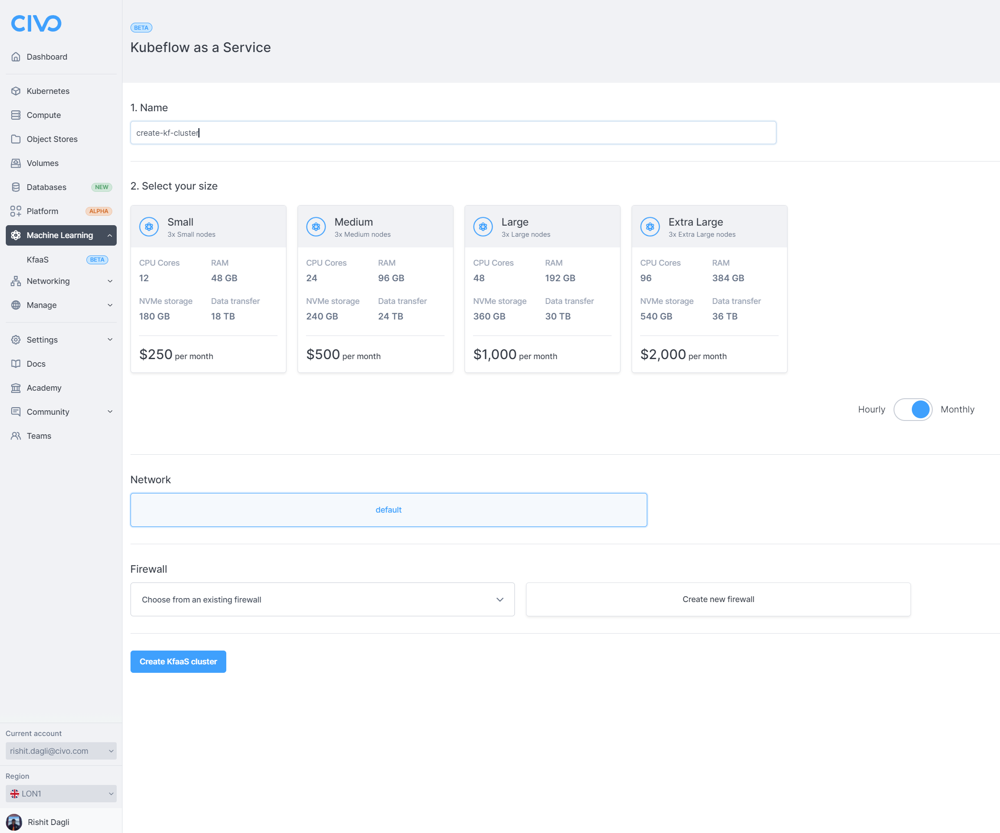

<head>
  <title>Creating a Kubeflow cluster | Civo Documentation</title>
</head>

:::note
Civo machine learning clusters are [billed hourly](../account/billing.md) and count towards your [account quota](../account/quota.md).
:::

import Tabs from '@theme/Tabs';
import TabItem from '@theme/TabItem';

## ⚠️ Deprecated Product Alert

**This managed product is deprecated and will be removed in the future.** Alternative method coming soon.

## Overview

Creating a managed Kubeflow Cluster on Civo requires a few specified parameters, whether you are starting the Kubeflow cluster through the web dashboard or using one of our API tools. The documentation below covers the main options available on initial Kubeflow cluster launch.

<Tabs groupId="create-instance">

<TabItem value="dashboard" label="Dashboard">

## Creating a Kubeflow Cluster from the Dashboard

Begin by selecting the Civo Region you are operating in. You can do so in the lower left of your [Dashboard page](https://dashboard.civo.com):


Then, navigate to the [Kubeflow Cluster creation page](https://dashboard.civo.com/kfclusters/new):



The sections give you options for the specifications of your Kubeflow Cluster.

### 1. Name

The name is the name of your Kubeflow Cluster. Names can only contain letters, numbers, dashes and full stops. Names must end on an alphanumeric character, not a dash or full stop.

### 2. Select your size

You can select the size and Kubeflow Cluster hardware specifications based on the task you want to accomplish. You can view the available sizing options [here](https://www.civo.com/pricing).

Sizing options may be restricted depending on your account quota and how many resources are already running in your account. See the [quota documentation](../account/quota.md) for more information.

The hourly/monthly slider for the pricing is purely to show the pricing equivalent at different time scales. All Civo resources are billed hourly. [Read more about billing](../account/billing.md).

:::tip
The minimum size for a managed Kubeflow cluster is the *small* size, which has the minimal resources required to run Kubeflow optimally due to its system requirements.
:::

### Firewall

You can create a new firewall along with creating this Kubeflow cluster, or choose from an existing one if present in the network. [Read more about firewalls on Civo](../networking/firewalls.md).

### Network

The [private network](../networking/private-networks.md) for the Kubeflow Cluster to be situated in. You can choose from the default network for your account in the current region, or if you have created networks prior to creating this Kubeflow Cluster, you can choose one of them.

### Creating your Kubeflow cluster

When you are satisfied with your initial Kubeflow cluster configuration, you can click "**Create**" and be directed to the Kubeflow Cluster's dashboard page. It will take a moment to become active, and you will be shown the status throughout as it builds:


</TabItem>

<TabItem value="cli" label="Civo CLI">

## Creating a KubeFlow cluster using the Civo CLI

You can create a Kubeflow cluster on the command line by running the `civo kfcluster create` command, with optional parameters.

:::tip

You can view the cluster creation options available on the Civo CLI by running:

```bash
civo kfcluster create --help
```

:::

### Creating an Kubeflow Cluster on the command line with no options

If you run `civo kfcluster create` on its own, it will create an Kubeflow Cluster with a random name, default options for the size, operating system, initial user and so on, in the currently-selected region, and return.

### Creating an Kubeflow Cluster on the command line with options

The CLI allows you to specify a number of options for your Kubeflow Cluster, from the size and specification of the virtual machine, to the firewall rules to set up, the version and flavour of operating system to use, and more. A full list of options for Kubeflow Cluster creation can be found by running `civo kfcluster create --help`.

As an example, the following command will create a Kubeflow Cluster in the current region, using the `g3.kf.small` Kubeflow cluster size.

```console
civo kfcluster create sample_kfcluster --size g3.kf.small
```

</TabItem>
</Tabs>

## Connect to Kubeflow Cluster

Now you can connect to the Kubeflow cluster using the dahboard URL shown on the Civo dashboard, after which you will be prompted to sign into the Kubeflow dashboard using your Civo credentials. Once you successfully sign in, you should be able to see the Kubeflow dashboard.


Now you can start using Civo's Kubeflow as a service!