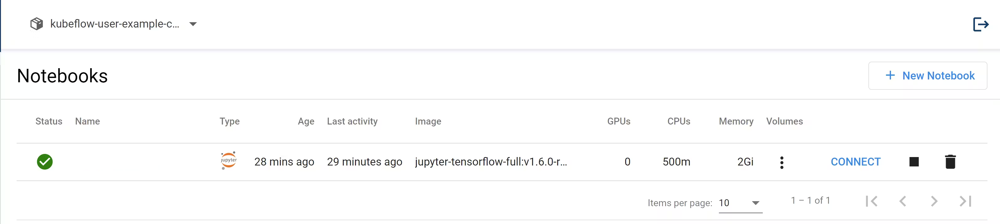

<head>
  <title>Creating a new Kubeflow notebook | Civo Documentation</title>
</head>

To create a new Kubeflow notebook, you will need to provide a name, select a development environment, and make a few architectural decisions. All of these are explained below.

## Notebook options

:::tipNamespaces
Always check on the top left corner of Kubeflow Dashboard if you are creating resources in the correct namespace.
:::

### Name

Choose a name for the notebook that makes sense for your organisation and workflow. Notebook names must be unique within a Kubeflow cluster.

### Development environment

For the notebook development environment, choose from the following options:

- **Jupyter Lab**, the renowned IPython Notebook environment. For most users, we recommend starting here.

- **VisualStudio Code**, an IDE environment with support for Jupyter notebooks. Recommended for more advanced users looking at working wider than Jupyter notebooks, or people who use VScode regularly and are familiar with it.

- **RStudio**, the first party development IDE and ecosystem for the R language. If you’re someone who prefers R over Python, this is the choice for you!

:::tipCustom environments
If you can’t find what you’re looking for or are the type of person who brings their own IDE, you’re also welcome to pull a custom container. Please ensure they meet the Kubeflow container image requirements [listed here](https://www.kubeflow.org/docs/components/notebooks/container-images/#image-requirements).
:::

### CPU / RAM

When creating a new notebook, you must specify the resources you want it to use in your cluster. The fields are:

- Minimum CPU: The scale-down utilisation of your notebook in CPU cores
- Maximum CPU: The scale up utilisation of your notebook in CPU cores, up to the core limit of your chosen Kubeflow cluster size (by default this is 120% of minimum CPU)
- Minimum Memory Gi: The minimum memory (in Gibibytes) your notebook can utilise
- Maximum Memory Gi: the maximum memory (in Gibibytes) your notebook can utilise, up to the RAM limit of your chosen Kubeflow cluster size (by default this is 120% of minimum memory)

### GPUs

:::warningGPU support coming soon
Please leave all GPU-related fields on the notebook setup page blank to prevent issues with your notebook server being created. Kubeflow will also warn you if you try to add a GPU.
:::

The Civo machine learning Kubeflow service runs a standard Kubeflow installation on your cluster, displaying all Kubeflow notebook option fields.

GPUs are not yet available on Civo, meaning that though GPU options are displayed, any values entered into these fields will prevent the notebook from starting.

GPU support is under development and this documentation will be updated to reflect the available options.

### Workspace volume

You can specify a workspace volume (new or existing) to be mounted as a PVC Volume on your home directory.

### Data volume

You can specify one or more data volumes (new or existing) to be mounted as PVC Volumes.

### Configurations

Configurations is a way to inject common data (environment variables, volumes) into notebooks. These can describe additional runtime requirements to be injected into the Pod at creation time.

### Affinity / Tolerations

You can also specify affinity and tolerations for the notebook server as described in the [Kubernetes docs](https://kubernetes.io/docs/concepts/scheduling-eviction/taint-and-toleration/).

### Shared Memory

Notebooks also allow you to enable shared memory. Common machine learning frameworks usually have methods that allow you to use shared memory, for example the `torch.multiprocessing` or `torch.Tensor.share_memory_()` APIs which heavily rely on the usage of shared memory.

## Creating your Notebook

When you are satisfied with your initial instance configuration, you can click "Create" and be directed to the instance's dashboard page. It will take a while to become active, and you will be shown when it builds:



## Accessing your Notebook Server

Once your instance is running, you will be able to connect to it using the Connect button.

## The Notebook ServiceAccount

When you create a new notebook Kubeflow by default assigns that Notebook pod the `default-editor` Kubernetes ServiceAccount. To better understand what this means for you as a user, you could run the following command in a notebook. This allows you to run `kubectl` inside it without providing additional authentication.

```
kubectl describe clusterrole kubeflow-edit
```