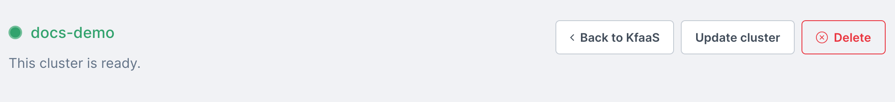
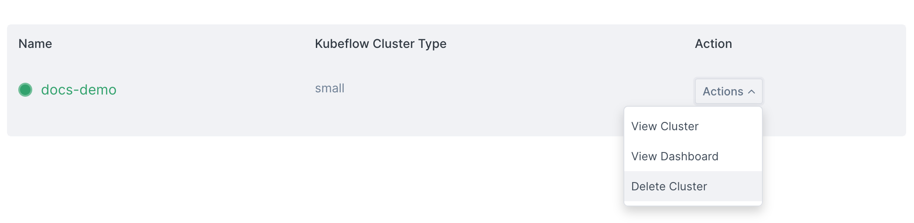

import Tabs from '@theme/Tabs';
import TabItem from '@theme/TabItem';

<head>
  <title>Deleting a Kubeflow cluster | Civo Documentation</title>
</head>

## ⚠️ Deprecated Product Alert

**This managed product is deprecated and will be removed in the future.** Alternative method coming soon.

## Overview

Kubeflow clusters created on Civo will remain in your account until you delete them. Clusters in your account are [billed hourly](../account/billing.md) based on their size, and count towards your [account quota](../account/quota.md). If you no longer need a Kubeflow cluster, you can delete it in the following ways.

:::danger

Cluster deletion is immediate and irreversible. Make sure you have retrieved any data you may need from your Kubeflow instance and any notebooks before deleting it.

:::

<Tabs groupId="delete-cluster">

<TabItem value="dashboard" label="Dashboard">

## Deleting a Kubeflow cluster from the Dashboard

You can delete a Kubeflow cluster from its dashboard page by clicking the "Delete" button on the top right of the page, also shown below:



Alternatively, you can delete a Kubeflow cluster from the listing view by clicking the "Actions" menu and selecting the "Delete" option, shown below:



As a precaution, the system will ask you to confirm the name of the cluster you are looking to delete.

When you confirm the cluster name, the system will proceed to delete the cluster immediately.

</TabItem>

<TabItem value="cli" label="Civo CLI">

## Deleting a Kubeflow cluster using Civo CLI

Ensuring your current [region](../overview/regions.md) is set to the one where the Kubeflow cluster is running, you can delete it using:

```bash
civo kfcluster delete cluster_name
```

By default, Civo CLI will confirm whether you want to proceed:

```bash
$ civo kfcluster delete demo-cluster
Warning: Are you sure you want to delete the demo-cluster Kubeflow cluster (y/N) ? y
The Kubernetes cluster (demo-cluster) has been deleted
```

:::tip
For scripting use, you can add a `-y` flag to Civo CLI commands which usually require confirmation. This will assume you will answer "yes" to any prompt.
:::

</TabItem>
</Tabs>