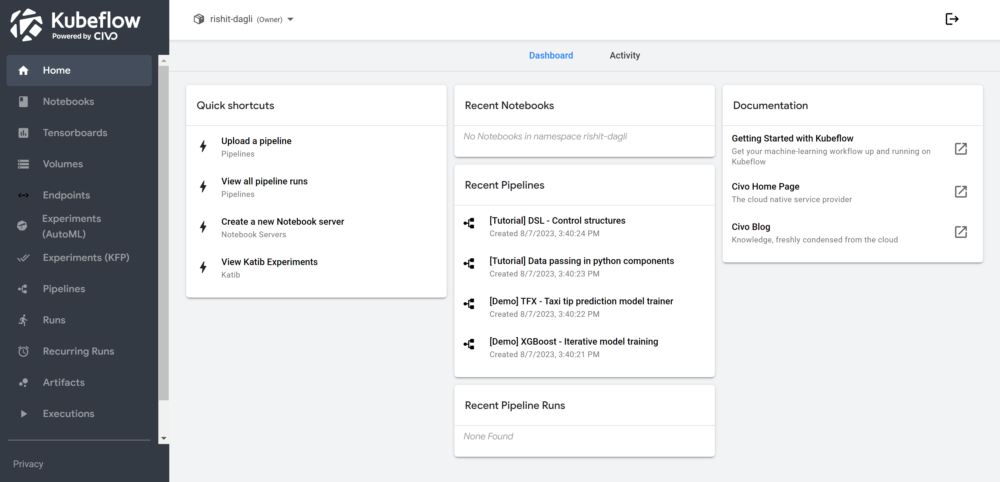
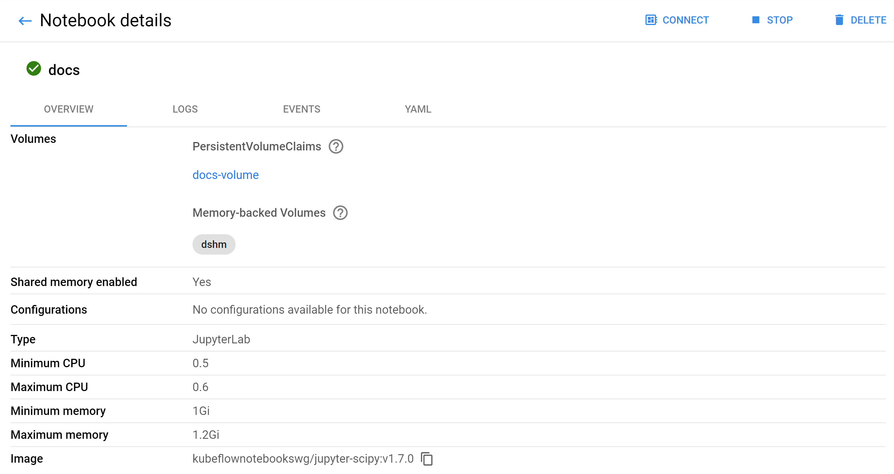

<head>
  <title>Kubeflow cluster dashboard | Civo Documentation</title>
</head>

## Logging in to your Kubeflow cluster

Once your cluster is running, you will need to authenticate yourself to access the cluster dashboard. The login credentials to use are the same ones you use to sign in to Civo.

:::noteOther user authentication
If a Kubeflow cluster administrator has given you access to a cluster they run, you will have a different mode of authentication. Ask your cluster administrator for details on how to log in to the cluster.
:::

## Kubeflow dashboard home screen

Once logged in, the Home tab will present you with an overview of your recent notebooks (Jupyter) and pipelines, quick shortcuts to your notebooks, pipelines and experiments and links to the Civo provided documentation.

The home page also contains your activities page, which can be used to troubleshoot your Kubeflow cluster and show you all active machine learning-related processes.

## Notebooks

Notebooks are the primary development environment for Kubeflow.

The Notebooks tab gives an overview of your available notebook environments and allows you to manage your existing notebooks or create new ones from pre-provided images or a custom container.

From the Notebooks dashboard you can:

- Create a new notebook
- Query and filter your notebooks
- Stop or start notebooks to free up resources or recreate an environment which you've spun down
- Delete your notebooks

Clicking on a notebook will show you all the logging, events and resources associated with that particular notebook:

## Pipelines

Pipelines is one of the most popular component of Kubeflow.

Kubeflow Pipelines allows you to easily manage, create and deploy end-to-end scalable machine learning workflows. Kubeflow Pipelines functions as an orchestrator for machine learning pipelines making experimentation and deployments pretty easy.

## Katib
<!-- Do we deploy this too in Civo Kubeflow? -->

Katib allows you to work with automated machine learning tasks, hyperparameter tuning, and neural architecture search. Finding the right values for hyperparameters is much dependent on previous experience and experimentation which is made easy with Katib.

## Training Operators

Training Operators allow you to train your machine learning models in a distributed fashion in Kubeflow. At the moment, training operators support TensorFlow, PyTorch, MXNet, and XGBoost jobs