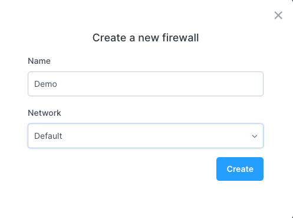
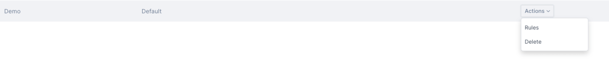
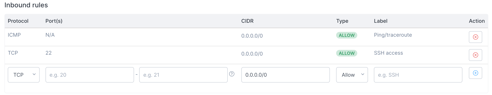
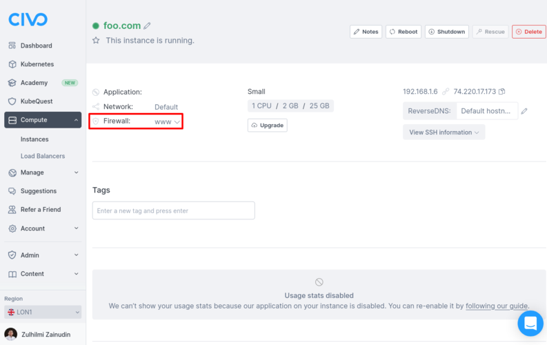
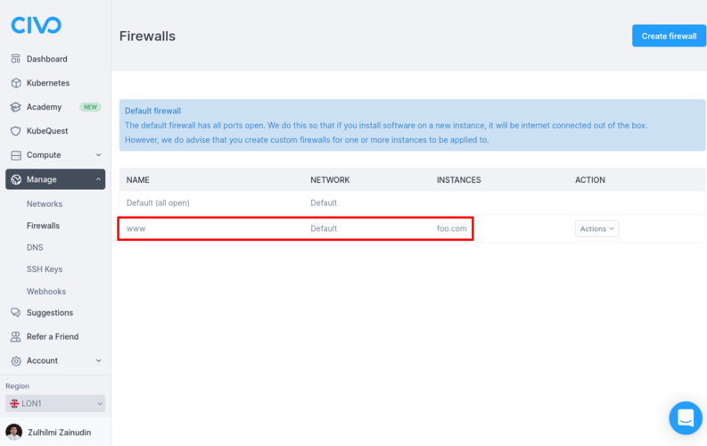

import Tabs from '@theme/Tabs';
import TabItem from '@theme/TabItem';

<head>
  <title>Using Firewalls with Civo Networking | Civo Documentation</title>
</head>

A firewall lets you control the incoming and outgoing network traffic from your cluster or instance. The `Default` firewall in each region has all ports open, but we strongly recommend you customize your firewalls for security reasons.

Firewalls are specific to a region and network: If you have a firewall in network A, it can only be used by resources running in network A.

## Listing firewalls

<Tabs groupId="list-firewalls">
<TabItem value="dashboard" label="Dashboard">

On the dashboard, you can list and manage firewalls through the [networking/firewalls](https://dashboard.civo.com/firewalls) section. In this view, you will see the firewalls by name, along with instances and clusters that are assigned to use them. By dropping down on the "Actions" button, you will be able to manage firewall rules or delete the firewall.
</TabItem>

<TabItem value="cli" label="Civo CLI">

You can see an overview of your firewalls using `civo firewall list` showing you which firewalls have been configured with rules, and whether any of your instances, clusters or load balancers are using a given firewall, such as in this case where a custom firewall called "demo-firewall" has rules defined for it, but no resources using it.

</TabItem>
</Tabs>

## Creating a firewall

<Tabs groupId="create-firewall">
<TabItem value="dashboard" label="Dashboard">

Click "Create a firewall" at the top of the [firewalls listing page](https://dashboard.civo.com/firewalls).

Enter a name for the firewall, and choose the network it belongs to. You can either choose the Default network or one of the networks created over in the [network section](https://dashboard.civo.com/networks). ([Read more about networks](./private-networks.md)).

Once the firewall is created, you can customise the inbound and outbound traffic rules. You can do so by dropping down the "Actions" menu and selecting "Rules":

This will allow you to specify a single port, or a port range, the protocol, direction and whether the rule is to allow or deny traffic:

Resources that are created or already running in the same network as the firewall can then be configured to use that firewall to control network traffic.

</TabItem>

<TabItem value="cli" label="Civo CLI">

To create a new Firewall, use the command `civo firewall create new_firewall_name`:

Once the firewall is created, you can customise the inbound and outbound traffic rules. You can do so by adding a new rule using `civo firewall rule create firewall_id` with the required and your choice of optional parameters, listed here and used in an example below:

For example:

</TabItem>

<TabItem value="terraform" label="Terraform">

### 1. Add a region to the provider

Since the `region` field is optional in most of Civo Terraform provider's resources and data sources (if no region is provided in the configuration or `provider.tf` file, the system will choose one for you), it's a good idea to just declare it once at the provider level.

The benefits of declaring region at provider level are:

- We don't have to repeat it all over the place in our configuration file(s)
- Terraform will ensure all API calls for data sources and resources communicate with a consistent region

To do so, simply update your `provider.tf` to include a `region` field. Example:

### 2. Prepare a configuration file

Create a file named `main.tf` and add your Terraform configuration. The configuration should include:

- The `Query small instance size` and `Query instance disk image` blocks, we are querying for a list of instance sizes and disk images to be used when creating a Civo compute instance later. For more detail about these blocks, see the [Terraform documentation on creating instances](../compute/create-an-instance.md).

- In the `Create a firewall` block:
  - A new firewall is declared using the `civo_firewall` resource and:
    - The firewall name is set to `www`.
    - This firewall can then be referred to as `civo_firewall.www`. For example, if we need to use this firewall's `id` later, the syntax will be `civo_firewall.www.id`.
- In the `Create a firewall rule` block:
  - a new firewall rule is declared using the civo_firewall_rule resource and:
    - It is linked to the `www` firewall above.
    - The protocol is set to `tcp`.
    - Both the start and end port of the rule are set to `6443` (a common port for HTTP).
    - CIDR notation is set to `0.0.0.0/0` to open the `6443` port to everyone.
    - The direction is set to `ingress` so this rule will be effective for incoming traffic (from the outside world to our compute instance).
    - The label is set to `web-server` for our reference.
    - This firewall rule can be later referred to as as `civo_firewall_rule.http` later, if desired.
    - The action is set to `allow`, this is going to add a rule to allow traffic Conversely, setting the action to `deny` will deny the traffic to the specified port(s).
- The `Create a compute instance` block is similar to the one created in the [instance creation documentation](../compute/create-an-instance.md), with the addition of a `firewall_id` line, which is pointed to `civo_firewall.www.id`. This means that when the compute instance described in the block is created, it will not use the `default` firewall. Instead, it will use the firewall created in the configuration above.

:::tip

For the full list of fields supported by `civo_firewall` and `civo_firewall_rule` resources, see the [Terraform provider documentation](https://registry.terraform.io/providers/civo/civo/latest/docs).

:::

### 3. Plan

With the above configuration saved, you can run `terraform plan` to see the resources to be created:

As you can see from the output above, what will happen later when the configuration file is applied is:

- Terraform will create a firewall named `www`
- Inside that `www` firewall, it will create a firewall rule to open port `6443` to outside world
- Then, a new compute instance will be created, and its firewall set to the new `www` firewall

### 4. Apply the configuration

To apply the configuration and allow Terraform to create the resources, run `terraform apply` and type `yes` when asked for confirmation:

When the creation completes, refresh your Civo web dashboard. You should see the new compute instance [on the instances page](https://dashboard.civo.com/instances). Click it to see more details.

Correspondingly, on the [Firewalls page](https://dashboard.civo.com/firewalls) for that region, the new firewall will be visible:

After applying the configuration, a new file named `terraform.tfstate` will be created in your local project directory. This is the Terraform state file.

This is the [Terraform State File](https://developer.hashicorp.com/terraform/language/state) which is created when the configuration is applied.

If you update your `main.tf` file and run `terraform apply` again, Terraform will refresh the state file, try to understand what you want to update and update your defined resources accordingly.

If there's no change in your `main.tf` file and you rerun `terraform apply`, it will output a `No changes. Your infrastructure matches the configuration` message back to you.
</TabItem>
</Tabs>

## Deleting a firewall

:::note

You cannot delete a firewall if an instance, cluster or other type of resource is using it. Change the firewall of such resources to be able to delete a firewall.

:::

<Tabs groupId="delete-firewall">
<TabItem value="dashboard" label="Dashboard">

On the web, you can delete a firewall from the [firewalls listing page](https://dashboard.civo.com/firewalls), using the Actions menu on the row of the firewall you want to delete.

The system will prompt you to confirm the name of the firewall to delete. When you confirm the firewall name, the system will proceed to delete it immediately.

</TabItem>

<TabItem value="cli" label="Civo CLI">

Delete a firewall using the CLI by running `civo firewall remove firewall_name` or `civo firewall remove firewall_id`:

:::tip
For scripting use, you can add a `-y` flag to Civo CLI commands which usually require confirmation. This will assume you will answer "yes" to any prompt.
:::

</TabItem>

</Tabs>
