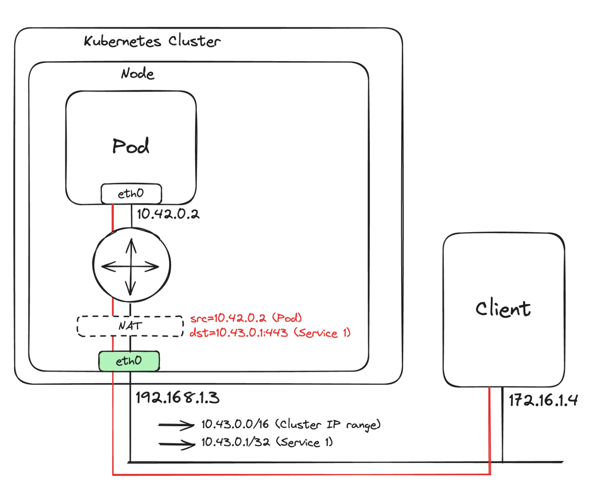

import Tabs from '@theme/Tabs';
import TabItem from '@theme/TabItem';

<head>
  <title>Preserve Source IP when using an Ingress Controller | Civo Documentation</title>
</head>

By default, when using Civo and [NGINX Ingress Controller](https://docs.nginx.com/nginx-ingress-controller/) or [Traefik](https://doc.traefik.io/traefik/), the incoming request will not pass the source IP of packets through to the Kubernetes service and ultimately to the containerized application (running in a pod). Instead, the application will see an intermediary IP (e.g. in-cluster NGINX pod’s IP as the source). With the following configuration change, the application will be able to see the source IP of packets and proceed with its business logic (i.e. If the IP is from APAC, redirect to APAC corporate site, otherwise, stay on current/global site).



This guide provides instructions on how to preserve the source IP for applications running on Kubernetes, with specific sections tailored for users of NGINX Ingress Controller and Traefik.

## Prerequisites

Before you start with the setup to preserve the source IP for applications running on Kubernetes using NGINX Ingress Controller or Traefik on Civo, ensure you have the following prerequisites in place:

- **Civo Kubernetes Cluster**: You must have an [active Civo account](https://www.civo.com/docs/account/signing-up) and a [Kubernetes cluster set up](https://www.civo.com/docs/kubernetes/create-a-cluster) on Civo.
- **Kubectl**: You must have kubectl installed on your host, in order to interact with the Kubernetes cluster via the command-line.
- **Helm**: Helm, the package manager for Kubernetes, is required for installing the NGINX Ingress Controller or Traefik. If you haven't installed Helm yet, you can do so through our [Civo Marketplace](https://www.civo.com/marketplace/helm) when setting up your cluster.
- **Access to Your Cluster**: Ensure you have downloaded the Kubeconfig from the Civo dashboard, and the appropriate role is assigned to your user in order to create deployments, services, and ingress resources within your cluster.
- **DNS Configuration (Optional)**: If you plan to test the ingress with a real domain, have access to your DNS provider to configure DNS records. This is optional for testing purposes, as you can also test using the LoadBalancer IP/DNS directly.
- **Cloudflare DNS (Recommended for Testing)**: For faster DNS propagation during testing, it's recommended to use Cloudflare's DNS servers (`1.1.1.1` and `1.0.0.1`). This step is optional but can help reduce wait times during DNS propagation.
- **jq (Optional)**: Some commands may utilize `jq`, a lightweight and flexible command-line JSON processor, for parsing command output. While not mandatory, installing `jq` could enhance your command-line experience. Visit the [jq documentation](https://stedolan.github.io/jq/download/) for installation instructions.
- **Familiarity with Kubernetes Concepts**: A basic understanding of [Kubernetes concepts](https://www.civo.com/academy/kubernetes-concepts), such as [deployments](https://www.civo.com/academy/kubernetes-setup), [services](https://www.civo.com/academy/kubernetes-services), and [ingress](https://www.civo.com/blog/intro-to-nginx-ingress-controller), is necessary to follow the instructions effectively.
- **Network Policies (If applicable)**: If your cluster has network policies in place, ensure they are configured to allow traffic as required for the ingress controllers to function properly.

:::note
For the setup to preserve the source IP using an Ingress controller on Civo, it is recommended to use Kubernetes version 1.20.x or newer, NGINX Ingress Controller version 0.34.1 or newer, Traefik version 2.4 or newer, and Helm version 3.5.x or newer.
:::

<Tabs groupId="list-application">
<TabItem value="NGINX" label="NGINX Ingress Controller">

The following will guide you through the process of creating a deployment using the ‘kennethreitz/httpbin’ image, creating a service, installing the NGINX Ingress Controller via helm chart, changing the NGINX service configuration, and creating an ingress to ensure the preservation of the source IP.

1. Create a HTTPbin Deployment using `kennethreitz/httpbin` image

```bash
k create deployment my-httpbin --image=kennethreitz/httpbin
```

2. Create a Service for Deployment

```
k expose deployment my-httpbin --port=80 --name=my-httpbin-svc
```

3. Install Nginx ingress controller

```
helm upgrade --install ingress-nginx ingress-nginx \
    --repo https://kubernetes.github.io/ingress-nginx \
    --namespace ingress-nginx --create-namespace
```

4. Edit the `ingress-nginx-controller` Service in `ingress-nginx` namespace

```
k -n ingress-nginx edit svc ingress-nginx-controller
```

Add this annotation:

```
kubernetes.civo.com/loadbalancer-enable-proxy-protocol: send-proxy
```

:::tip
Change `.spec.externalTrafficPolicy` from `Cluster` to `Local`
:::

5. Edit the `ingress-nginx-controller` ConfigMap in `ingress-nginx` namespace

```
k -n ingress-nginx edit cm ingress-nginx-controller
```

Add these lines under `data`:

```
real-ip-header: proxy_protocol
use-proxy-protocol: "true"
```

6. Create an Ingress:

```yaml
apiVersion: networking.k8s.io/v1
kind: Ingress
metadata:
  name: my-httpbin-ingress
  namespace: default
spec:
  ingressClassName: nginx
  rules:
  - http:
      paths:
      - pathType: Prefix
        path: "/"
        backend:
          service:
            name: my-httpbin-svc
            port:
              number: 80
```

7. Hit the LoadBalancer's IP/DNS to test
</TabItem>

<TabItem value=traefik" label="Traefik">

If you're using Traefik instead of NGINX Ingress Controller, follow these steps:

Civo provides 2 ways for you to add Traefik, through Helm or through the Civo Marketplace:
Helm

1. Create a HTTPbin Deployment using `kennethreitz/httpbin` image

```sh
k -n default create deployment my-httpbin --image=kennethreitz/httpbin
```

2. Create a Service for Deployment above

```sh
k -n default expose deployment my-httpbin --port=80 --name=my-httpbin-svc
```

3. Create _traefik-values.yaml_ file:

```yaml
service:
  annotations:
    kubernetes.civo.com/loadbalancer-enable-proxy-protocol: send-proxy
  spec:
    externalTrafficPolicy: Local

additionalArguments:
  - "--entrypoints.web.proxyProtocol.trustedIPs=10.0.0.0/8,172.16.0.0/12,192.168.0.0/16"
  - "--entrypoints.websecure.proxyProtocol.trustedIPs=10.0.0.0/8,172.16.0.0/12,192.168.0.0/16"
```

4. Install Nginx ingress controller

```sh
helm upgrade --install traefik traefik/traefik --values traefik-values.yaml --namespace traefik --create-namespace
```

5. Create an Ingress Resource:

```yaml
apiVersion: networking.k8s.io/v1
kind: Ingress
metadata:
  name: my-httpbin-ingress
  namespace: default
spec:
  rules:
  - http:
      paths:
      - pathType: Prefix
        path: "/"
        backend:
          service:
            name: my-httpbin-svc
            port:
              number: 80
```

6. Use curl to send traffic to the LoadBalancer's IP/DNS to test

```sh
curl <LB_IP>/ip
```
    
Or,

```sh
curl <LB_DNS>/ip
```

:::note
It could take up to 5-10 minutes for new LB DNS to get propagated across main DNS resolvers. We recommend using Cloudflare DNS (`1.1.1.1`) as a DNS server for faster DNS propagation results.
:::

</TabItem>

## Security Implications

When enabling the proxy protocol and exposing real client IPs to applications, several security implications must be carefully considered:

- **IP Spoofing Risk**: Exposing real client IPs can increase the risk of IP spoofing, where an attacker might impersonate another user's IP address. It's essential to ensure that your application has mechanisms in place to detect and mitigate such risks, possibly through rate limiting, IP reputation analysis, or more sophisticated network security solutions.
- **Firewall Rules**: With the source IP preserved, you might need to adjust your [firewall rules](https://www.civo.com/docs/networking/firewalls) to accurately reflect the traffic you expect to allow or block. This adjustment is crucial to prevent unauthorized access while ensuring legitimate traffic is not inadvertently blocked.
- **Load Balancer Configuration**: Ensure that your [load balancer is correctly configured](https://www.civo.com/docs/kubernetes/load-balancers) to use the proxy protocol. A misconfiguration could lead to loss of client IP information or even block incoming traffic.
- **Network Policies**: In Civo Kubernetes environments, [network policies](https://www.civo.com/docs/networking/private-networks) might need to be updated to account for traffic flow based on real client IPs. This update ensures that only allowed IPs can access certain services, enhancing your cluster's security posture.
- **Privacy Considerations**: Storing or logging real client IPs can have privacy implications, depending on your jurisdiction and applicable data protection laws. Ensure that your application complies with such regulations by implementing appropriate data handling and privacy measures.

## Troubleshooting

Encountering issues during or after setup is not uncommon. Here are some troubleshooting tips for common issues related to LoadBalancer configuration, DNS propagation delays, or errors in applying the YAML files:

- LoadBalancer Issues:
  - Ensure the LoadBalancer supports the proxy protocol.
  - Verify the annotations used for the LoadBalancer service are correctly applied and supported by your cloud provider or infrastructure.
  - Check the LoadBalancer's logs for any errors or warnings that might indicate misconfiguration or operational issues.
- DNS Propagation Delays:
  - Use tools like `dig` or `nslookup` to verify that your DNS records are correctly set up and propagating. Remember, DNS propagation can take time, varying from a few minutes to 48 hours.
  - For immediate testing, modify your `/etc/hosts` file (or its equivalent on non-Unix systems) to map the domain name directly to the LoadBalancer's IP.
- Errors Applying YAML Files:
  - Verify the syntax and integrity of your YAML files. Tools like `yamllint` can help check for syntax errors.
  - Ensure that you have the necessary permissions to apply the configurations. Running `kubectl auth can-i <action> <resource>` can help identify permission issues.
  - Check for deprecated or unsupported Kubernetes API versions in your YAML files, especially if you're using an older version of Kubernetes.
- General Troubleshooting:
  - Review the logs of your Ingress controller and application pods. These logs can provide valuable insights into what might be going wrong.
  - Ensure your Kubernetes cluster is healthy and that all nodes are ready and not experiencing issues.
  - Use `kubectl describe` commands to inspect the state and events related to your deployments, services, and ingress resources for any anomalies or errors.
