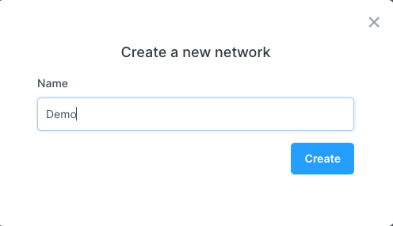
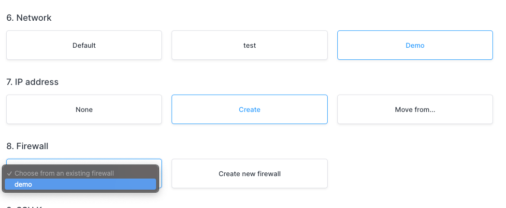
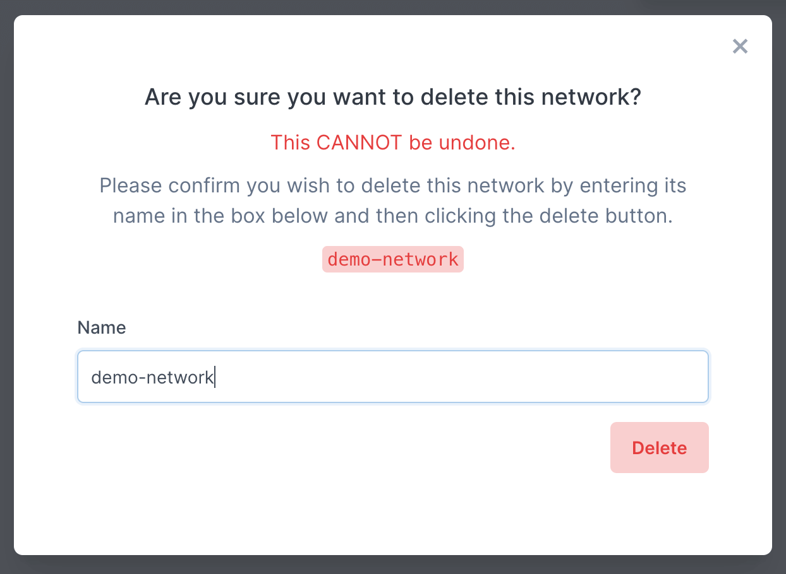

import Tabs from '@theme/Tabs';
import TabItem from '@theme/TabItem';

# Private networks

Networks provide isolation for your instances and Kubernetes clusters, separating groups of instances used for different purposes. When you create a resource such as a Kubernetes cluster, you can assign it to a specific network.

Networks are region-specific: if you create a network in one Civo region it will not be visible in another. Networks also count toward your [quota](../account/quota.md).

:::note
Network assignment is permanent. If you create a resource in one network, you cannot move it to another network. You would need to re-create the resource in the network of your choice.
:::

## Listing networks

<Tabs groupId="list-networks">
<TabItem value="dashboard" label="Dashboard">

You can find the [networks management section](https://dashboard.civo.com/networks) under Networking in your Civo dashboard.

Each region will have a `Default` network created automatically. When creating resources, unless you specify a network, they will be assigned to this Default network. If you have created other networks, they will be displayed with a set of options to manage them. You can also rename a network in this view.


</TabItem>

<TabItem value="cli" label="Civo CLI">

You can list your currently-configured networks by calling `civo network list`. This will show the network ID, name label, region and status:

```console
$ civo network list
+--------------------------------------+--------------+--------+---------+--------+
| ID                                   | Label        | Region | Default | Status |
+--------------------------------------+--------------+--------+---------+--------+
| 95a515ea-37a1-4fca-ad03-7c7c32f59f5a | Default      | FRA1   | true    | Active |
| ac9db91c-9689-4023-a44b-a5b562c3aa6a | demo-network | FRA1   | false   | Active |
+--------------------------------------+--------------+--------+---------+--------+
```

</TabItem>
</Tabs>

## Creating a private network

<Tabs groupId="create-network">

<TabItem value="dashboard" label="Dashboard">

To create a network, click on the "Create a network" button on top of the [networks page](https://dashboard.civo.com/networks).

Once you do, you will be able to give your new network a name:



After the network is created you can create resources that share the network, and can route to each other internally. You will be able to choose the network in the [instance creation](../compute/create-an-instance.md) or [cluster creation](../kubernetes/create-a-cluster.md) step like in the image below:



</TabItem>

<TabItem value="cli" label="Civo CLI">

You can create a new private network using the command `civo network create network_label`:

```console
civo network create cli-demo
Created a network called cli-demo with ID 1c93d0ca-d733-4ffe-8a31-2c0bcd565885
```

After the network is created you can create resources that share the network, and can route to each other internally. You will be able to choose the network in the [instance creation](../compute/create-an-instance.md) or [cluster creation](../kubernetes/create-a-cluster.md) process.

</TabItem>

<TabItem value="terraform" label="Terraform">

Once you have configured the [Civo Terraform provider](../overview/terraform.md), you can define a new private network in Terraform as follows.

### Prepare the configuration file

The configuration for creating a new network in Terraform is defined by

```terraform
# Create a network
resource "civo_network" "custom_net" {
    region = "LON1"
    label = "my-network"
}
```


This uses the [civo_network](https://registry.terraform.io/providers/civo/civo/latest/docs/resources/network) resource to create a new network, in this case with the label `my-network` which will be visible in your account dashboard. This network can then be referred to as `civo_network.custom_net` in other Terraform resources, if needed. For example, you can [create an instance](../compute/create-an-instance.md) or [create a new firewall](../networking/firewalls.md) in a particular network.

If you save the above configuration in a file called `main.tf`, you will be able to apply this configuration to your account.
### Plan

With the above configuration saved, you can run `terraform plan` to see the resources to be created:

```console
$ terraform plan
Terraform used the selected providers to generate the following execution plan. Resource actions
are indicated with the following symbols:
  + create

Terraform will perform the following actions:

  # civo_network.custom_net will be created
  + resource "civo_network" "my-network" {
      + region               = "LON1"
      + id                   = (known after apply)
      + name                 = "my-network"
      + network_id           = (known after apply)
    }
```

### Apply the configuration

To apply the configuration and allow Terraform to create the resources, run `terraform apply` and type `yes` when asked for confirmation:

```console
$ terraform apply
Terraform used the selected providers to generate the following execution plan. Resource actions
are indicated with the following symbols:
  + create

  # civo_network.custom_net will be created
  + resource "civo_network" "custom_net" {
      + default = (known after apply)
      + id      = (known after apply)
      + label   = "my-network"
      + name    = (known after apply)
    }
Plan: 1 to add, 0 to change, 0 to destroy.

Do you want to perform these actions?
  Terraform will perform the actions described above.
  Only 'yes' will be accepted to approve.

  Enter a value: yes
(...)
```

When the creation completes, refresh your Civo web dashboard. You should see the new network on the [Networks page](https://dashboard.civo.com/networks).
</TabItem>

</Tabs>

## Deleting a private network

Networks can be deleted if no resources such as instances or clusters exist in them. In other words, you can only delete an empty private network.

Once you have removed any resources running in a network, you will be able to delete it.

<Tabs groupId="delete-network">

<TabItem value="dashboard" label="Dashboard">

From the Networks listing page, click on the Actions menu item for the network you wish to delete, and click "Delete":


You will need to input the name of the network to delete as a confirmation. Once you do, the network can be deleted:



</TabItem>

<TabItem value="cli" label="Civo CLI">

Network deletion is done by calling `civo network remove network_label` or `civo network remove network_id`:

```console
$ civo network rm cli-demo
Warning: Are you sure you want to delete the cli-demo network (y/N) ? y
The network (cli-demo) has been deleted
```

:::tip
For scripting use, you can add a `-y` flag to Civo CLI commands which usually require confirmation. This will assume you will answer "yes" to any prompt.
:::

</TabItem>
</Tabs>