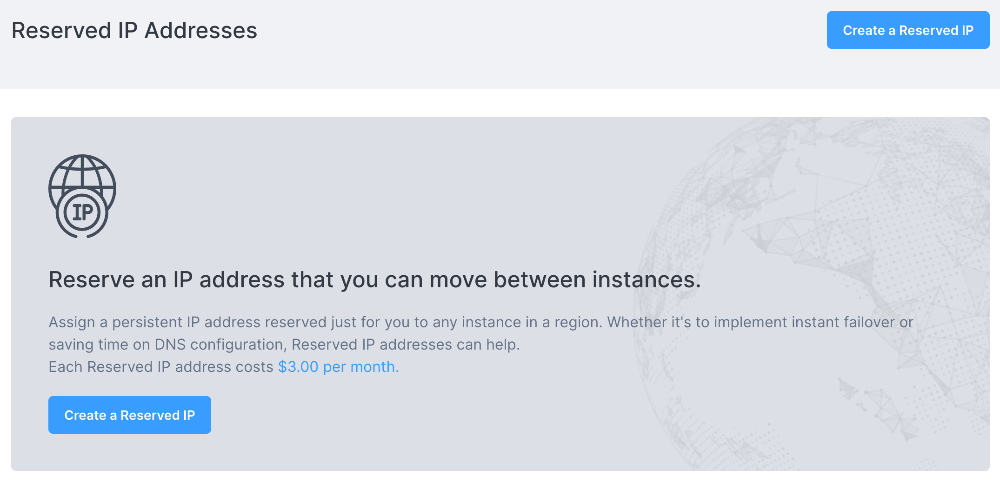
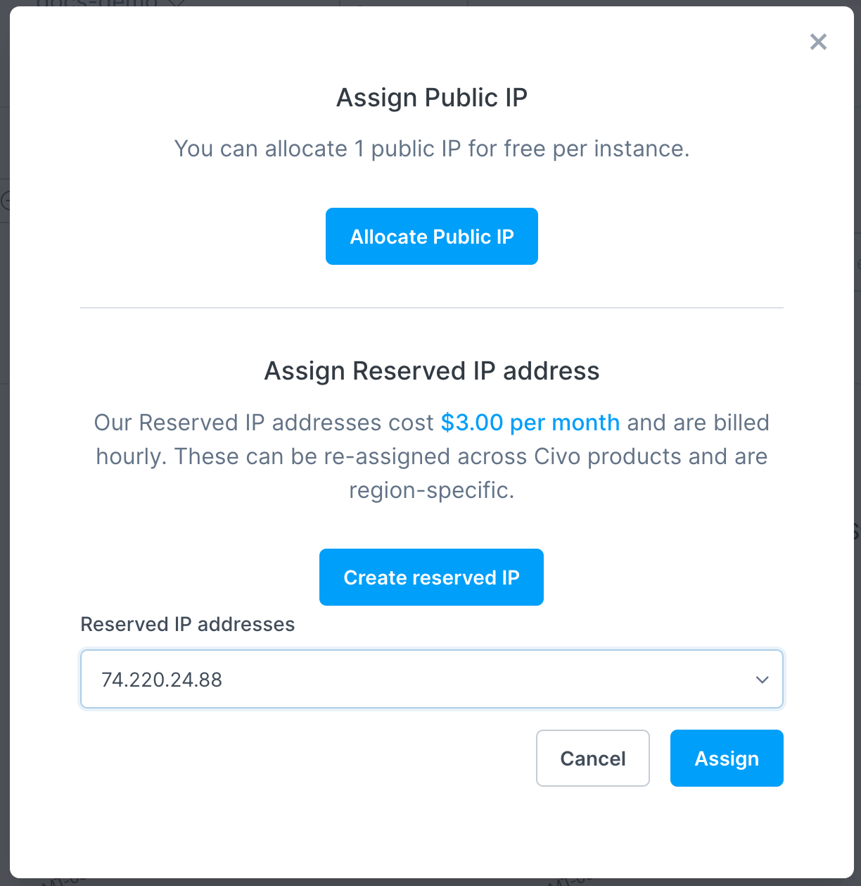
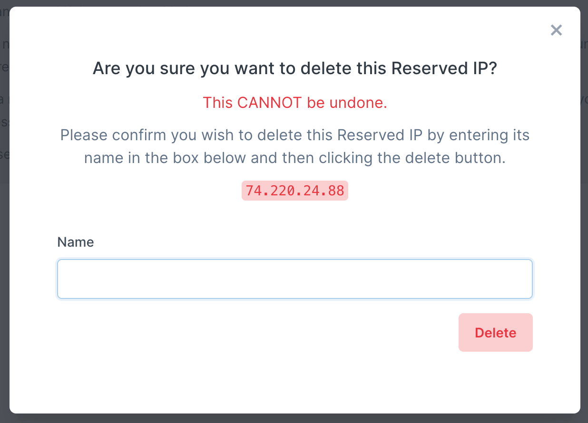

import Tabs from '@theme/Tabs';
import TabItem from '@theme/TabItem';

<head>
  <title>Managing IP Addresses for Civo Resources | Civo Documentation</title>
</head>

While resources that are accessible from the public internet, such as [instances](../compute/) and Kubernetes cluster [load balancers](../kubernetes/load-balancers.md), get assigned public IP addresses when they are created, there are times you may wish to ensure that the IP address gets reserved to you. This allows you to change these publicly routable resources without changing their IP addresses. Reserving a [static IP address](https://dashboard.civo.com/reserved-ips) allows you to reassign the address from one instance to another to build resiliency.

If you create a new instance or load balancer, you will be able to attach a reserved IP address in your account. If you select an address that is already assigned to a resource, it will be moved to the new one immediately.

If you release a reserved IP address assignment from an instance or load balancer, the address remains in your account to be assigned to other resources unless you delete it.

You can claim reserved IPs subject to your [quota allowance](../account/quota). Reserved IPs are region-specifc, which means each one you reserve can only be used for resources within that Civo region.

<Tabs groupId="reserve-ip">

<TabItem value="dashboard" label="Dashboard">

## Reserving a new IP address from the Dashboard

The [Reserved IP section](https://dashboard.civo.com/reserved-ips) of your account allows you to claim a new IP address, or view addresses you have reserved.



Begin by clicking "Create a reserved IP".

The pop-up will ask you to give a name for your reserved IP. This is a label to help you to remember the purpose of the reservation.

When you confirm this name, you will see the newly-reserved IP details on the dashboard. This will also show the address is not assigned to a resource.


The *Actions* menu for each address you reserve will allow you to either *Assign* the address to a running Civo instance, or *Delete* the address to stop it counting toward your quota and billing.

</TabItem>

<TabItem value="civo-cli" label="Civo CLI">

## Reserving an IP address using Civo CLI

The command to reserve a new IP address is `civo ip reserve`. It takes an optional argument `-n <label>` to assign a name to the newly-reserved address:

```bash
$ civo ip reserve -n docs-demo
Reserved IP called docs-demo with ID 4828b05a-3ee2-4e3f-bb5d-108345ac6ba5
```

If you do not provide the `-n <label>` argument, the Civo API will assign the address value as the name for the reserved IP:

```bash
$ civo ip reserve
Reserved IP with ID 0f9518f0-7d43-41a5-b81e-59ce56c8d8c2

$ civo ip ls
+--------------------------------------+-------------------+--------------+-------------------+
| ID                                   | Name              | Address      | Assigned To(type) |
+--------------------------------------+-------------------+--------------+-------------------+
| 0f9518f0-7d43-41a5-b81e-59ce56c8d8c2 | 74.220.24.88      | 74.220.24.88 | No resource       |
+--------------------------------------+-------------------+--------------+-------------------+
```

</TabItem>
</Tabs>

<Tabs groupId="assign-ip-to-instance">

<TabItem value="dashboard" label="Dashboard">

## Assigning a reserved IP to a running instance from the Dashboard

You can assign a reserved IP address to a running instance through the instance's dashboard page by clicking the "Assign Reserved IP" button:


If the instance was created without an assigned public IP address, you will be able to claim a random one on the resulting screen, reserve a new IP address, or pick from previously reserved addresses:



Once you click "Assign" the IP address will appear as the public IP address of the instance, and will be shown on the instance dashboard:


</TabItem>

<TabItem value="civo-cli" label="Civo CLI">

## Assigning a reserved IP to a running instance using Civo CLI

You can assign a reserved, unallocated IP address to an instance in that region by running `civo ip assign <address> --instance <instance>`:

```console
$ civo ip assign 74.220.24.88 --instance ip-receiver
Assigned IP 74.220.24.88 to instance ip-receiver
```

You can also specify the ID of the IP address acquired by `civo ip ls` in the command:

```
$ civo ip assign 0f9518f0-7d43-41a5-b81e-59ce56c8d8c2 --instance ip-receiver
Assigned IP 74.220.24.88 to instance ip-receiver
```

</TabItem>
</Tabs>

<Tabs groupId="release-reserved-ip">

<TabItem value="dashboard" label="Dashboard">

## Releasing an instance's reserved IP from the Dashboard

An assigned, reserved IP address can be unallocated or released from an instance by clicking the *Release Reserved IP* button on the instance page and confirming the IP address name.


</TabItem>

<TabItem value="civo-cli" label="Civo CLI">

## Releasing an instance's reserved IP using Civo CLI

The command to release a reserved IP address from an instance is `civo ip unassign <address>`:

```console
$ civo ip unassign 74.220.24.88
Warning: Are you sure you want to unassign 74.220.24.88 ip from Civo resource (y/N) ? y
Unassigned IP 74.220.24.88 from Civo resource
```

</TabItem>
</Tabs>

<Tabs groupId="delete-reserved-ip">

<TabItem value="dashboard" label="Dashboard">

## Deleting a reserved IP from the Dashboard

Deleting reserved IPs is managed through the [Networking/Reserved IPs section](https://dashboard.civo.com/reserved-ips) of your dashboard.

By dropping down on the *Actions* menu, select "Delete IP".

This will prompt you to confirm the IP address:



**Note**: You can only delete reserved IPs that are not attached to an instance or load balancer. You must release any assignment before deleting.

</TabItem>

<TabItem value="civo-cli" label="Civo CLI">

## Deleting a reserved IP using Civo CLI

The command to delete a reserved IP is `civo ip delete <label>`:

```bash
$ civo ip delete docs-demo
Warning: Are you sure you want to delete the docs-demo IP (y/N) ? y
IP called docs-demo with ID 4828b05a-3ee2-4e3f-bb5d-108345ac6ba5 was deleted
```

**Note**: You can only delete reserved IPs that are not attached to an instance or load balancer. You must release any assignment before deleting.

</TabItem>
</Tabs>

## Reserved IP addresses and Kubernetes load balancers

IP addresses that have been reserved in your account can be assigned to Kubernetes load balancers by means of an annotation on the cluster itself. See the [load balancer documentation](../kubernetes/load-balancers.md#reserved-ip-address) for more details.
