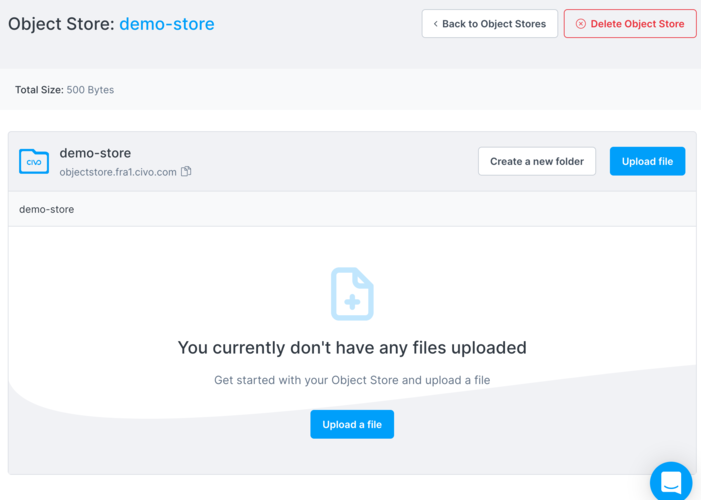
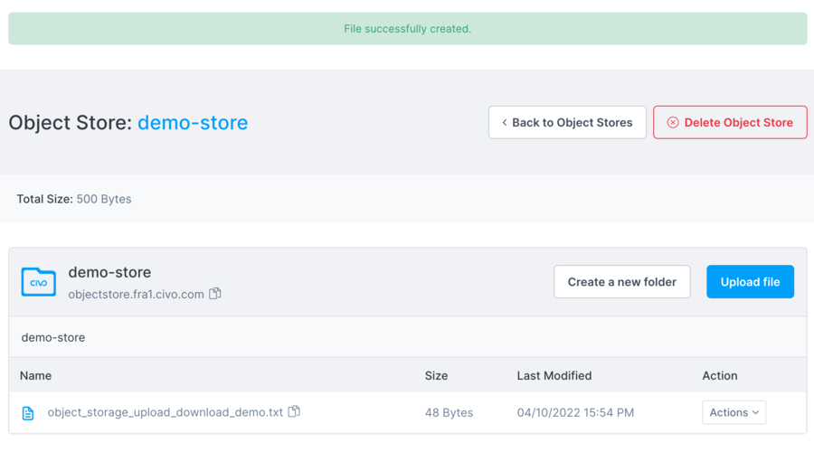
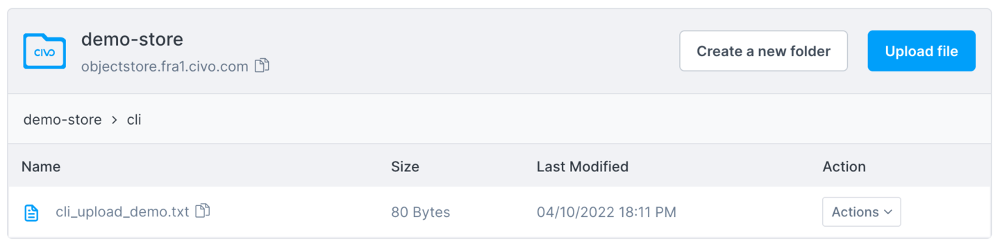

import Tabs from '@theme/Tabs';
import TabItem from '@theme/TabItem';

<head>
  <title>Adding Files to Your Object Stores | Civo Documentation</title>
</head>

You can add (upload) files to your object stores both through the [object store dashboard](https://dashboard.civo.com/object-stores) in your account and using the S3 API directly with a tool such as [s3cmd](https://github.com/s3tools/s3cmd).

Generally, if the files you want to upload to an object store are large, or there are many of them, it is recommended to use the API rather than uploading them using your web browser.

## Uploading files to object stores using the web

Start by clicking the name of the object store you wish to upload to. You will be taken to the file management page for the store:



Next, click "Upload file" and select a file to add to the store from your local machine. Keep the Permissions private for now. In S3-type storage, objects can be *private* (accessible only by providing the credential details) or *public* (accessible by anyone with the URI to the object). By default, objects are created as Private.

When you have chosen a file to upload, click "Upload file".

When the file is added, you should see a message informing you that it was successfully created on the object store, along with its details in the store.



You can also create folders and upload files to particular folders to create a directory-like structure. The folder name will be part of the URL used to retrieve any files you upload.

## Uploading files using the command line

To upload files using the command line you will need an S3 API tool installed on your system. This documentation assumes you have `s3cmd` set up.

### Setting up credentials for s3cmd

In order to interact with the Civo object store you created, you'll need `s3cmd` to be made aware of the credentials and location. You can either use environment variables like this tutorial, or input credential values directly into the s3cmd configuration which you can create by running `s3cmd --configure` and following the prompts.

First, you will need to retrieve the Access Key from the [object store credential details](./object-store-credentials#retrieving-object-store-credential-details) in question.

Civo CLI has a method to *export* credential details for s3cmd. The format is `civo objectstore credential export -a <credential_access_key>`:

```console
$ civo objectstore credential export --access-key=OIPUMAEH30PMWHYQU2IX
# Tip: You can redirect output with (>> ~/.zshrc) to add these to Zsh's startup automatically
export AWS_ACCESS_KEY_ID=OIPUMAEH30PMWHYQU2IX
export AWS_SECRET_ACCESS_KEY=kRk1RiXCrV7R7rfSDwAEZUI6HhGbP2xjgJJJ76mw
export AWS_DEFAULT_REGION=FRA1
export AWS_HOST=https://objectstore.fra1.civo.com
```

:::note
As S3 was developed by Amazon Web Services (AWS), tools commonly use the AWS variable names for other S3 hosts that do not run on AWS. This ensures interoperability between object store providers, where the Access Key ID/Secret Key credential mechanic is used throughout.
:::

### Using s3cmd to upload a file to an object store

You will need a file to upload to the object store accessed in the previous step. As an example, you can create a short text file:

```console
$ cat <<EOF >cli_upload_demo.txt
Hello from the command line.
This file will be uploaded to a Civo object store.
EOF
```

The s3cmd syntax to upload a file to a store is `s3cmd put FILE [FILE...] s3://STORENAME[/FOLDERNAME]`. Assuming you named your object store `demo-store`, the command would be:

```console
$ s3cmd --access_key=${AWS_ACCESS_KEY_ID} --secret_key=${AWS_SECRET_ACCESS_KEY} --host=${AWS_HOST} --host-bucket=s3://demo-store put --acl-public cli_upload_demo.txt s3://demo-store/cli/

upload: 'cli_upload_demo.txt' -> 's3://demo-store/cli/cli_upload_demo.txt'  [1 of 1]
 80 of 80   100% in    0s   572.01 B/s  done
Public URL of the object is: http://objectstore.fra1.civo.com/demo-store/cli/cli_upload_demo.txt
```

In this command, the structure is as follows:

- The `--host` argument specifies the object store host, i.e. the Civo region where the store was created,
- The `--host-bucket` argument names the object store in the host region as an S3 URI, in this case "demo-store",
- The `put` command tells s3cmd to upload file(s) to be specified,
- The `--aci-public` argument makes the permissions on this uploaded file public,
- `cli_upload_demo.txt` is the file to be uploaded,
- `s3://demo-store/cli` is the path in the object store to upload the file to.

Now, if you look on the web interface for the object store, you can see that a folder called `cli/` has been created and it contains the file you uploaded:



You can also use `s3cmd` to list the files:

```console
s3cmd --access_key=${AWS_ACCESS_KEY_ID} --secret_key=${AWS_SECRET_ACCESS_KEY} --host=${AWS_HOST} --host-bucket=s3://demo-store ls s3://demo-store/cli/
```
