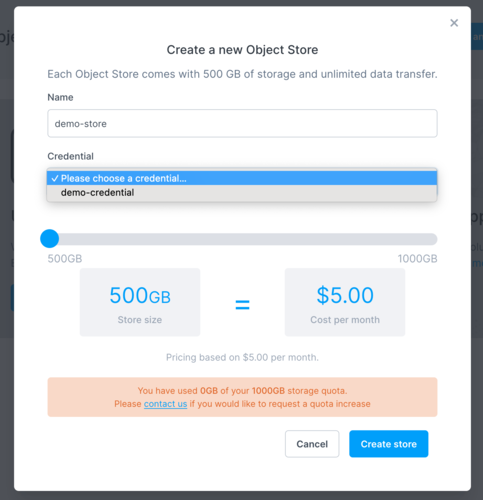
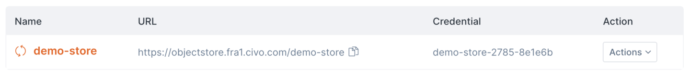

import Tabs from '@theme/Tabs';
import TabItem from '@theme/TabItem';

<head>
  <title>Creating an Object Store | Civo Documentation</title>
</head>

## Prerequisite: Credentials

Civo object stores are accessed through the S3 API using specified credentials. If you have not yet [created an object store credential](./object-store-credentials), you will be prompted to do so when you first try to create an object store.

## Object store creation options

<Tabs groupId="create-objectstore">
<TabItem value="dashboard" label="Dashboard">

Start by clicking "Create an Object Store", which should show you the following screen:

For the Name field, use a descriptive name for the object store.

As the system would have prompted you to create a credential in the previous step if none existed in the region before, you will be able to assign it to your object store as an authorized accessor by dropping down to the Credential menu to select the one you created.

Pick the credential name you just created from the drop-down menu.

You can size an object store in 500GB increments up to your object store [quota limit](../account/quota). The price (displayed monthly but charged on an hourly basis) will change depending on the size of the object store you create.

Next, click "Create store" to proceed.

The page should show your store being created, along with the access URL and associated credentials from your list:

Once you see the URL endpoint for the store, you will be able to proceed to add files to it.

</TabItem>

<TabItem value="cli" label="Civo CLI">

The command to create an object store using Civo CLI is `civo objectstore create <name>`, with optional parameters.

The optional parameters are:

`--size {500/1000/1500...}` - the size in GB of the store, in multiples of 500.

`--owner-access-key <id>` - the [object store credential](./object-store-credentials) referenced by id to make the owner of the store to be created.

`--owner-name <name>` - the [object store credential](./object-store-credentials) referenced by its name to make the owner of the store to be created.

`--region <region>` the Civo region in which to create the object store. If not provided, will use the currently-selected region.

</TabItem>
</Tabs>
