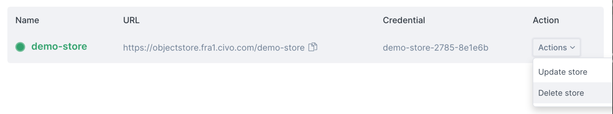
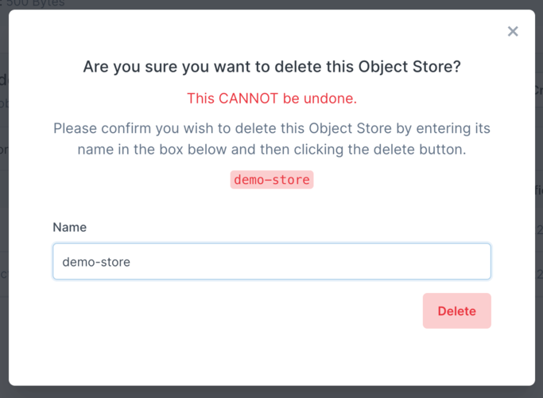

import Tabs from '@theme/Tabs';
import TabItem from '@theme/TabItem';


# Deleting object stores

Object stores accrue charges based on their size, which are billed to your account. If you no longer require an object store, you can delete it to prevent further charges.

:::warning
Object store deletion destroys all objects (files) within the store. There is no way to recover these files if the object store is deleted.
:::

<Tabs groupId="delete-store">
<TabItem value="dashboard" label="Dashboard">

You can delete an object store from your account by navigating to the [listing of object stores](https://dashboard.civo.com/object-stores) and selecting "Delete store" from the Action column:



This will prompt you to confirm the name of the store to be deleted as a security measure:



All files and the object store itself will be deleted as soon as you confirm this step, so make sure you only do this if you have recovered all files you may need.

You will then be able to [delete any credentials](./object-store-credentials#deleting-object-store-credentials) that were assigned to the object store. 

</TabItem>

<TabItem value="cli" label="Clivo CLI">

The command to delete an object store using Civo CLI is `civo objectstore delete <store-name>`:

```console
$ civo objectstore delete demo-store
Warning: Are you sure you want to delete the demo-store Object Store (y/N) ? y
The objectStore (demo-store) has been deleted
```

You can then [remove any unneeded object store credentials](./object-store-credentials#deleting-object-store-credentials).

</TabItem>
</Tabs>

:::note
Note that you cannot delete credentials that are assigned to active object stores - the store itself must be deleted before the credential can be removed.
:::