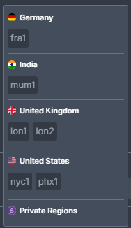
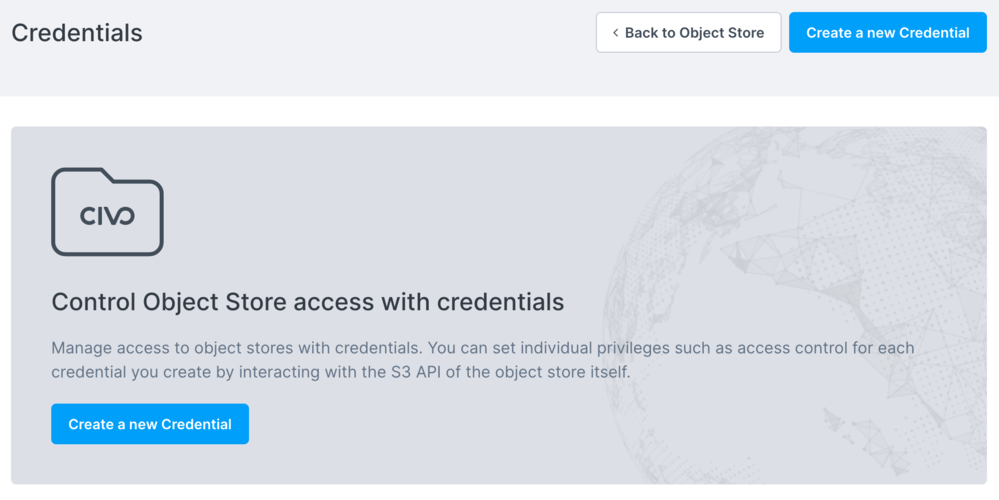
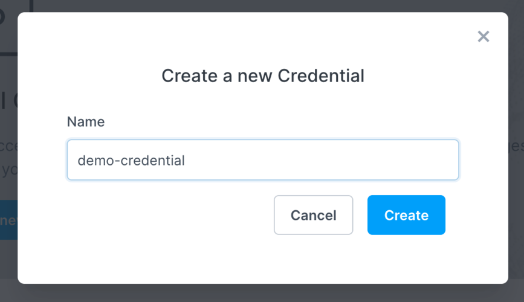
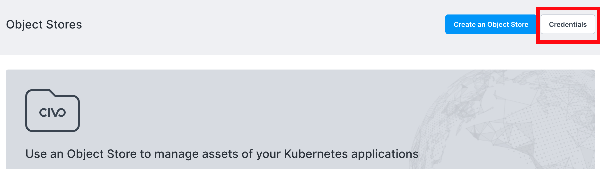
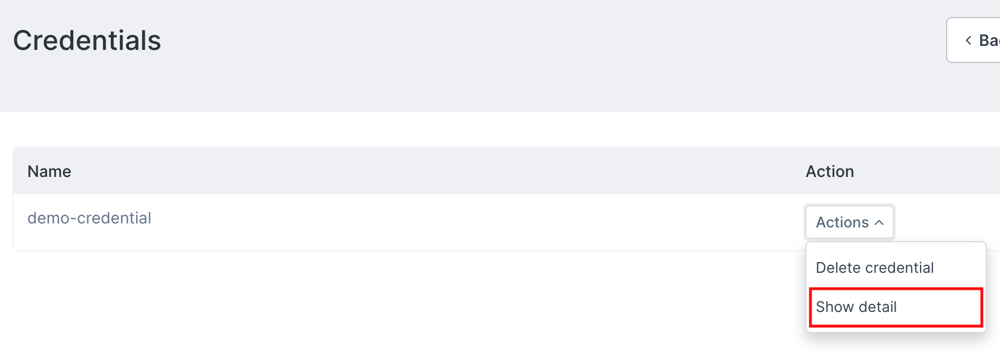
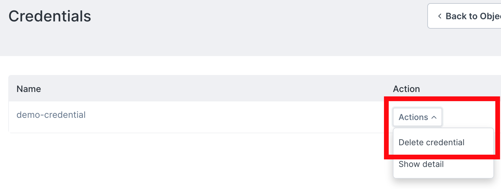

import Tabs from '@theme/Tabs';
import TabItem from '@theme/TabItem';

# Object store credentials

To access object store contents through the S3 API, you will need to create a credential that can be associated with the store. All Civo object stores are created as private and require an access key ID and secret credentials.

## Creating an object store credential

<Tabs groupId="create-credential">
<TabItem value="dashboard" label="Dashboard">

Begin by selecting the Civo Region you are operating in. You can do so in the lower left of your [Dashboard page](https://dashboard.civo.com):



Then, navigate to the [Object store credentials page](https://dashboard.civo.com/object-stores/credentials):



Next, click the "Create a new Credential" button to be given the option to give a name for your credential.



Once you click "Create", the system will prepare your new credential to be assigned to an object store of your choice.

You can now proceed to [create an object store](./create-an-object-store).
</TabItem>

<TabItem value="cli" label="Civo CLI">

To create a new Object store credential with your chosen name, you can use the `civo objectstore credential create` CLI command, like this:

```console
$ civo objectstore credential create demo-credential
Creating Object Store Credential demo-credential in LON1
```

</TabItem>
</Tabs>

## Retrieving object store credential details

<Tabs groupId="retrieve-credentials">
<TabItem value="dashboard" label="Dashboard">

On the [object stores page](https://dashboard.civo.com/object-stores), you will find the Credentials management [button link](https://dashboard.civo.com/object-stores/credentials) at the top:



On the credentials management page, you can drop down on the credential of your choosing to list its details:



This detail page shows two pieces of information for the credential:

- The `Access Key ID`,
- The hidden `secret key`

Both will be required to access files in object stores marked *private*.

</TabItem>
<TabItem value="cli" label="Civo CLI">

In order to retrieve the *secret key* of an object store credential on the command line, begin by finding the Access Key of the key you want by using `civo objectstore credential ls`:

```console
$ civo objectstore credential ls
+-----------------+----------------------+--------+
| Name            | Access Key           | Status |
+-----------------+----------------------+--------+
| demo-credential | KQHD3XHBP8O9PG2YF48T | ready  |
+-----------------+----------------------+--------+
```

:::note
The above command will show the access key to the credential, but not the `secret key`. This is intentional.
:::

To retrieve the secret key for a credential, provide the *Access key* as a `-a` parameter to the `civo objectstore credential secret` command as follows:

```console
$ civo objectstore credential secret -a KQHD3XHBP8O9PG2YF48T
Your secret key is: 9OW1dRuveD5Kk8B4YgvUHrD5iQxt77C6ZA5xOD4O
```

</TabItem>

</Tabs>

## Deleting object store credentials

<Tabs groupId="delete-credentials">
<TabItem value="dashboard" label="Dashboard">

Object store credentials can be deleted through accessing the [Credentials page](https://dashboard.civo.com/object-stores/credentials) of the object stores listing:


You can then select the credential to delete and drop down on the *Actions* menu to select *Delete credential*:



</TabItem>
<TabItem value="cli" label="Civo CLI">

You can remove any unneeded object store credentials using the command `civo objectstore credential delete <credential-name>`.

</TabItem>
</Tabs>

:::note
Note that you cannot delete credentials that are assigned to active object stores - the store itself must be deleted before the credential can be removed.
:::