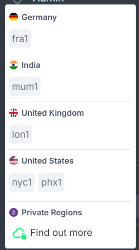

<head>
  <title>A Guide to Civo Regions | Civo Documentation</title>
</head>

Civo resources can be deployed in a number of regions around the world.

Resources such as Kubernetes clusters and virtual machine instances are region-specific. This means that running clusters are displayed only on the listings in the region where they are deployed.

## Selecting a region on the web dashboard

You can select a region from the region drop-down menu at the bottom of the left-hand sidebar in your account on any page of the Civo dashboard:



## Selecting a region on the command line

With [Civo CLI](../overview/tools-overview), you can see the list of available regions by running:

```bash
civo region list
```

You can then select a region from the list by running:

```bash
civo region use <REGION_CODE>
```

This will execute any further commands in the region of your choice.

:::tip
You can also pass a `--region <CODE>` parameter to any CLI command to execute it in the region specified by the code, without changing or setting your current region.
:::

## What products are available per region?

| Products | LON1 | FRA1 | NYC1 | PHX1 | MUM1 |
|----------|------|------|------|------|------|
| CPU Kubernetes | 🟢 Available | 🟢 Available | 🟢 Available | 🟢 Available | 🟢 Available |
| GPU Kubernetes | 🟢 Available | 🔴 Unavailable | 🔴 Unavailable | 🔴 Unavailable | 🔴 Unavailable |
| CPU Compute | 🟢 Available | 🟢 Available | 🟢 Available | 🟢 Available | 🟢 Available |
| GPU Compute | 🟢 Available | 🔴 Unavailable | 🔴 Unavailable | 🔴 Unavailable | 🔴 Unavailable |
| Object Stores | 🟢 Available | 🟢 Available | 🟢 Available | 🔴 Unavailable | 🟢 Available |
| Volumes | 🟢 Available | 🟢 Available | 🟢 Available | 🟢 Available | 🟢 Available |
| Databases | 🟢 Available | 🟢 Available | 🟢 Available | 🟢 Available | 🟢 Available |
