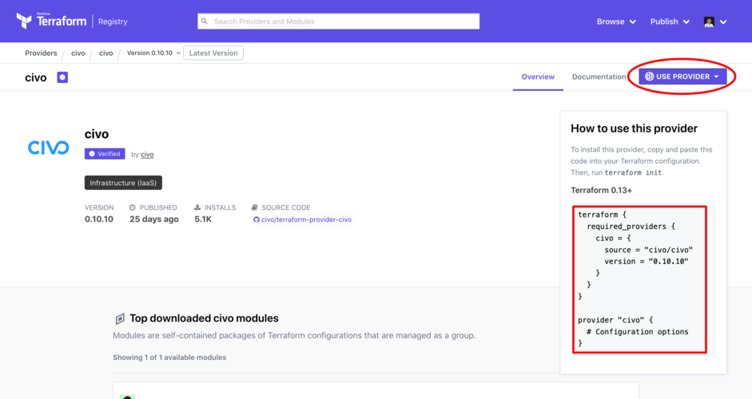
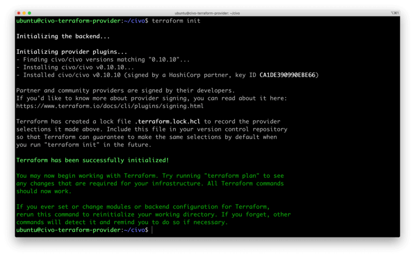

<head>
  <title>Using Terraform with Civo | Civo Documentation</title>
</head>

## Overview

[Terraform](https://www.terraform.io) is an infrastructure as code (IaC) tool that can help you manage cloud resources using code. In order to use Terraform on a cloud service, you need to set up the *Provider* for that service. A provider (also know as plugin) is the middle layer between the Terraform CLI that you will be using and the cloud platform that you are using. It's implemented in Go and interface with the cloud platform's API using a client library — which also written in Go. Civo maintains a [Terraform provider](https://registry.terraform.io/providers/civo/civo/latest) that gives users access to resources in their accounts.

## Setting up the Civo Terraform provider

In order to use the Civo Terraform provider, you need to set up the Terraform command-line interface itself first. It's available for Mac, Linux and Windows on [the official site](https://developer.hashicorp.com/terraform/downloads).

The following setup guide and the examples in the Civo product documentation assume you have the Terraform CLI installed.

### Create a Provider file

To create a provider file for Terraform to read, create a file called `provider.tf` in a text editor of your choice.

The file should contain the provider information from the [Civo Terraform Provider page](https://registry.terraform.io/providers/civo/civo/latest) that you get when you select "Use Provider":



In your editor, replace the `# Configuration options` line with `token = "<YOUR_CIVO_API_KEY>"`. The `<YOUR_CIVO_API_KEY>` block should be the [API key](../account/api-keys.md) for the account you wish to manage using Terraform.

As an example, the file may look like the following

```hcl
terraform {
  required_providers {
    civo = {
      source = "civo/civo"
      version = "1.0.19"
    }
  }
}

provider "civo" {
  token = "RE4wnvq3oEHD4rdjkidaBdKJRHau1ToYyGPTTgXyD90Va3nFyq"
}
```

For the latest feature set, make sure your `version` line matches the latest version on the [Terraform Provider page](https://registry.terraform.io/providers/civo/civo/latest).

Once you save the file, you can proceed to initialize a new Terraform project.

### Initialize a Terraform Project using the Civo provider

In order to initialize our Terraform project, run the command below to download the Civo Terraform provider and set it up it with required files and folders:

```bash
terraform init
```

This should output a success message:



Congratulations! You now have a working Terraform project. You can use this setup to manage cloud resources on Civo according to the product and service-specific documentation.

As some examples, you can do all of the following with Terraform:

- Create a [Kubernetes cluster](../kubernetes/create-a-cluster.md)
- Create [private networks](../networking/private-networks.md)
- Manage [virtual machine instances](../compute/create-an-instance.md)

## Upgrading the Terraform provider

If you see that your Terraform provider version is behind the [latest Civo provider release](https://registry.terraform.io/providers/civo/civo/latest), you can upgrade your project as follows:

### Update the Terraform provider file

First, update the `version` line of the `provider.tf` file for your project to match the version in the provider registry and save the file.

### Upgrade the Terraform project

Second, use the Terraform CLI to initialize an upgrade to your project:

```bash
terraform init --upgrade
```

You should see an update message confirming the provider version has changed.
