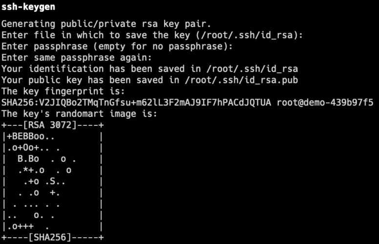
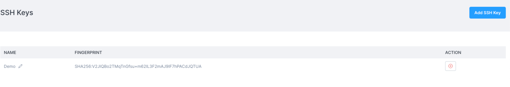

# SSH Key management and use

You can add your SSH keys to your Civo account and use them to log in to Civo instances that have the key associated with them.

SSH keys can be added to accounts under the [Manage/SSH Keys](https://dashboard.civo.com/ssh_keys) section of your dashboard, or programmatically using the [Civo API](https://www.civo.com/api/sshkeys).

You can have multiple SSH keys stored in your account at one time. The initial association of an SSH key with a compute instance will apply one key of your choice.

You must have an existing SSH key in order to add one to your Civo account. The following section describes how you can generate a new key.

## Generating a new SSH key

If you do not yet have an SSH key, you can use the `ssh-keygen` command on your system to generate an SSH key pair. This command is automatically present in Linux and MacOS systems; for Windows, please see [this documentation](https://docs.microsoft.com/en-us/windows-server/administration/openssh/openssh_install_firstuse).

When running the command and entering the desired filename and passphrase, it should output something like the following:

.

You are now ready to add your new key to your Civo account.

## Adding a SSH key to your Civo account

Once you have a generated key, you can copy the **public key** to add to your Civo account in the [SSH keys section](https://dashboard.civo.com/ssh_keys).

The dialog will prompt you for a memorable name and have space to paste the entirety of the public key.

Be sure to include the `ssh-rsa` and any trailing information, these are also part of the key.

Once you click *Create*, the key will be then stored with the name you chose in your account:

You can now launch virtual machine instances and automatically associate your created key with them, allowing you to log in without a password. Learn more about instance creation here.