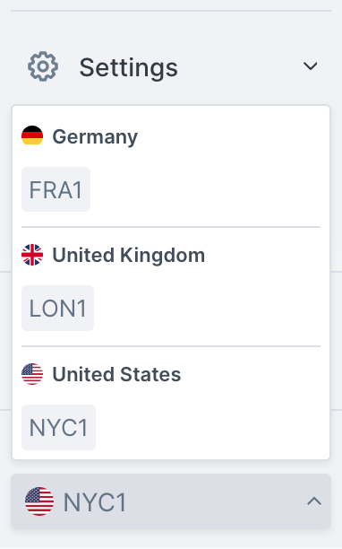
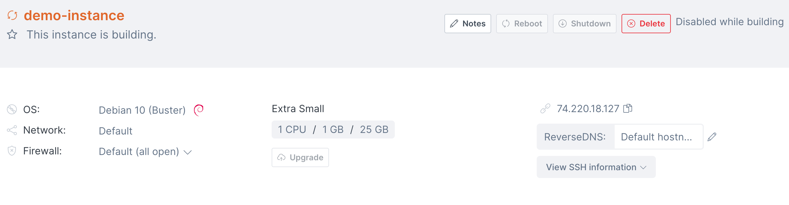

import Tabs from '@theme/Tabs';
import TabItem from '@theme/TabItem';

# Creating an instance

## Overview

Creating an instance on Civo requires a few specified parameters, whether you are starting the instance through the web dashboard or using one of our API tools. The documentation below covers the main options available on initial instance launch.

<Tabs groupId="create-instance">

<TabItem value="dashboard" label="Dashboard">

## Creating an instance from the Dashboard

Begin by selecting the Civo Region you are operating in. You can do so in the lower left of your [Dashboard page](https://dashboard.civo.com):



Then, navigate to the [instance creation page](https://dashboard.civo.com/instances/new):


The numbered sections give you options for the specifications of your compute instances.

### 1. Hostname

The hostname is the name of the instance. If you specify multiple instances to create in section **2** the same hostname will be used for each, with a running sequential number added to make them unique.

Hostnames can only contain letters, numbers, dashes and full stops. Hostnames must end on an alphanumeric character, not a dash or full stop.

### 2. How many instances?

You can create one or more instances in one operation, subject to the limitations of your [quota](../Account/quota.md). Each instance created will have the same parameters, only the hostname and IP addresses will be different.

### 3. Select size

You can select the size and instance hardware specifications based on the task you want to accomplish. You can view the available sizing options [here](https://www.civo.com/compute-pricing).

Sizing options may be restricted depending on your account quota and how many resources are already running in your account. See the [quota documentation](../Account/quota.md) for more information.

The hourly/monthly slider for the pricing is purely to show the pricing equivalent at different time scales. All Civo resources are billed hourly. [Read more about billing](../Account/billing.md).

### 4. Select image

The base operating system image to use for the instance. Note that you can select from a number of versions of each operating system.

Custom instance types are not supported on Civo at the moment.

### 5. Initial user

The initial user to create for the created instance(s). This is the username to use when logging in to the instance for the first time over SSH.

### 6. Network

The [private network](../Networking/private-networks.md) for the instance to be situated in. You can choose from the default network for your account, or if you have created networks prior to creating this instance, you can choose from one of them.

### 7. Public IP address

Select *create* if you would want the instance to have a public IP address and therefore be routable from the wider internet. If you do not choose to create the instance with a public IP address, it will only be accessible from within your chosen [network](../Networking/private-networks.md).

### 8. Firewall

You can create a new firewall along with creating this instance, or choose from an existing one if present in the network. Read more about firewalls on Civo.

### 9. SSH Key

You can choose a random password for logging in to the instance, or use a [previously-uploaded key](../Account/ssh-keys.md).

### 10. Initialisation script

If you want your instance to be preinstalled with some tools, or want to run a script on startup, this is the section to paste the script. [Read more about instance initialisation script usage](https://www.civo.com/learn/compute-instance-cloud-init-install-script-usage).

### 11. Tags

You can tag instances for administrative and organisation reasons by adding tags here. Tags are entirely optional.

### Creating your instance

When you are satisfied with your initial instance configuration, you can click "**Create**" and be directed to the instance's dashboard page. It will take a moment to become active, and you will be shown the status throughout as it builds:



### Accessing your instance with SSH

Once your instance is running, you will be able to connect to it using SSH. If you chose to use an [uploaded SSH key](../Account/ssh-keys.md), you will be able to connect without a password. If you chose to use a random password, you can copy it to your clipboard by clicking on the "*View SSH information* dropdown at the top of the instance's page.

Assuming you had a public IP address assigned to the instance, you will be able to access it with the command format `ssh username@instanceIP`. The IP address information is also displayed at the top of the instance details page.

</TabItem>
  
<TabItem value="cli" label="Civo CLI">

## Creating an instance using the Civo CLI

You can create a Civo instance on the command-line by running the `civo instance create` command, with optional parameters.

:::tip

You can view the instance creation options available on the Civo CLI by running:

```bash
civo instance create --help
```

:::

### Creating an instance on the command line with no options

If you run `civo instance create` on its own, it will create an instance with a random name, default options for the size, operating system, initial user and so on, in the currently-selected region, and return.

### Creating an instance on the command line with options

The CLI allows you to specify a number of options for your instance, from the size and specification of the virtual machine, to the firewall rules to set up, the version and flavour of operating system to use, and more. A full list of options for instance creation can be found by running `civo instance create --help`.

As an example, the following command will create an instance in the current region, using the `g3.small` instance type, using the Ubuntu Jammy disk image for the operating system, with an initial user called demo-user.

`civo instance create --hostname=api-demo.test --size=g3.medium  --diskimage=ubuntu-jammy --initialuser=demo-user`

</TabItem>

</Tabs>
