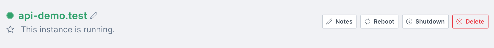

import Tabs from '@theme/Tabs';
import TabItem from '@theme/TabItem';

# Deleting an instance

## Overview

Instances on Civo will remain in your account until you delete them. Instances that are in your account, even if switched off, [remain billable](../account/billing.md) and count towards your [account quota](../account/quota.md). If you no longer need an instance, you can delete it in the following ways.

:::danger

Instance deletion is immediate and irreversible. Make sure you have retrieved any data you may need from an instance before deleting it.

:::

<Tabs groupId="delete-instance">

<TabItem value="dashboard" label="Dashboard">

## Deleting an instance from the Dashboard

You can delete an instance from the instance's dashboard page by clicking the "Delete" button on the top right of the page, also shown below:



As a precaution, the system will ask you to confirm the hostname of the instance you are looking to delete.

When you confirm the hostname, the system will proceed to delete the instance immediately.
</TabItem>

<TabItem value="cli" label="Civo CLI">

## Deleting an instance using Civo CLI

Ensuring your current region is set to the one where the instance is running, you can delete an instance using:

```bash
civo instance delete instance_name
```

By default, Civo CLI will confirm whether you want to proceed:

```bash
$ civo instance delete api-demo.test
Warning: Are you sure you want to delete the api-demo.test instance (y/N) ? y
The instance (api-demo.test) has been deleted
```

:::tip
For scripting use, you can add a `-y` flag to Civo CLI commands which usually require confirmation. This will assume you will answer "yes" to any prompt.
:::

</TabItem>
</Tabs>