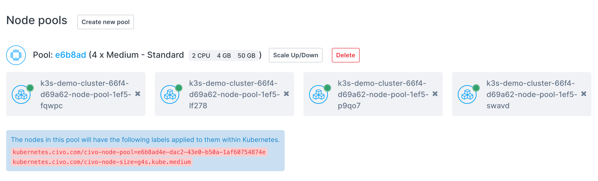
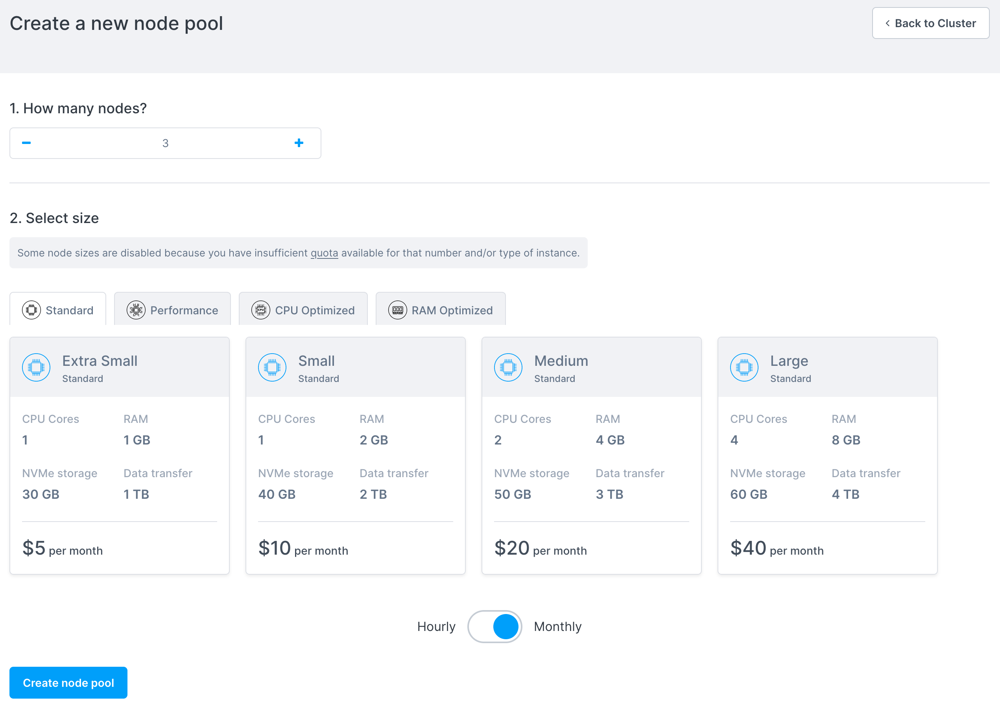
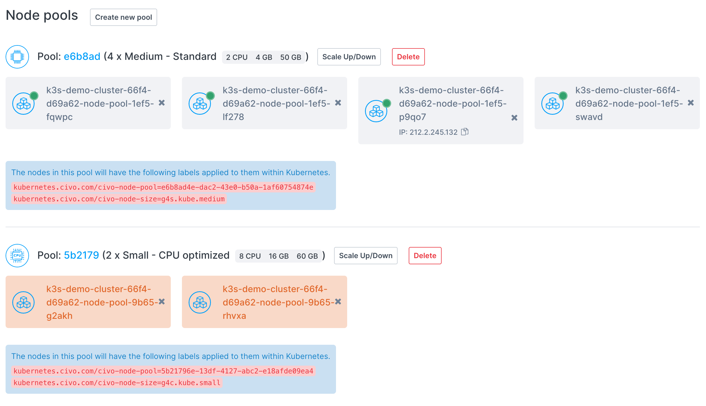
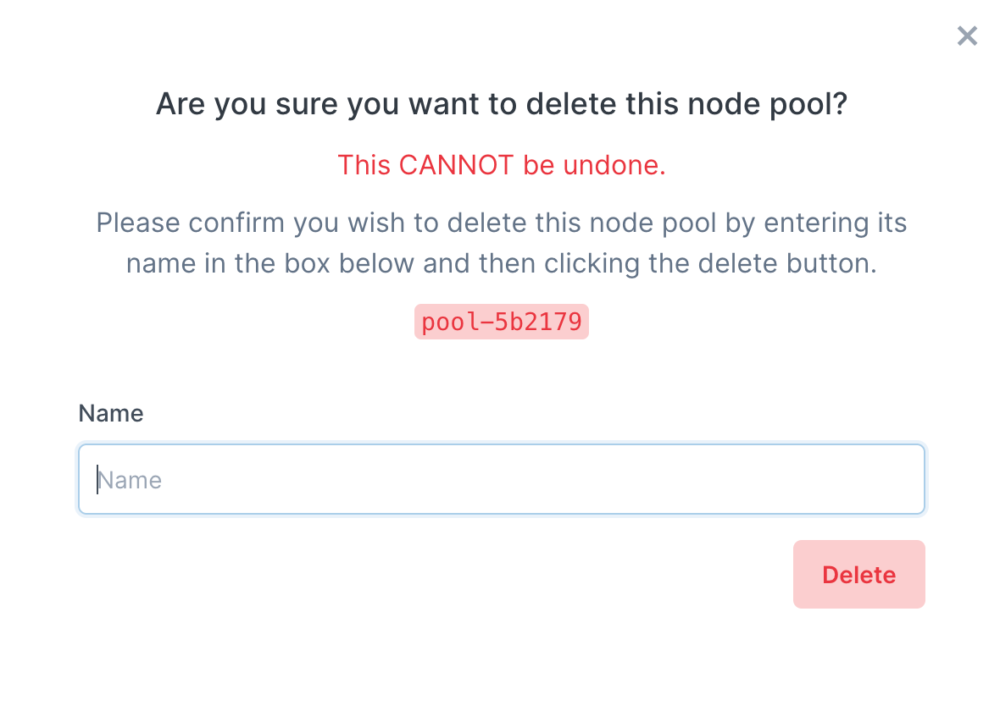

import Tabs from '@theme/Tabs';
import TabItem from '@theme/TabItem';

# Managing a Kubernetes cluster's node pools

## Overview

You can group a cluster's worker nodes into *node pools*. The nodes in each pool are all of the same size, so if you want a cluster to have nodes of different instance sizes, you must create a new pool for each size.

### Adding a new node pool

<Tabs groupId="add-nodepools">

<TabItem value="dashboard-add-nodepool" label="Dashboard">

You can add a new node pool to a running cluster by clicking on "**Create new pool**" on your cluster's information page.



You will be taken to the pool creation page:



In this section, you can select the number of nodes to create in this new pool, and the specifications/size of the nodes to create. You can choose from the same sizes as when [creating a cluster](create-a-cluster.md).

The cost per node of each type is displayed.

When you click "**Create new pool**" you will be taken back to the cluster information page and the new pool will be displayed as creating:



You can then specify specific tasks within your cluster to run on a specific pool's nodes, optimizing your cluster.

</TabItem>

<TabItem value="cli-add-nodepool" label="Civo CLI">

The command to add a node pool to a running cluster is `civo kubernetes node-pool create CLUSTER_NAME -n NUMBER -s SIZE`. For example, to add a new node pool of 2 `g4s.kube.medium` nodes to a cluster called "civo-cluster" you would use:

```bash
civo kubernetes node-pool create civo-cluster -n 2 -s g4s.kube.medium
```

The `--size` or `-s` parameter is followed by the code of the type of Kubernetes node you want to create, which you can get by running `civo sizes ls`.

</TabItem>
</Tabs>

### Deleting a node pool

<Tabs groupId="delete-nodepools">
<TabItem value="dashboard-delete-nodepool" label="Dashboard">

You can delete a node pool entirely by clicking on the "**Delete**" button next to the node pool information.


A popup will appear asking you to confirm that you want to delete the node pool by entering its name:



The pool will be deleted as soon as you click "**Delete**" and is irreversible. All workloads in that pool will be destroyed and re-allocated in your cluster.

</TabItem>

<TabItem value="cli-delete-nodepool" label="Civo CLI">

Deletion of a node pool through the CLI uses the syntax `civo kubernetes node-pool delete CLUSTER_NAME POOL_ID`.

You can retrieve the pool ID by running `civo kubernetes show CLUSTER_NAME`. It will be shown as part of the node pools section in parentheses:

```console
[...]
Pool (5b2179):
+---------------------------------------------------+----+--------+----------------+-----------+----------+---------------+
| Name                                              | IP | Status | Size           | Cpu Cores | RAM (MB) | SSD disk (GB) |
+---------------------------------------------------+----+--------+----------------+-----------+----------+---------------+
| k3s-demo-cluster-66f4-d69a62-node-pool-9b65-g2akh |    | ACTIVE | g4c.kube.small |         8 |    16384 |            60 |
| k3s-demo-cluster-66f4-d69a62-node-pool-9b65-rhvxa |    | ACTIVE | g4c.kube.small |         8 |    16384 |            60 |
+---------------------------------------------------+----+--------+----------------+-----------+----------+---------------+

Labels:
kubernetes.civo.com/node-pool=5b21796e-13df-4127-abc2-e18afde09ea4
kubernetes.civo.com/node-size=g4c.kube.small
[... continues]
```

In this case the id is `52b2179`, and the cluster name is `demo-cluster`. You can delete the node pool, therefore, by running

```bash
civo kubernetes node-pool delete demo-cluster 5b2179
```

The CLI would confirm the deletion:

```console
Warning: Are you sure you want to delete the 5b2179 node pool (y/N) ? y
The node pool (5b21796e-13df-4127-abc2-e18afde09ea4) has been deleted from the cluster (demo-cluster)
```

</TabItem>

</Tabs>
