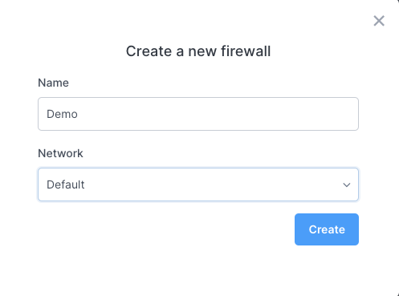
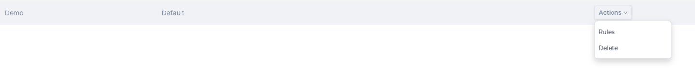

import Tabs from '@theme/Tabs';
import TabItem from '@theme/TabItem';

# Firewalls

A firewall lets you control the incoming and outgoing network traffic from your cluster or instance. The `Default` firewall in each region has all ports open, but we strongly recommend you customize your firewalls for security reasons.

Firewalls are specific to a region and network: If you have a firewall in network A, it can only be used by resources running in network A.

## Listing firewalls

<Tabs groupId="list-firewalls">
<TabItem value="dashboard" label="Dashboard">

On the dashboard, you can list and manage firewalls through the [networking/firewalls](https://dashboard.civo.com/firewalls) section. In this view, you will see the firewalls by name, along with instances and clusters that are assigned to use them. By dropping down on the "Actions" button, you will be able to manage firewall rules or delete the firewall.
</TabItem>

<TabItem value="cli" label="Civo CLI">

You can see an overview of your firewalls using `civo firewall list` showing you which firewalls have been configured with rules, and whether any of your instances, clusters or load balancers are using a given firewall, such as in this case where a custom firewall called "demo-firewall" has rules defined for it, but no resources using it.

```console
$ civo firewall list
+--------------------------------------+-------------------------------------------+---------+-------------+-----------------+----------------+--------------------+
| ID                                   | Name                                      | Network | Total rules | Total Instances | Total Clusters | Total LoadBalancer |
+--------------------------------------+-------------------------------------------+---------+-------------+-----------------+----------------+--------------------+
| 16a4e13a-e228-4cba-8630-505c7cdf5ca7 | Default (all open)                        | Default |           3 |               0 |              1 |                  0 |
| aaaf9e85-31e1-4a27-b91c-1647ba95e637 | demo-firewall                             | Default |           6 |               0 |              0 |                  0 |
+--------------------------------------+-------------------------------------------+---------+-------------+-----------------+----------------+--------------------+
```

</TabItem>
</Tabs>

## Creating a firewall

<Tabs groupId="create-firewall">
<TabItem value="dashboard" label="Dashboard">

Click "Create a firewall" at the top of the [firewalls listing page](https://dashboard.civo.com/firewalls).

Enter a name for the firewall, and choose the network it belongs to. You can either choose the Default network or one of the networks created over in the [network section](https://dashboard.civo.com/networks). ([Read more about networks](./private_networks.md)).



Once the firewall is created, you can customise the inbound and outbound traffic rules. You can do so by dropping down the "Actions" menu and selecting "Rules":



This will allow you to specify a single port, or a port range, the protocol, direction and whether the rule is to allow or deny traffic:


Resources that are created or already running in the same network as the firewall can then be configured to use that firewall to control network traffic.

</TabItem>

<TabItem value="cli" label="Civo CLI">

To create a new Firewall, use the command `civo firewall create new_firewall_name`:

```console
$ civo firewall create civocli_demo
Created a firewall called civocli_demo with ID ab2a25d7-edd4-4ecd-95c4-58cb6bc402de
```

Once the firewall is created, you can customise the inbound and outbound traffic rules. You can do so by adding a new rule using `civo firewall rule create firewall_id` with the required and your choice of optional parameters, listed here and used in an example below:

```console
  -a, --action string      the action of the rule can be allow or deny (default is allow) (default "allow")
  -c, --cidr string        the CIDR of the rule you can use (e.g. -c 10.10.10.1/32,148.2.6.120/32) (default "0.0.0.0/0")
  -d, --direction string   the direction of the rule can be ingress or egress (default is ingress) (default "ingress")
  -e, --endport string     the end port of the rule
  -l, --label string       a string that will be the displayed as the name/reference for this rule
  -p, --protocol string    the protocol choice (TCP, UDP, ICMP) (default "TCP")
  -s, --startport string   the start port of the rule
```

For example:

```bash
$ civo firewall rule create cli-demo --startport=22 --direction=ingress --label='SSH access' --action="allow"
Created a firewall rule called SSH access to allow, ingress access to port 22 from 0.0.0.0/0 with ID 15ce86b9-e269-4f0d-a83c-10e49fbf9eba
```

</TabItem>
</Tabs>

## Deleting a firewall

:::note

You cannot delete a firewall if an instance, cluster or other type of resource is using it. Change the firewall of such resources to be able to delete a firewall.

:::

<Tabs groupId="delete-firewall">
<TabItem value="dashboard" label="Dashboard">

On the web, you can delete a firewall from the [firewalls listing page](https://dashboard.civo.com/firewalls), using the Actions menu on the row of the firewall you want to delete.


The system will prompt you to confirm the name of the firewall to delete. When you confirm the firewall name, the system will proceed to delete it immediately.

</TabItem>

<TabItem value="cli" label="Civo CLI">

Delete a firewall using the CLI by running `civo firewall remove firewall_name` or `civo firewall remove firewall_id`:

```bash
$ civo firewall remove cli-demo
Warning: Are you sure you want to delete the cli-demo firewall (y/N) ? y
The firewall (cli-demo) has been deleted
```

:::tip
For scripting use, you can add a `-y` flag to Civo CLI commands which usually require confirmation. This will assume you will answer "yes" to any prompt.
:::

</TabItem>

</Tabs>