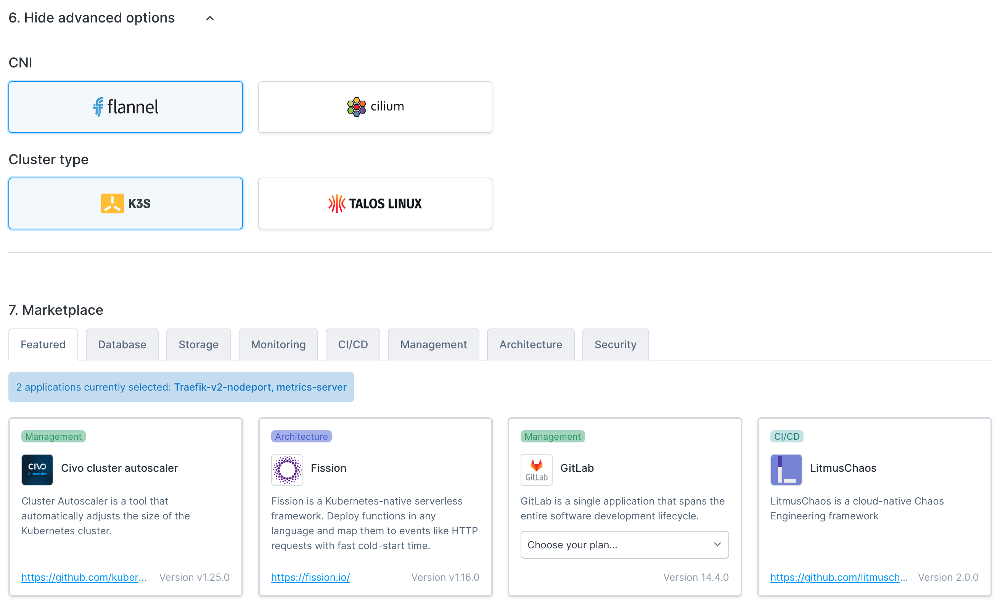

import Tabs from '@theme/Tabs';
import TabItem from '@theme/TabItem';

# Creating a Kubernetes cluster

## Overview

Creating a managed Kubernetes cluster on Civo provides you with options, from a streamlined experience to customisation of various aspects of how your cluster is set up. The documentation below covers the main options available on initial cluster launch.

<Tabs groupId="create-cluster">
<TabItem value="dashboard" label="Dashboard">

## Creating a cluster on the Dashboard

Begin by selecting the Civo Region you are operating in. You can do so in the lower left of your [Dashboard page](https://dashboard.civo.com):


Then, navigate to the [Kubernetes cluster creation page](https://dashboard.civo.com/kubernetes/new):


The numbered sections give you options for the specifications of your cluster.

### 1. Name

This is your cluster's name. May not contain a space.

### 2. Number of nodes

Kubernetes clusters on Civo can have multiple node pools - this is the number you want to launch in the cluster's initial node pool. This can be scaled up and down once the cluster is running, and does not include the control plane node, which is handled by Civo.

### 3. Network

If you have created custom networks in this region, you will be able to choose one of them here. Custom networks allow you to define private networking within a region, which allows you to prevent some resources from being routable to the public internet. Civo Kubernetes clusters will always have a public IP address.

### 4. Firewall

If you have configured existing firewalls in this region, you will be able to select one of them for this cluster, or create a new firewall and specify which port(s) to open. Firewall rules can be customised after creation.

### 5. Node size

The specifications for the machines in the initial node pool. These are priced per node, per hour. The "Hourly/Monthly" slider allows you to estimate the cost per month or per hour of the cluster running. For more information, see the Billing section.

Sizes or configurations may not be available due to quota on your account or the number of nodes you have chosen in section 2 above.

Depending on the applications you want to run on your cluster, you may need to select larger nodes.



### 6. Advanced options

This section allows you to optionally configure advanced options. 

#### Container Networking Interface (CNI)

The default CNI on Civo is Flannel. However, you can choose Cilium as an alternative Container Networking Interface (CNI) for your cluster.

Please note that the Cilium CNI is not compatible with Talos clusters. If you choose Cilium as your CNI and set Talos as your cluster type, the system will default to using Flannel.

#### Cluster type

The Cluster type selector allows you to choose between K3s or Talos Linux. The underlying operating system on K3s clusters is an Alpine Linux image. Talos Linux is an immutable Kubernetes-oriented Linux operating system.

As noted above, please note that the Cilium CNI is not compatible with Talos clusters and Flannel will be used instead.

### 7. Marketplace

You can remove applications to prevent them from being installed by default, or add applications to start alongside your cluster. For more information, see the Marketplace documentation.

### Creating your cluster

When you are satisfied with your initial cluster configuration, you can click "**Create cluster**" and be directed to the cluster's dashboard page. It will take a moment to become active, and you will be shown the status throughout.


Once running, you can use `kubectl` and the downloaded `kubeconfig` file from the cluster's page to interact with your cluster. You will find the `kubeconfig` file for download in the "Cluster information" section:


</TabItem>

<TabItem value="cli" label="Civo CLI">

## Creating a cluster using Civo CLI

You can create a Civo Kubernetes cluster on the command line by running the `civo kubernetes create` command, with optional parameters.

### Creating a cluster on the command line with no options

If you run `civo kubernetes create` on its own, it will create a cluster in the currently-selected region with a generated name, some default options, and return.

### Creating a cluster on the command line with options

The CLI allows you to specify any number of options for your cluster, from the size of the nodes in the initial node pool to the firewall rules to set up, the version of Kubernetes to use, and more. A full list of options for cluster creation can be found by running `civo kubernetes create --help`.

As an example, the following command will create a 4-node K3s cluster called "civo-cluster" of *g4s.kube.medium* nodes, with a custom firewall with only port 6443 open, in the LON1 region, and wait for the cluster to become live before saving the *kubeconfig* alongside your current `~/.kube/config` file.

`civo kubernetes create civo-cluster -n 4 -s g4s.kube.medium --cluster-type k3s --create-firewall --firewall-rules "6443" --region LON1 --wait --save --merge --switch`

When you run the above, the Civo CLI will show you the completion time and confirm your *kubeconfig* has been merged in, and the current context has been switched to the new cluster:

```console
Merged with main kubernetes config: ~/.kube/config

Access your cluster with:
kubectl get node
The cluster civo-cluster (ac1447d4-d938-4c0d-8eb6-7844b7f0a4dd) has been created in 1 min 28 sec
```

### Downloading the cluster's kubeconfig from the command line

Once running, you can use `kubectl` and the *kubeconfig* file from the cluster to interact with it. If you did not save the *kubeconfig* on cluster creation, you can use `civo kubernetes config civo-cluster --save --merge` to download the configuration and access your cluster.

</TabItem>

<TabItem value="terraform" label="Terraform">

## Creating a Cluster using Terraform

### Defining a Kubernetes resource in Terraform

Once you have configured the [Civo Terraform provider](../overview/terraform.md), you can define a Civo Kubernetes resource in Terraform:

```terraform
resource "civo_kubernetes_cluster" "cluster" {
  name              = "<name you want to give your cluster>"
  cluster_type      = "k3s" # Your choice of cluster type, can be k3s or talos
  applications      = ""
  num_target_nodes  = 3
  target_nodes_size = element(data.civo_instances_size.small.sizes, 0).name
  region            = "NYC1" # Your choice of Civo region
}

data "civo_kubernetes_cluster" "cluster" {
  name = civo_kubernetes_cluster.cluster.name
}

data "civo_instances_size" "small" {
    filter {
        key = "type"
        values = ["kubernetes"]
    }
}
```

You can find further information on the data that can be specified by running the following commands:

`terraform refresh`

`terraform console`

`data.civo_instances_size.small`

### Creating a defined cluster with Terraform

After specifying the fields for your Kubernetes cluster, run `terraform plan` to ensure it can be created correctly. This should not throw any errors. However, if you receive any errors, you can now make sure to fix those.

Lastly, we can create our cluster by running `terraform apply`. You should see an output similar to the following:


</TabItem>
</Tabs>