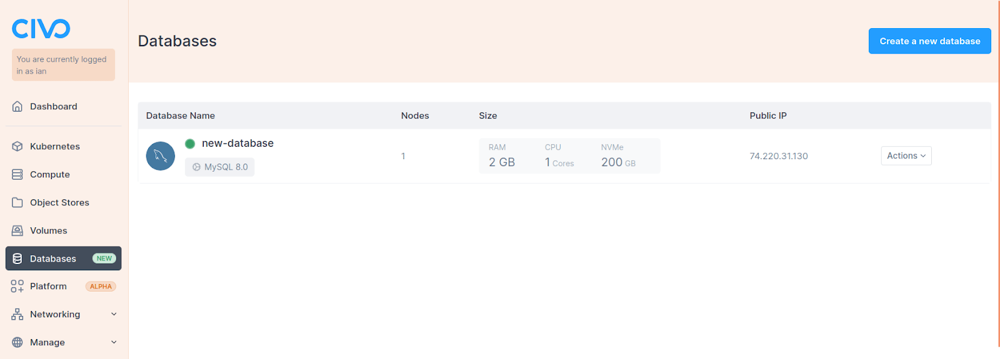
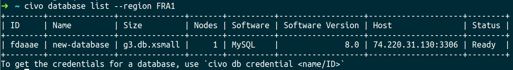
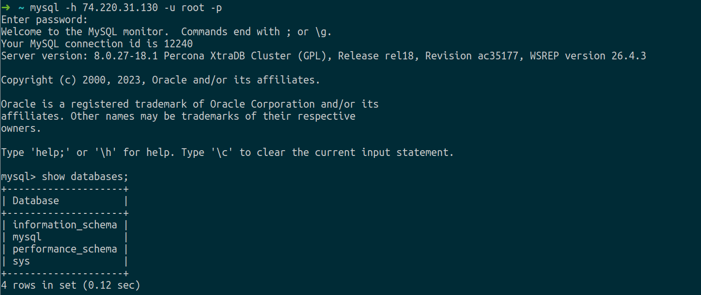

<head>
  <title>Connecting to a Civo MySQL Database | Civo Documentation</title>
</head> 

After setting up your MySQL database with Civo, you can connect to it using various methods. This document guides you through obtaining connection details from the Civo dashboard and CLI, and connecting using the `mysql` client command.

## Retrieving your Connection Details

### Through the Civo Dashboard

To retrieve your database connection details, go to:
- Your [Civo Dashboard page](https://dashboard.civo.com)
- Navigate to the database section in the left-hand panel:



- Select your database to view the connection details, including:
  - Host IP/FQDN, 
  - Username,
  - Password.


### Through the Civo CLI

Use the Civo CLI to manage your databases. Civo CLI allows you to create, update, delete, and list Civo Databases.

- To list your databases, run:

```bash
civo database list
```



- To get the credentials of a specific database, use:

```bash
civo database credential [Database_Name] 
```


## Connect to your Civo Database

The `mysql` client command is a popular choice for connecting to MySQL databases. 

Execute the command without the password and enter it when prompted to ensure security:

```bash
mysql -h [MySQL host IP/FQDN] -u [username] -p
```



## Connection Troubleshooting

If you encounter connection issues, verify that your credentials are correct and that the Civo firewall allows connections from your source IP address, if you need further assistance contact support.

## Post-Connection Validation

 Once connected, run a test query to validate the connection:

```bash
SHOW DATABASES;
```
Ensure that the expected databases are listed and accessible.

## Use Case Examples

For a comprehensive understanding of MySQL applications and use case examples, visit our [MySQL tutorials](https://www.civo.com/learn/categories/mysql). These tutorials offer practical insights and showcase real-world scenarios, helping you effectively implement and utilize MySQL in diverse environments.
