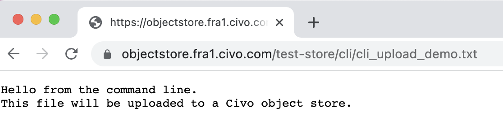

---
sidebar:
  order: 4
title: Downloading files from object stores
description: Learn how to access files in Civo Object Stores through URLs or the S3 API. Follow our instructions for successful downloads from object stores.
---

import { Tabs, TabItem } from '@astrojs/starlight/components';

## Accessing files by URL

Files uploaded as *public* to object stores can be accessed by their URL, whether through the object store's file listing page on the dashboard, or on the command line.

As an example, if you followed the [command-line file uploading document](./adding-files-to-object-stores#using-s3cmd-to-upload-a-file-to-an-object-store), you would be able to use the URL generated by the upload command to access the file directly, as output by s3cmd:

```console
...
upload: 'cli_upload_demo.txt' -> 's3://demo-store/cli/cli_upload_demo.txt'  [1 of 1]
 80 of 80   100% in    0s   572.01 B/s  done
Public URL of the object is: http://objectstore.fra1.civo.com/demo-store/cli/cli_upload_demo.txt
```

This file would be accessible through e.g. your web browser:



## Accessing uploaded files using the S3 API

Aside from being able to access public files in object stores through a browser or a tool such as curl by providing the URI, the S3 API allows for downloading files on the command line.

:::note
The following section assumes your `s3cmd` is configured to access the object store in question as per the [object store credentials](./object-store-credentials#retrieving-object-store-credential-details) documentation
:::

As an example, a directory called `cli/` was created in the [documentation for uploading files](./adding-files-to-object-stores#using-s3cmd-to-upload-a-file-to-an-object-store).

If you were to want to download that entire directory's contents to another machine, you could run:

```console
$ s3cmd --host=${AWS_HOST} --host-bucket=s3://test-store get --recursive s3://test-store/cli/

download: 's3://test-store/cli/cli_upload_demo.txt' -> './cli_upload_demo.txt'  [1 of 1]
 80 of 80   100% in    0s   596.15 B/s  done
```

In the above command, the crucial parts are the `get` command to download the path specified, and the `--recursive` switch which allows downloading the entire contents of a directory. If a path is not specified, the contents of the directory location will be downloaded to the current working directory on the machine where the command is run.

If only a single file is needed, its path and filename can be specified without needing the `--recursive` option.

:::tip
If you want to download a file that was added to the store as *Private* you would need to perform the download on the command line as this passes the credentials to authorise you to perform the action.
:::
